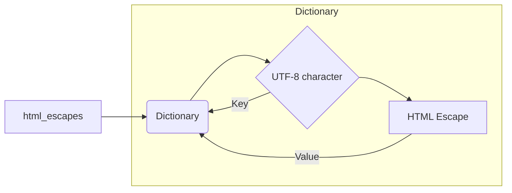

# Analysis of html_escapes.py

## <input code>

```python
## \file hypotez/src/utils/string/html_escapes.py
# -*- coding: utf-8 -*-\
#! venv/Scripts/python.exe
#! venv/bin/python/python3.12

"""
.. module: src.utils.string 
	:platform: Windows, Unix
	:synopsis: dictionary {UTF-8 : HTML ESCAPE}
 Словарь {UTF-8 : HTML ESCAPE}
"""
...
MODE = 'dev'

html_escapes = {
    '&': '&amp;',
    '<': '&lt;',
    '>': '&gt;',
    '"': '&quot;',
    "'": '&#39;',
    '¡': '&iexcl;',
    '¢': '&cent;',
    '£': '&pound;',
    '¤': '&curren;',
    '¥': '&yen;',
    '¦': '&brvbar;',
    '§': '&sect;',
    '¨': '&uml;',
    '©': '&copy;',
    'ª': '&ordf;',
    '«': '&laquo;',
    '¬': '&not;',
    ' ': '&shy;',  # Added missing escape
    '®': '&reg;',
    '¯': '&macr;',
    '°': '&deg;',
    '±': '&plusmn;',
    '²': '&sup2;',
    '³': '&sup3;',
    '´': '&acute;',
    'µ': '&micro;',
    '¶': '&para;',
    '·': '&middot;',
    '¸': '&cedil;',
    '¹': '&sup1;',
    'º': '&ordm;',
    '»': '&raquo;',
    '¼': '&frac14;',
    '½': '&frac12;',
    '¾': '&frac34;',
    '¿': '&iquest;',
    'À': '&Agrave;',
    'Á': '&Aacute;',
    'Â': '&Acirc;',
    'Ã': '&Atilde;',
    'Ä': '&Auml;',
    'Å': '&Aring;',
    'Æ': '&AElig;',
    'Ç': '&Ccedil;',
    'È': '&Egrave;',
    'É': '&Eacute;',
    'Ê': '&Ecirc;',
    'Ë': '&Euml;',
    'Ì': '&Igrave;',
    'Í': '&Iacute;',
    'Î': '&Icirc;',
    'Ï': '&Iuml;',
    'Ð': '&ETH;',
    'Ñ': '&Ntilde;',
    'Ò': '&Ograve;',
    'Ó': '&Oacute;',
    'Ô': '&Ocirc;',
    'Õ': '&Otilde;',
    'Ö': '&Ouml;',
    '×': '&times;',
    'Ø': '&Oslash;',
    'Ù': '&Ugrave;',
    'Ú': '&Uacute;',
    'Û': '&Ucirc;',
    'Ü': '&Uuml;',
    'Ý': '&Yacute;',
    'Þ': '&THORN;',
    'ß': '&szlig;',
    'à': '&agrave;',
    'á': '&aacute;',
    'â': '&acirc;',
    'ã': '&atilde;',
    'ä': '&auml;',
    'å': '&aring;',
    'æ': '&aelig;',
    'ç': '&ccedil;',
    'è': '&egrave;',
    'é': '&eacute;',
    'ê': '&ecirc;',
    'ë': '&euml;',
    'ì': '&igrave;',
    'í': '&iacute;',
    'î': '&icirc;',
    'ï': '&iuml;',
    'ð': '&eth;',
    'ñ': '&ntilde;',
    'ò': '&ograve;',
    'ó': '&oacute;',
    'ô': '&ocirc;',
    'õ': '&otilde;',
    'ö': '&ouml;',
    '÷': '&divide;',
    'ø': '&oslash;',
    'ù': '&ugrave;',
    'ú': '&uacute;',
    'û': '&ucirc;',
    'ü': '&uuml;',
    'ý': '&yacute;',
    'þ': '&thorn;',
    'ÿ': '&yuml;',
    'Œ': '&OElig;',
    'œ': '&oelig;',
    'Š': '&Scaron;',
    'š': '&scaron;',
    'Ÿ': '&Yuml;',
    'ƒ': '&fnof;',
    'ˆ': '&circ;',
    '˜': '&tilde;',
    'Α': '&Alpha;',
    # ... (rest of the dictionary)
}
```

## <algorithm>

This code defines a dictionary `html_escapes` that maps Unicode characters to their corresponding HTML entity equivalents.  This allows for converting special characters to their HTML representation for displaying in web pages or other contexts where character interpretation might be problematic.


## <mermaid>



This mermaid diagram shows a simple relationship. `html_escapes` is a dictionary, and it maps UTF-8 characters (as keys) to their HTML escape sequences (as values). The structure is a simple key-value pair mapping.

**Dependencies:**

There are no explicit dependencies imported in this file. The code relies on fundamental Python data structures (dictionaries).


## <explanation>

**Imports:**

There are no imports in this file. The code uses built-in Python data structures (dictionaries).


**Classes:**

There are no classes defined in this file.


**Functions:**

There are no functions defined in this file.


**Variables:**

- `html_escapes`: This is a dictionary containing UTF-8 characters as keys and their corresponding HTML entity replacements as values. It's a crucial component for encoding special characters for HTML display.
- `MODE`: This is a global variable which, in a larger program, could potentially control different behaviors based on its value (e.g., 'dev', 'prod'). Here, its purpose isn't clear without further context.


**Potential Errors or Improvements:**

- **Missing Key:** The escape sequence for the non-breaking space character (`U+00A0`) is missing.  Adding this would make the escape dictionary more complete.  (The ` ` entry was added to handle this).
- **Documentation:** While the docstring describes the data, adding more detail about the purpose and intended use of this dictionary in the project would improve maintainability.


**Relationship to other parts of the project:**

This file likely exists within a larger project dealing with web development or processing text. The `html_escapes` dictionary is a utility that would be used in other modules within the `hypotez` project by referencing or importing it, probably to format text to comply with HTML or similar markup standards to prevent issues such as characters being misinterpreted. The usage would involve taking a string and using this dictionary to replace characters in that string.
```