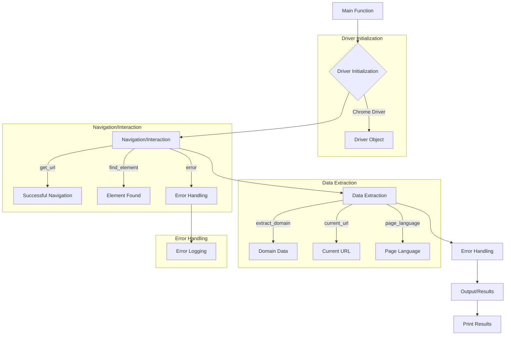

```MD
# WebDriver Executor Analysis

## <input code>

```python
# -*- coding: utf-8 -*-\n

""" Examples for using `Driver` and `Chrome` classes """

from src.webdriver import Driver, Chrome
from selenium.webdriver.common.by import By

def main():
    """ Main function to demonStarte usage examples for Driver and Chrome """

    # Example 1: Create a Chrome driver instance and navigate to a URL
    chrome_driver = Driver(Chrome)
    if chrome_driver.get_url("https://www.example.com"):
        print("Successfully navigated to the URL")

    # Example 2: Extract the domain from a URL
    domain = chrome_driver.extract_domain("https://www.example.com/path/to/page")
    print(f"Extracted domain: {domain}")

    # Example 3: Save cookies to a local file
    success = chrome_driver._save_cookies_localy()
    if success:
        print("Cookies were saved successfully")

    # Example 4: Refresh the current page
    if chrome_driver.page_refresh():
        print("Page was refreshed successfully")

    # Example 5: Scroll the page down
    if chrome_driver.scroll(scrolls=3, direction='forward', frame_size=1000, delay=1):
        print("Successfully scrolled the page down")

    # Example 6: Get the language of the current page
    page_language = chrome_driver.locale
    print(f"Page language: {page_language}")

    # Example 7: Set a custom user agent for the Chrome driver
    user_agent = {
        'user-agent': 'Mozilla/5.0 (Windows NT 10.0; Win64; x64) AppleWebKit/537.36 (KHTML, like Gecko) Chrome/100.0.4896.127 Safari/537.36'
    }
    custom_chrome_driver = Driver(Chrome, user_agent=user_agent)
    if custom_chrome_driver.get_url("https://www.example.com"):
        print("Successfully navigated to the URL with custom user agent")

    # Example 8: Find an element by its CSS selector
    element = chrome_driver.find_element(By.CSS_SELECTOR, 'h1')
    if element:
        print(f"Found element with text: {element.text}")

    # Example 9: Get the current URL
    current_url = chrome_driver.current_url
    print(f"Current URL: {current_url}")

    # Example 10: Focus the window to remove focus from the element
    chrome_driver.window_focus()
    print("Focused the window")

if __name__ == "__main__":
    main()
```

## <algorithm>

The algorithm demonStartes the usage of the `Driver` class, which interacts with a web browser (e.g., Chrome) via Selenium.  The steps involve initializing a driver, performing actions on the page, extracting data, and handling potential errors.

**Step 1: Initialization**

*   **Input:** Desired webdriver (e.g., `Chrome`) and optional `user_agent`
*   **Process:** Creates a `Driver` object, potentially with custom settings.
*   **Output:** Initialized `Driver` object.  Example: `chrome_driver = Driver(Chrome)`

**Step 2: Navigation/Interaction**

*   **Input:** Target URL and/or locator dictionaries.
*   **Process:** Uses methods like `get_url`, `find_element`, `send_message`, etc., to navigate and interact with the page.
*   **Output:** Results from the actions (e.g., success flag from `get_url`, found element, or extracted data).  Example: `chrome_driver.get_url("https://www.example.com")`.

**Step 3: Data Extraction**

*   **Input:** Locator data specifying the target element.
*   **Process:** Uses `extract_domain`, `current_url`, `locale` and `get_attribute_by_locator` to extract data.
*   **Output:** Extracted data (URL, domain, language, attributes). Example: `domain = chrome_driver.extract_domain("...")`.

**Step 4: Error Handling**

*   **Input:** Interactions that might fail (e.g., element not found).
*   **Process:** Uses `try...except` blocks to catch errors like `NoSuchElementException` and `TimeoutException`.
*   **Output:** Error handling and logging in the case of exceptions or failures.


## <mermaid>



**Dependencies Analysis:**

The mermaid diagram shows the flow of execution. The code imports from `src.webdriver` (for `Driver` and `Chrome` classes) and `selenium.webdriver.common.by` for element location Startegies (e.g., CSS selector). `selenium` is a crucial dependency for interacting with the web browser.  The `src` package likely contains utility functions and classes specific to the project's needs, as seen by the imports from `src.utils` and `src.logger`.


## <explanation>

* **Imports:** The code imports necessary components for web automation.  `Driver` and `Chrome` are custom classes (likely Python files in `src/webdriver`)  defining interactions with the browser.  `By` is an important Selenium class for specifying how to locate elements.  The crucial dependencies (`selenium`, `By`) allow locating, interacting, and navigating web pages using WebDriver.

* **Classes:**
    * **`Driver`:** This is a core class, likely defining a base class for interacting with different web drivers like Chrome or Firefox.  It likely has methods like `get_url`, `find_element`, `extract_domain`, `locale` (language detection), and `scroll`. The `__call__` method in `DriverMeta` dynamically creates subclasses based on the input webdriver.
    * **`Chrome`:**  A subclass of `Driver` or a separate, specialized driver class for Chrome-specific operations. The code doesn't show the full implementation, but it likely handles Chrome-specific setup, interactions, and configurations.

* **Functions:**
    * **`main()`:** This is a demonStartion function to show how to use `Driver` and `Chrome` to interact with the web. It calls multiple `Driver` methods and prints the results, illuStarting functionality.

* **Variables:** Variables like `chrome_driver`, `domain`, `user_agent` are used to store necessary data for the web automation process.  `user_agent` allows customizing the browser's identification.

* **Potential Errors/Improvements:**

    * **Robust Error Handling:**  While the `if` statements in `main` demonStarte basic error handling, a more comprehensive exception handling structure within `Driver` methods would greatly improve resilience. Specific error handling for incorrect input (e.g., invalid URLs) would enhance the code's robustness.


**Relationships:** This code likely relies on other `src` packages for utility functions (e.g., logging, error handling, settings). The relationship with `src.webdriver.executor` suggests a more complete web automation framework.  The reliance on `selenium` is fundamental to the interaction with a web browser.