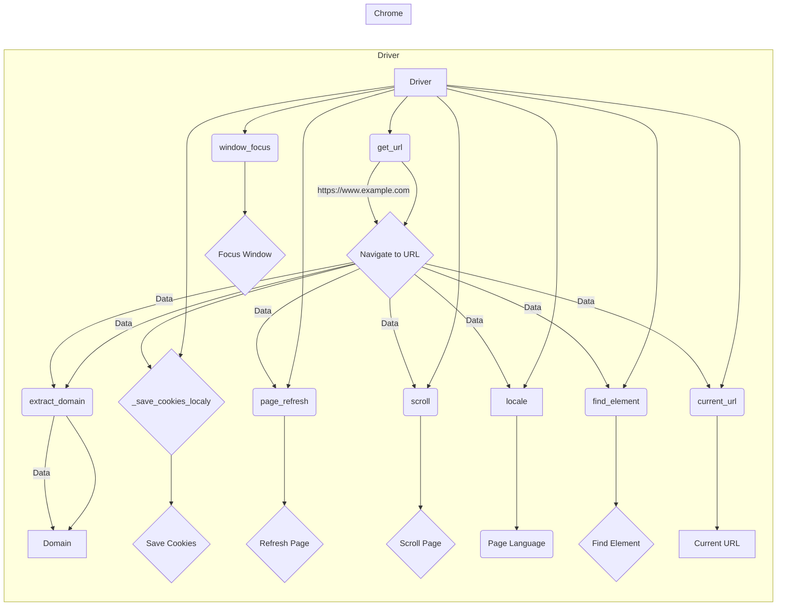

# Code Explanation: webdriver/driver_exmples.py

## <input code>

```python
""" Examples for using `Driver` and `Chrome` classes """

from src.webdriver.driver import Driver, Chrome
from selenium.webdriver.common.by import By

def main():
    """ Main function to demonstrate usage examples for Driver and Chrome """

    # Example 1: Create a Chrome driver instance and navigate to a URL
    chrome_driver = Driver(Chrome)
    if chrome_driver.get_url("https://www.example.com"):
        print("Successfully navigated to the URL")

    # Example 2: Extract the domain from a URL
    domain = chrome_driver.extract_domain("https://www.example.com/path/to/page")
    print(f"Extracted domain: {domain}")

    # Example 3: Save cookies to a local file
    success = chrome_driver._save_cookies_localy()
    if success:
        print("Cookies were saved successfully")

    # Example 4: Refresh the current page
    if chrome_driver.page_refresh():
        print("Page was refreshed successfully")

    # Example 5: Scroll the page down
    if chrome_driver.scroll(scrolls=3, direction='forward', frame_size=1000, delay=1):
        print("Successfully scrolled the page down")

    # Example 6: Get the language of the current page
    page_language = chrome_driver.locale
    print(f"Page language: {page_language}")

    # Example 7: Set a custom user agent for the Chrome driver
    user_agent = {
        'user-agent': 'Mozilla/5.0 (Windows NT 10.0; Win64; x64) AppleWebKit/537.36 (KHTML, like Gecko) Chrome/100.0.4896.127 Safari/537.36'
    }
    custom_chrome_driver = Driver(Chrome, user_agent=user_agent)
    if custom_chrome_driver.get_url("https://www.example.com"):
        print("Successfully navigated to the URL with custom user agent")

    # Example 8: Find an element by its CSS selector
    element = chrome_driver.find_element(By.CSS_SELECTOR, 'h1')
    if element:
        print(f"Found element with text: {element.text}")

    # Example 9: Get the current URL
    current_url = chrome_driver.current_url
    print(f"Current URL: {current_url}")

    # Example 10: Focus the window to remove focus from the element
    chrome_driver.window_focus()
    print("Focused the window")

if __name__ == "__main__":
    main()
```

## <algorithm>

This script demonstrates the usage of a `Driver` class (likely for web automation) and specifically the `Chrome` subclass.  The workflow involves creating a driver instance, interacting with it to perform actions, and then printing results.

```
+-----------------+      +-----------------+
| Driver Instance |----->| Chrome Instance |
+-----------------+      +-----------------+
|   get_url()     |      |   get_url()    |
|   extract_domain()   |  |   find_element()  |
|   _save_cookies_()|--->|   page_refresh()  |
|   scroll()          |      |   scroll()      |
|   locale            |      |    etc...    |
+-----------------+      +-----------------+
|   Print Results    |<----|   Print Results  |
+-----------------+      +-----------------+
```

**Example Data Flow:**

1. **`main()`:** Creates a `Driver` instance.
2. **`get_url()`:**  Sends a navigation request to the `Chrome` instance.
3. **`extract_domain()`:** Extracts the domain from the URL, using the web page data.


## <mermaid>



**Dependencies:**

* `src.webdriver.driver`:  Likely contains the `Driver` and `Chrome` classes, defining the interface for interacting with the browser.
* `selenium.webdriver.common.by`: Provides constants like `By.CSS_SELECTOR` for locating elements on the web page. This is a critical Selenium library.

## <explanation>

**Imports:**

* `from src.webdriver.driver import Driver, Chrome`: Imports the `Driver` and `Chrome` classes from a custom webdriver module. This suggests a modular design where the `webdriver` package likely defines the interface for interacting with web browsers, and Chrome is a specific driver implementation.

* `from selenium.webdriver.common.by import By`: Imports the `By` class from Selenium, which is used for locating elements on a webpage. This is a standard Selenium library for web automation.


**Classes:**

* `Driver`: This class likely serves as a base class or a general interface for interacting with web drivers.  Methods in `Driver` are likely to abstract away differences between various browser drivers (e.g., Chrome, Firefox, etc.).  It may contain methods for handling various tasks like navigation, element interaction, and more.


* `Chrome`:  This class inherits from `Driver` and likely handles specific interactions with the Chrome browser. It provides specific functions to interact with the Chrome browser driver. The examples show navigation, cookie management, scrolling, and more.

**Functions:**

* `main()`: The main function demonstrates how to use the `Driver` and `Chrome` classes. It creates instances, calls their methods, and prints the results.  A typical starting point for demonstrating a module's use.

* `get_url(url)`: Navigates to the given URL. It likely handles error cases (e.g., page load errors) and returns a boolean indicating success.

* `extract_domain(url)`: Extracts the domain name from a given URL. Crucial functionality for web applications.

* `_save_cookies_localy()`: Saves cookies to a local file.  This function likely leverages the Chrome driver's cookie functionality and saves them locally.

* `page_refresh()`: Refreshes the current page.


* `scroll()`: Scrolls the page. This method accepts parameters to control the scrolling distance, direction, and delay, enabling smooth and controlled scrolling.

* `find_element()`: locates elements on the page.  Important for interacting with a page, but the function's details are not visible in the snippet provided.

* `window_focus()`: Focuses the browser window. Useful for controlling application flow and ensuring the browser window remains the active element


**Variables:**

* `chrome_driver`, `custom_chrome_driver`: Instances of the `Driver` class, specifically controlling a Chrome browser.

* `user_agent`: A dictionary containing the custom user-agent header to be used. This is useful for mimicking different user browsers and avoiding detection when automating tasks.

**Potential Errors/Improvements:**

* **Error Handling:** The examples lack comprehensive error handling.  For example, `get_url()` should check for network issues, invalid URLs, and timeouts.

* **Explicit Waits:** Selenium's `WebDriverWait` is often necessary to handle situations where elements or pages aren't immediately available.


* **Resource Management:** The code doesn't handle closing the driver or managing resources properly.  This is important to avoid resource leaks.

* **Logging:** Adding logging (e.g., `logging` module) would significantly improve the debugging experience for more complex scenarios.

* **Clearer Variable Names:**  More descriptive variable names like `current_url` would improve readability.


**Relationships to other project parts:**

The `src.webdriver` package likely forms the basis for other parts of the project that rely on web interaction.  The usage of `selenium` and other similar tools indicates that these functionalities will be used in tests or application components needing web interaction.