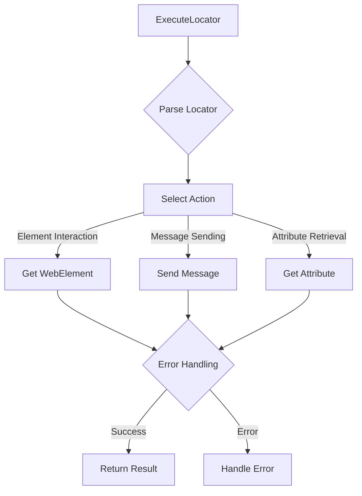

```MD
# ExecuteLocator Class Analysis

## <input code>

```python
# ... (imports)
from selenium import webdriver
# ... (other imports)

class ExecuteLocator:
    # ... (attributes)
    def __init__(self, driver, *args, **kwargs):
        self.driver = driver
        self.actions = ActionChains(driver)

    def execute_locator(self, locator: dict, message: str = None, typing_speed: float = 0, continue_on_error: bool = True) -> Union[str, list, dict, WebElement, bool]:
        # ... (implementation)
    
    def get_webelement_by_locator(self, locator: dict | SimpleNamespace, message: str = None) -> WebElement | List[WebElement] | bool:
        # ... (implementation)
    
    # ... (other methods)
```

## <algorithm>

The `ExecuteLocator` class manages interactions with web elements using Selenium WebDriver.  The workflow is primarily driven by the `execute_locator` method, which dispatches operations based on the `locator` dictionary.  Here's a step-by-step overview:

1. **Input:** The `execute_locator` method receives a `locator` dictionary, which defines how to locate and interact with an element on a web page.  It also accepts optional `message`, `typing_speed`, and `continue_on_error` parameters.

2. **Locator Parsing:** The `locator` dictionary is parsed to determine the type of action to perform (e.g., getting an element, sending a message, etc.). This might involve checking `by`, `selector`, and other keys.

3. **Action Selection:** Based on the parsed `locator`, the appropriate method (e.g., `get_webelement_by_locator`, `send_message`) is called to perform the action.

4. **Element Interaction:** Methods like `get_webelement_by_locator` use the parsed locator information to find the element(s) within the current page context.

5. **Attribute Retrieval (optional):** If required, `get_attribute_by_locator` retrieves specific attributes from the located element.

6. **Message Sending (optional):**  If the `locator` specifies, `send_message` sends a message to the located element (e.g., typing text into an input field).

7. **Error Handling:** The `continue_on_error` flag controls whether the process continues after encountering an error during any step.

8. **Return Value:**  The selected method returns the result of the operation, potentially an element, a list of elements, attribute values, a boolean indicating success/failure, or other relevant data.


## <mermaid>



**Dependencies Analysis:**

The diagram's `ExecuteLocator` box represents the core class.  The dependencies are implicit.  `Get WebElement` and `Send Message` use Selenium WebDriver methods (implicitly imported). `Handle Error` relies on custom exception handling (`src.logger.exceptions`) and possibly other logging and utility functions. The dependency structure is indicated by the code imports, such as `from selenium import webdriver`.


## <explanation>

**Imports:**

- `selenium`: The core Selenium library for interacting with web browsers.  It's crucial for automating web page interactions.
- `selenium.webdriver.*`:  Specific parts of Selenium, like `webdriver`, `common.keys`, `common.by`, `remote.webelement`, `support.ui`, `support.expected_conditions`, and `common.action_chains` are used to operate on the browser and web elements.
- `src`: This is likely the root directory of your project. The `src.utils.printer` module handles output, potentially including JSON handling (`j_loads`, `j_dumps`). `src.utils.string` is for string manipulation, and `src.logger` for logging events and exceptions.
- `src.logger.exceptions`: This suggests custom exception classes for specific error conditions encountered within the `ExecuteLocator` logic, providing more descriptive error handling.

**Classes:**

- `ExecuteLocator`: This class provides a structured way to interact with web elements.  The core of the class is `execute_locator`. It encapsulates the logic to determine the action based on the `locator` dictionary.

**Methods:**

- `__init__`: Initializes the `ExecuteLocator` with a Selenium WebDriver instance and `ActionChains` to enable more complex interactions.
- `execute_locator`:  The central method, receiving a dictionary to identify an element and defining the action to perform on it. `continue_on_error` controls error propagation.
- `get_webelement_by_locator`: Fetches the element from the page based on the provided locator (using Selenium).
- `get_attribute_by_locator`: Retrieves an element's attribute value.
- `_get_element_attribute`: A helper to retrieve a specific attribute.
- `send_message`: Sends a message to the located element (e.g., typing).
- `evaluate_locator`:  Used to evaluate a locator attribute; this method's precise role needs more context.
- `_evaluate`:  A helper for `evaluate_locator`.


**Variables:**

- `driver`: The WebDriver instance; critical for all browser interactions.
- `locator`: A dictionary containing the necessary information to locate and operate on a specific webpage element.
- `message`, `typing_speed`, `continue_on_error`: Optional parameters customizing the `execute_locator` method's behavior.


**Potential Errors/Improvements:**

- **Error Handling:** While `continue_on_error` exists, there's no explicit retry mechanism.  Adding a retry Startegy could be valuable if the operation might fail temporarily.
- **Robustness:** The code doesn't include comprehensive error handling for invalid or missing locator keys in the dictionary, which could lead to unexpected behavior. Handling `NoSuchElementException` and `TimeoutException` are essential.  Adding `try...except` blocks would improve robustness.
- **Type Safety:** Using type hints (e.g., `locator: dict`) is a good practice for better readability and maintainability.


**Relationship with other parts of the project:**

The `ExecuteLocator` class relies heavily on `src` modules, including error handling, logging, and utilities. This indicates a close relationship with the general project structure for handling web-related actions, page manipulation, and logging of the process.  The `locator` structure likely originates from configuration files or other data sources managed within the project.