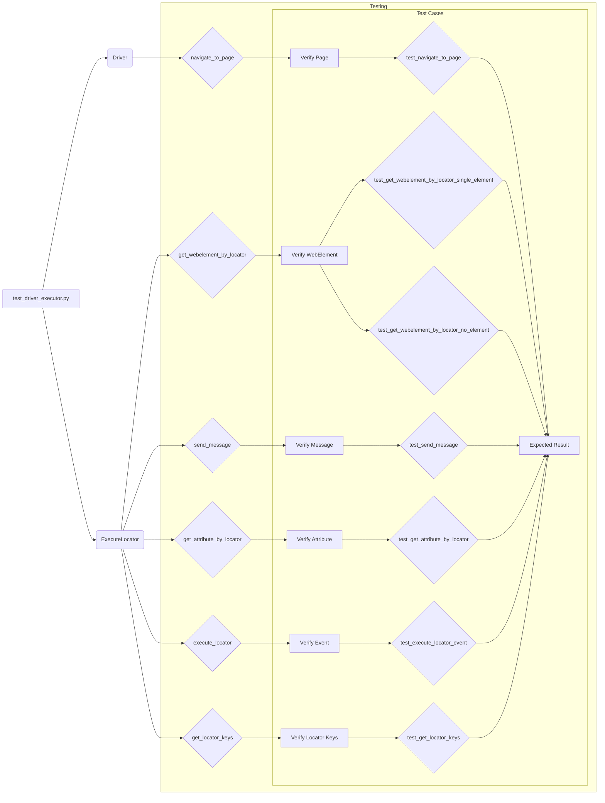

```MD
# Code Explanation: `guide_test_driver_executor.md`

## <input code>

```
Вот руководство для тестеров по запуску и выполнению тестов из файла `test_driver_executor.py`, а также описание тестов и их целей.

---
# Руководство для тестера по запуску и выполнению тестов

## Введение

В этом руководстве описывается, как запустить и выполнить тесты для классов `Driver` и `ExecuteLocator`, расположенные в файле `test_driver_executor.py`. Тесты проверяют функциональность методов классов и взаимодействие между `Driver` и `ExecuteLocator`.

## Структура тестов

... (rest of the content)
```

## <algorithm>

This document is a test guide, not a program.  It describes *how* to run tests, not the *algorithm* of the test code itself.  It describes the structure of the tests, the methods and functions being tested, how to run them (using `pytest`), and the expected results for each test case.


## <mermaid>



**Dependencies Analysis:**

The diagram assumes the existence of `pytest` and `selenium` packages, since the document explains how to install them using `pip install -r requirements.txt`. The `ChromeDriver` is also necessary for browser automation through Selenium.  It also refers to classes like `Driver` and `ExecuteLocator`, which would be defined in `test_driver_executor.py`. The diagram doesn't explicitly show the internal workings of those classes, just the method calls being tested.


## <explanation>

This document is a user guide and *not* the code itself.  It provides instructions on how to run tests written in Python, likely using the `pytest` framework, for testing the functionality of the `Driver` and `ExecuteLocator` classes.  

* **Imports:** The document mentions a `requirements.txt` file.  This is standard Python practice, defining the external libraries (like `pytest`, `selenium`, and potentially `webdriver` ) the project depends on.  The explicit listing of `pytest` suggests a testing framework.  `selenium` is needed for web browser interaction (and so will imply WebDriver).

* **Classes (`Driver`, `ExecuteLocator`):** These are Python classes, likely containing methods that interact with WebDriver (or a similar browser automation library) to control the browser and test web elements. The guide details methods being tested (e.g., `navigate_to_page`, `get_webelement_by_locator`) within these classes.

* **Functions (e.g., `test_navigate_to_page`):** These are pytest test functions that verify specific behaviors.  They're designed to assert conditions (e.g., the URL after navigation).

* **Variables:** The guide doesn't detail variables because it's focused on the test *structure* and execution flow. Variables would be within the test functions.  However, it does describe the configuration (e.g., `executable_path`, or settings needed to interact with the browser).

* **Potential Errors/Improvements:** The guide could be improved by clarifying:
    * The exact structure of the `Driver` and `ExecuteLocator` classes (e.g., what data they hold, their relationships).
    * Specific error messages or expected exceptions (e.g., for invalid locators).
    * How test setup (like setting up a browser instance) and teardown (closing the browser) are handled within the test functions.


**Relationship with other parts of the project:** The guide indicates that these tests interact with the `webdriver` package,  and likely interact with the web pages being tested. The guide assumes existence of a `test_driver_executor.py` which contains the code of the `Driver` and `ExecuteLocator` classes and related test functions. The `requirements.txt` file would also be needed for running the tests. The code probably interacts with browser (e.g., Chrome), for which the correct WebDriver (e.g., `ChromeDriver`) needs to be downloaded and placed at the correct location.