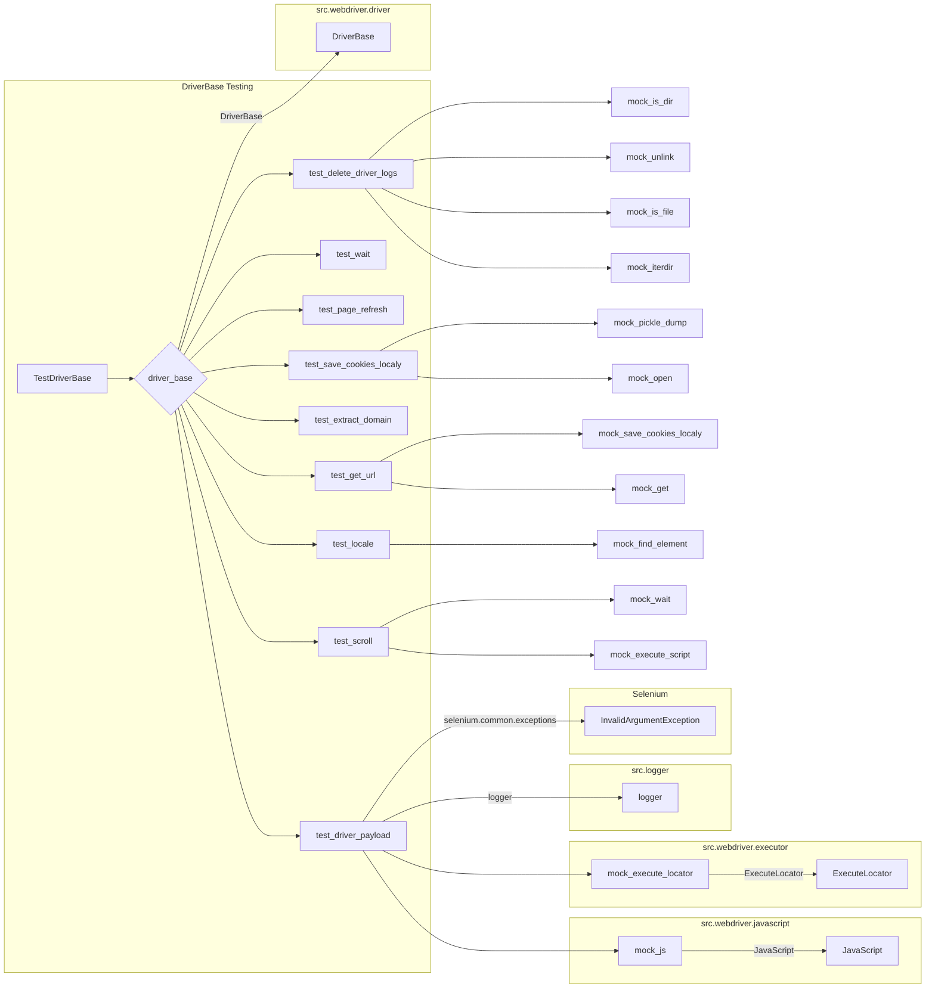

# Code Explanation for hypotez/src/webdriver/_pytest/test_driver.py

## <input code>

```python
# -*- coding: utf-8 -*-

#! venv/bin/python/python3.12

"""
.. module: src.webdriver._pytest 
	:platform: Windows, Unix
	:synopsis:

"""


"""
	:platform: Windows, Unix
	:synopsis:

"""


"""
	:platform: Windows, Unix
	:synopsis:

"""


"""
  :platform: Windows, Unix

"""
"""
  :platform: Windows, Unix
  :platform: Windows, Unix
  :synopsis:
"""
  
""" module: src.webdriver._pytest """


""" тестовый файл test_driver.py включает тесты для следующих методов класса DriverBase:
 - driver_payload
 - scroll
 - locale
 - get_url
 - extract_domain
 - _save_cookies_localy
 - page_refresh
 - wait
 - delete_driver_logs
Тесты используют pytest и unittest.mock для создания фиктивных объектов и методов, 
чтобы изолировать тестируемый код и избежать взаимодействия с реальными веб-страницами и файлами.
"""

import pytest
from unittest.mock import Mock, patch, PropertyMock
from selenium.common.exceptions import InvalidArgumentException
from src.webdriver.driver import DriverBase
from src.logger import logger

class TestDriverBase:
    @pytest.fixture
    def driver_base(self):
        """Fixture to create an instance of DriverBase for testing."""
        return DriverBase()

    # ... (rest of the code) ...
```

## <algorithm>

The code defines a series of tests for the `DriverBase` class using the `pytest` framework and `unittest.mock`.  The tests aim to validate the functionality of methods within the `DriverBase` class without interacting with a real browser.

1. **Test Setup:** A `driver_base` fixture creates an instance of `DriverBase` for each test.
2. **Method Invocation:**  Methods of the `DriverBase` class are called, such as `driver_payload`, `scroll`, `locale`, `get_url`, `extract_domain`, `_save_cookies_localy`, `page_refresh`, `wait`, `delete_driver_logs`.
3. **Mock Objects:** The `unittest.mock` library is used to mock dependencies (like `JavaScript`, `ExecuteLocator`). This allows testing methods in isolation.
4. **Assertions:** Assertions verify that the methods are behaving as expected.  Assertions check return values or if mocked methods were called with correct parameters.


## <mermaid>


**Dependencies Analysis:**

* `pytest`: A testing framework for Python code.
* `unittest.mock`: Used for creating mock objects to isolate testing from external dependencies.
* `selenium.common.exceptions`: Used to handle exceptions related to Selenium interactions.
* `src.webdriver.driver`: Contains the `DriverBase` class being tested.
* `src.logger`: Likely a logging module for the project.

## <explanation>

**Imports:**

* `pytest`: Used for defining and running tests.  Crucial for the testing infrastructure.
* `unittest.mock`: Used to create mock objects that simulate the behavior of external dependencies (`JavaScript`, `ExecuteLocator`) for isolating tests and preventing interaction with real webpages.
* `selenium.common.exceptions`: Provides classes for handling exceptions that might arise during Selenium interactions. This is crucial for robustness.
* `src.webdriver.driver`: Contains the `DriverBase` class, which is the class being tested. This suggests a modular structure with `webdriver` as a package.
* `src.logger`: Import for logging; helpful for debugging and tracing within the system.


**Classes:**

* `TestDriverBase`: This class contains the test methods for the `DriverBase` class. `pytest`'s `@pytest.fixture` decorator is used to create `driver_base`.


**Functions:**

* Test methods (e.g., `test_driver_payload`, `test_scroll`): These functions define the individual tests, each testing a specific method of `DriverBase`.
    * `driver_base`:  Fixture supplying a `DriverBase` instance for testing each method.
    * `patch`:  Used to replace external functions/classes with mocked ones, allowing isolation of tests.


**Variables:**

* `MODE`: A global variable likely controlling the testing environment.
* `to_file` (in `test_save_cookies_localy`): This variable is a Path object, used to specify the file location for saving cookies.
* `temp_dir` (in `test_delete_driver_logs`):  A variable storing a `Path` object used to represent the temporary directory for driver logs.
* `gs.dir_cookies`, `gs.dir_logs`: Likely global variables from another part of the project that define file paths for handling cookies and logs respectively. (The `gs` prefix suggests a global/settings object.)


**Potential Errors/Improvements:**

* **Missing `src` Context:**  The code heavily relies on imports from the `src` package.  The imports are from an assumed `src` structure, and the exact layout of that structure (e.g., `src/webdriver/driver.py`)  isn't fully visible in this snippet. This would need further investigation to understand how the `src` packages interact and how they are potentially dependent on each other.
* **Global Variables (`gs`):** The use of global variables `gs.dir_cookies` and `gs.dir_logs` could lead to unexpected behavior if those variables are not correctly initialized or if there are unintended dependencies in the project. Consider making these parameters or passing them to the `DriverBase` methods as arguments, making the tests more modular.
* **File Handling:** The `_save_cookies_locally` test uses `open` and `pickle.dump`. Ensure proper error handling in case these operations fail (e.g., file permission issues).
* **Real-world Data:**  Mocking everything is great for testing, but consider a test that uses a real or simulated browser environment to ensure that the integration points of these tests function in a real-world situation.


**Relationship Chain:**

1. `hypotez/src/webdriver/_pytest/test_driver.py` (tests) -> `src.webdriver.driver` (class being tested).
2. `src.webdriver.driver` might depend on `src.webdriver.javascript`, `src.webdriver.executor`, and potentially other `src` packages for its functionality.
3. These external dependencies could have their own sets of tests.
4. The `src.logger` package is likely used for recording actions and errors that the code might encounter. This makes it an important part of the program's infrastructure.


This analysis provides a good starting point for understanding the code's functionality and its interactions with other parts of the project.