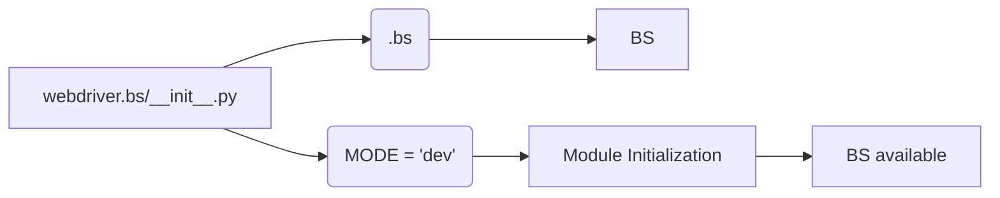

# <input code>

```python
## \file hypotez/src/webdriver/bs/__init__.py
# -*- coding: utf-8 -*-
#! venv/Scripts/python.exe
#! venv/bin/python/python3.12

"""
.. module: src.webdriver.bs 
	:platform: Windows, Unix
	:synopsis:

"""
MODE = 'dev'

from .bs import BS
```

# <algorithm>

The code is a module initializer for a package named `webdriver.bs`.  Its primary function is to import and make available a class named `BS` from a submodule named `bs`.

**Step 1**: Defining a variable.

*   **Input**: None.
*   **Process**:  Sets the variable `MODE` to the string 'dev'.
*   **Output**: `MODE` = 'dev'.


**Step 2**: Importing `BS`

*   **Input**: None
*   **Process**:  Imports the class `BS` from the submodule `bs` within the current package `webdriver.bs`.
*   **Output**: The `BS` class is available for use within the current module.  This step establishes the fundamental functionality that `webdriver.bs` provides.


# <mermaid>



**Dependencies Analysis**:

*   `MODE`: This variable doesn't depend on any external imports; it's a simple constant within the module.
*   `.bs`: This imports the `BS` class from the submodule `bs`, a module within the same `webdriver` package.  This dependency signifies that the submodule `bs` is required for the `webdriver.bs` module to function. The `.` before `bs` means it's relative to the current package, `webdriver.bs`.

# <explanation>

* **Imports**: The code imports the class `BS` from the submodule `bs` within the `webdriver` package.  This is a standard Python import pattern used to reuse code from a related module within a package. The import `from .bs import BS` means that the `bs` module is located in the same directory as the `__init__.py` file.


* **Classes**: The code defines no classes itself; it uses the `BS` class defined in the `bs` module.  Critically, this file acts as an interface to access the `BS` class, not as an implementation of the functionality.

* **Functions**: There are no functions directly defined in this file. Its role is to expose a named import `BS`.

* **Variables**: The only variable is `MODE`, which is a string literal, and likely represents a configuration mode (e.g., 'dev', 'prod') used by the `BS` class. Its value here is set to 'dev'.

* **Potential Errors or Improvements**:  
    *   The `MODE` variable doesn't appear to be used within the file.  Potentially, the file should use `MODE` for conditional logic or configuration of `BS`.  
    *   No meaningful error handling or checks are present. The file simply provides access to the class.


* **Relationship with other parts of the project:** The `webdriver.bs` module likely relies on classes and functions within `bs` to interact with web drivers (for example, using Selenium). Other parts of the larger `hypotez` project might use the `BS` class to create and manage browser sessions for their application testing tasks.


**In Summary:** This `__init__.py` file is a simple module initializer. It establishes a single dependency, `bs`, providing access to the functionality contained in that module.  The variable `MODE` adds the possibility for future configuration, but its current use is unclear.