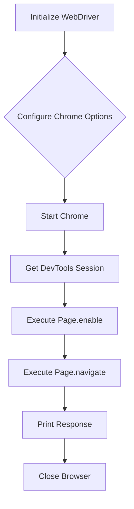
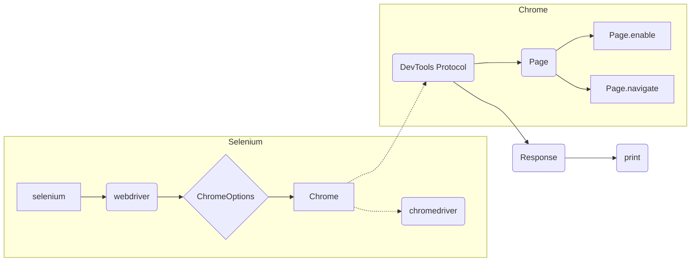

```MD
# WebDriver and DevTools Interaction in Chrome

## <input code>

```python
from selenium import webdriver
from selenium.webdriver.chrome.service import Service
from selenium.webdriver.chrome.options import Options

# Set the path to ChromeDriver
service = Service('/path/to/chromedriver')

# Configure ChromeOptions
chrome_options = Options()
chrome_options.add_argument('--remote-debugging-port=9222')

# Launch Chrome with specified options
driver = webdriver.Chrome(service=service, options=chrome_options)

# Get DevTools session
dev_tools = driver.execute_cdp_cmd('Page.enable', {})

# Execute a command via DevTools Protocol
response = driver.execute_cdp_cmd('Page.navigate', {'url': 'https://www.example.com'})
print(response)

# Close the browser
driver.quit()
```

## <algorithm>



**Example Data Flow:**

* **A:**  `service = Service('/path/to/chromedriver')` sets up the ChromeDriver service.
* **B:** `chrome_options.add_argument('--remote-debugging-port=9222')` configures the Chrome browser to listen on port 9222 for remote debugging.
* **C:** `driver = webdriver.Chrome(...)` launches Chrome with the configured options.
* **D:** `dev_tools = driver.execute_cdp_cmd('Page.enable', {})` calls a WebDriver method to obtain a DevTools session (internally handling communication with the browser).
* **E:** `driver.execute_cdp_cmd('Page.enable', {})` sends a command to enable the page domain of the DevTools Protocol for the current session.
* **F:** `response = driver.execute_cdp_cmd('Page.navigate', {'url': 'https://www.example.com'})` sends a command to navigate to the specified URL; the result is stored in `response`.
* **G:** `print(response)` displays the response from the DevTools Protocol.
* **H:** `driver.quit()` closes the Chrome browser.


## <mermaid>



**Dependencies Analysis:**

* `from selenium import webdriver`: Imports the core Selenium WebDriver interface.  `selenium` package is a dependency that provides the high-level interaction capabilities with web browsers.

* `from selenium.webdriver.chrome.service import Service`: Imports the service class for managing ChromeDriver. `selenium.webdriver.chrome` is a submodule focused on Chrome-specific functionalities, and `Service` class is for initiating and managing ChromeDriver processes.


* `from selenium.webdriver.chrome.options import Options`: Imports the `Options` class for customizing Chrome behavior. `selenium.webdriver.chrome` package again, and `Options` class provides ways to configure Chrome options (arguments).


## <explanation>

**Imports:**

* `from selenium import webdriver`:  Provides the base class for interacting with web browsers using the Selenium WebDriver API. This is crucial for initiating and controlling the browser process.
* `from selenium.webdriver.chrome.service import Service`:  This import handles the process of interacting with ChromeDriver. It's responsible for starting and managing the ChromeDriver executable, ensuring proper communication between Python and the browser.
* `from selenium.webdriver.chrome.options import Options`: This module handles configuration of Chrome options (like specifying the remote debugging port). This is necessary to customize the Chrome browser instance for your automation needs.


**Classes:**

* `Service`: Represents a service responsible for starting and managing the ChromeDriver executable. It is used to start and stop Chrome instances, handling its life-cycle, and allowing for better control over the browser.
* `Options`:  Allows configuration of various Chrome options. In this example, `add_argument('--remote-debugging-port=9222')` configures Chrome to enable remote debugging on port 9222, enabling communication with DevTools Protocol.
* `webdriver`: An abstract interface allowing control of different browsers. This implementation is very specific to Chrome browsers.

**Functions:**

* `webdriver.Chrome(service=service, options=chrome_options)`:  Creates a new Chrome WebDriver instance. It takes the `service` (for ChromeDriver) and `options` (for Chrome configurations) as arguments.  This function is responsible for setting up the environment to interact with Chrome.
* `driver.execute_cdp_cmd('Page.enable', {})`: Executes a DevTools Protocol command (`Page.enable`). This method is central to interacting with DevTools Protocol. It takes the command name and arguments as input. This activates the features of the DevTools protocol for the current session.
* `driver.execute_cdp_cmd('Page.navigate', {'url': 'https://www.example.com'})`: This sends a command to navigate to a specific URL.


**Variables:**

* `service`: Represents the ChromeDriver service object.
* `chrome_options`: Represents a set of options for configuring the Chrome browser.
* `driver`: The instantiated WebDriver object used for interacting with the Chrome browser.


**Potential Errors/Improvements:**

* **Error Handling:** The code lacks error handling.  If ChromeDriver is not found or there are network issues, the script will crash. Adding `try...except` blocks would improve robustness.
* **Explicit Wait:**  Consider adding waits (e.g., explicit waits using `WebDriverWait`) to handle scenarios where page elements might not be immediately available after navigation.

**Relationships with other parts of the project:**

The code directly depends on the Selenium library and the `ChromeDriver`. This code interacts with Chrome browser through the DevTools protocol.  Other parts of the project that rely on Selenium or web automation would leverage this type of function to control browser interactions.  For example, UI testing frameworks or automation scripts for web applications could call this code.