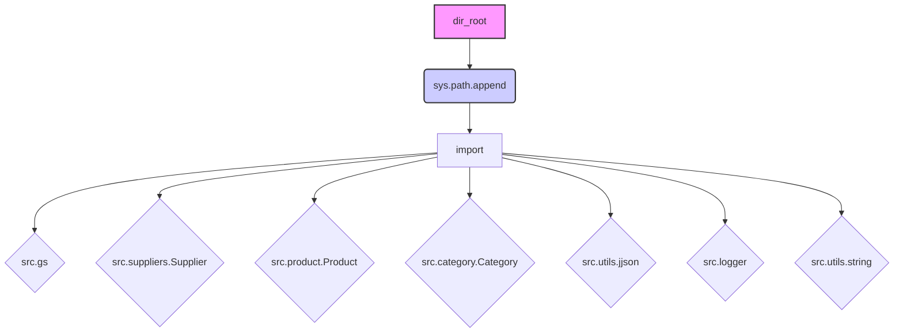

# Code Explanation for hypotez/src/webdriver/chrome/_examples/header.py

## <input code>

```python
## \file hypotez/src/webdriver/chrome/_examples/header.py
# -*- coding: utf-8 -*-\

#! venv/bin/python/python3.12

"""
.. module: src.webdriver.chrome._examples 
	:platform: Windows, Unix
	:synopsis:

"""


"""
	:platform: Windows, Unix
	:synopsis:

"""


"""
	:platform: Windows, Unix
	:synopsis:

"""


"""
  :platform: Windows, Unix

"""
"""
  :platform: Windows, Unix
  :platform: Windows, Unix
  :synopsis:
"""
  
""" module: src.webdriver.chrome._examples """


import sys
import os
from pathlib import Path

dir_root : Path = Path (os.getcwd()[:os.getcwd().rfind('hypotez')+11])
sys.path.append (str (dir_root) )  # Добавляю корневую папку в sys.path
dir_src = Path (dir_root, 'src')
sys.path.append (str (dir_root) ) 
...

print(dir_root)
# ----------------
from pathlib import Path
import json
import re
# ----------------

from src import gs
from src.suppliers import Supplier
from src.product import Product, ProductFields, ProductFieldsLocators
from src.category import Category
from src.utils.jjson import j_dumps, j_loads,   pprint, save_text_file
from src.logger import logger
from src.utils.string import StringFormatter, StringNormalizer, ProductFieldsValidator
...
```

## <algorithm>

No clear algorithm is present as the code snippet is a header file. It focuses on setting up the Python environment by adding the project's root directory to the `sys.path` to allow importing modules from the `src` directory.

## <mermaid>



**Explanation of Dependencies:**

* **`sys`, `os`, `pathlib`:** Standard Python libraries for system interaction, file system operations, and path manipulation.
* **`json`, `re`:** For handling JSON data and regular expressions.
* **`src` package:** This implies that the code belongs to a larger project structure, containing various submodules (suppliers, products, category, utils, etc.)
    * **`gs`:** Likely a custom module within the `src` package.
    * **`Supplier`:** Class potentially defining suppliers' data.
    * **`Product`, `ProductFields`, `ProductFieldsLocators`:** Classes for product information.
    * **`Category`:** Class for categories.
    * **`jjson`:** Module containing functions to work with JSON data (e.g., serialization, deserialization, pretty printing).
    * **`logger`:** Logging module (potentially from a dedicated library).
    * **`StringFormatter`, `StringNormalizer`, `ProductFieldsValidator`:**  Classes for string manipulation, normalization, and validation (related to product data).

The code snippet demonStartes how to import modules from the `src` package, which is a common practice in larger projects to organize code and encourage modularity.

## <explanation>

* **Imports:** The code imports necessary modules for various tasks, including file system interactions, JSON handling, regular expressions, and custom modules from the `src` package. The imports are crucial for enabling the application to access and use functions and classes from external modules.


* **Classes:**  The presence of classes such as `Supplier`, `Product`, `Category`, `StringFormatter`, `StringNormalizer`, `ProductFieldsValidator` suggests an object-oriented design. This implies that the data structures and related operations are organized within classes to encapsulate data and behaviors related to specific entities (e.g., products, suppliers).


* **Functions:** The imported modules likely contain functions (e.g., `j_dumps`, `j_loads`, `pprint`, `save_text_file`) for working with JSON, logging, string manipulation, etc. The exact signatures of these functions will be defined in the modules being imported.

* **Variables:** `MODE` is a global variable likely defining a mode for the application (e.g., 'dev', 'prod'). `dir_root` and `dir_src` are variables that store paths to the project's root and `src` directories, respectively.  Their purpose is to manage file paths.


* **Potential Errors/Improvements:**
    * **`...`:** The presence of `...` signifies missing code. This incomplete code may cause runtime errors if it relies on functions or classes not defined or properly imported.
    * **`sys.path.append` with duplicated `str(dir_root)`:** The `sys.path.append(str(dir_root))` line is repeated. This might be unnecessary and could create unexpected behaviour.  Consider removing the second or better yet, fixing the source.
    * **Missing `from` statement:** While not directly causing error, the missing `from` statements after `...` raise questions about the intended behaviour of these parts of the code.

* **Chain of Relationships:** The `src` package and its modules (e.g., `src.suppliers`) represent a chain of relationships. The `webdriver` and `chrome` parts suggest that this code may be used with a web automation library. The relationship between these modules and their usage within `header.py` would need context of the calling code.


**In Summary:** The `header.py` file appears to be a setup file, defining necessary imports and setting paths for the rest of the application to function correctly.  It relies heavily on modules from within the `src` package, which need to be properly defined elsewhere in the project.