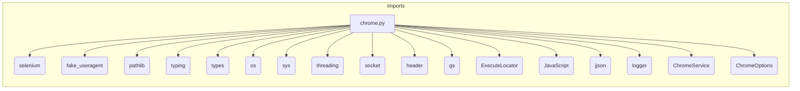

```MD
# Chrome WebDriver Implementation Analysis

## <input code>

```python
## \file hypotez/src/webdriver/chrome/chrome.py
# -*- coding: utf-8 -*-\
#! venv/Scripts/python.exe
#! venv/bin/python/python3.12

"""
.. module:: src.webdriver.chrome
    :platform: Windows, Unix
    :synopsis: Chrome WebDriver implementation.

This module provides a custom implementation of Selenium's Chrome WebDriver. It integrates
settings defined in the `chrome.json` configuration file, such as user-agent and browser
profile settings, to allow for flexible and automated browser interactions.

Key Features:
    - Centralized configuration through JSON files.
    - Support for multiple browser profiles.
    - Enhanced logging and exception handling.
"""


import os
import sys
import threading
import socket
from pathlib import Path
from typing import List, Optional, Dict, Union
from types import SimpleNamespace
from selenium import webdriver
from selenium.webdriver.chrome.service import Service as ChromeService
from selenium.webdriver.chrome.options import Options as ChromeOptions
from fake_useragent import UserAgent
from selenium.common.exceptions import WebDriverException

import header
from src import gs
from src.webdriver.executor import ExecuteLocator
from src.webdriver.js import JavaScript
from src.utils.jjson import j_loads_ns
from src.logger import logger


class Chrome(webdriver.Chrome):
    """Class for Chrome WebDriver."""

    _instance = None
    driver_name: str = 'chrome'
    config: SimpleNamespace

    def __new__(cls, *args, **kwargs):
        """Ensure a single instance of Chrome WebDriver.

        If an instance already exists, calls `window_open()`.

        Returns:
            Chrome: The singleton instance of the Chrome WebDriver.
        """
        if cls._instance is None:
            cls._instance = super().__new__(cls)
        else:
            cls._instance.window_open()  # Open a new window if instance already exists
        return cls._instance

    def __init__(self, user_agent: Optional[str] = None, *args, **kwargs):
        """Initializes the Chrome WebDriver with the specified options and profile.

        Args:
            user_agent (Optional[str]): The user agent string to be used. Defaults to a random user agent.
        """
        # ... (rest of the code)
```

## <algorithm>

```mermaid
graph TD
    A[Instantiate Chrome] --> B{Check Instance};
    B -- Exists --> C[window_open()];
    B -- Doesn't Exist --> D[Create Instance];
    D --> E[__init__];
    E --> F[Load config (chrome.json)];
    F --> G{Valid config?};
    G -- Yes --> H[Initialize ChromeOptions];
    H --> I[Apply options from config];
    H --> J[Create profile directory];
    J --> K[Create service object];
    K --> L[Initialize driver (super().__init__) ];
    L --> M[Call _payload];
    M --> N[Create JavaScript executor];
    N --> O[Set WebDriver methods];
    O --> P[Create ExecuteLocator executor];
    P --> Q[Set WebDriver methods];
    G -- No --> R[Logging error & return];

    subgraph Exception Handling
        L --> S[Exception];
        S --> T[Logging error & return];
    end
```

## <mermaid>



**Dependencies Analysis**:

The `mermaid` diagram shows the imports from various Python packages.  `selenium`, `fake_useragent`, `pathlib`, `typing`, `types`, `os`, `sys`, `threading`, `socket`, `header`, `gs`, `ExecuteLocator`, `JavaScript`, `jjson`, `logger`, `ChromeService`, and `ChromeOptions` are imported to provide functionalities for web driver interaction, user agent management, file system operations, typing hints, etc., as needed by the code.  The import `header` and `gs` suggest the existence of other modules within the project (`src`).  Understanding the specific roles of `header` and `gs` would require reviewing their respective files.

## <explanation>

**Imports**:

- `selenium`, `fake_useragent`, `pathlib`, `typing`, `types`, `os`, `sys`, `threading`, `socket`:  Standard Python libraries or external packages.
- `header`, `gs`, `ExecuteLocator`, `JavaScript`, `jjson`, `logger`:  Likely internal to the project (`hypotez`), providing helper functions, configuration access, WebDriver execution logic, JS interaction, JSON handling, and logging.
- `ChromeService`, `ChromeOptions`: Specific parts of the Selenium library for Chrome WebDriver.

**Classes**:

- `Chrome(webdriver.Chrome)`:  A subclass of Selenium's `webdriver.Chrome`.  It's designed to be a singleton (`_instance`) to ensure only one Chrome WebDriver instance exists throughout the program. The `__new__` method ensures the singleton pattern is followed.  This is important for managing resources. `__init__` method loads configurations, sets up WebDriver options, and initializes the necessary components.

**Functions**:

- `__new__(cls, *args, **kwargs)`:  Handles the creation of a single instance of the `Chrome` class, preventing multiple instances and making sure each use has only one WebDriver object open.
- `__init__(self, user_agent=None, *args, **kwargs)`: Initializes the Chrome WebDriver with potential user agent, options, and settings from `chrome.json`. The `normalize_path` function is crucial for handling paths with environment variables.
- `_payload(self)`: This method initializes important WebDriver functionality by instantiating the `JavaScript` and `ExecuteLocator` objects and assigning their functions to the `Chrome` instance.
- `normalize_path(path: str) -> str`: Replaces environment variable placeholders (e.g., `%APPDATA%`) with actual paths in the OS.

**Variables**:

- `MODE`: Represents the development mode.
- `config`: A `SimpleNamespace` object that holds the loaded configuration from `chrome.json`.
- `options`: Stores the WebDriver options.
- `service`: Stores the Chrome WebDriver service object.


**Potential Errors/Improvements**:

- **Error Handling**:  While the code includes `try...except` blocks, the `...` placeholders suggest there's more error handling required, particularly for handling invalid JSON data (`chrome.json`) or exceptions during the initialization of the driver.
- **Explicit Config Validation**:  Instead of a simple `if not self.config:` check, validate the structure and contents of the `chrome.json` file thoroughly to prevent unexpected behavior or crashes.
- **Clearer Error Messages**: More specific error messages can help diagnose problems more efficiently (e.g., `Invalid format in 'chrome.json'`).
- **Resource Management**: Closing the WebDriver instance when no longer needed to prevent resource leaks is recommended.


**Relationships with Other Project Parts**:

The code heavily relies on components from other parts of the project, notably `gs` (likely for configuration and path management), `JavaScript` (for browser interactions through JavaScript), and `ExecuteLocator` (for web element interaction). The `jjson` module from `src.utils` is used to load the configuration file. The `logger` component is used for logging actions and errors.

```