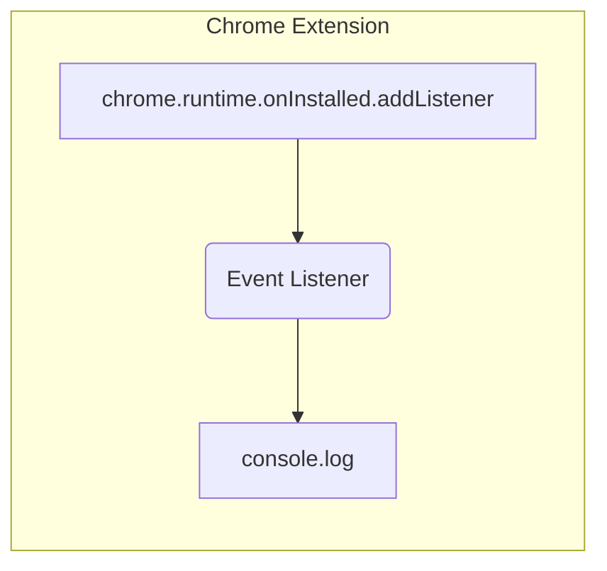

# Code Explanation

## <input code>

```javascript
chrome.runtime.onInstalled.addListener(() => {
    console.log('OpenAI Model Interface Extension Installed');
});
```

## <algorithm>

```mermaid
graph TD
    A[chrome.runtime.onInstalled.addListener] --> B{Event Triggered};
    B --> C[console.log('OpenAI Model Interface Extension Installed')];
    C --> D[Extension Installed];
```

* **Event Triggered**: The `chrome.runtime.onInstalled` listener is registered.  This listener is designed to be triggered when a Chrome extension is installed.
* **console.log**: This function logs a message to the browser's console.  In this case, it prints "OpenAI Model Interface Extension Installed" to the console.
* **Extension Installed**: The extension installation process is completed.


## <mermaid>



This Mermaid code represents a single function, `chrome.runtime.onInstalled.addListener`. This function acts as an event listener for the 'onInstalled' event associated with Chrome extensions.

Dependencies:  This code only depends on the `chrome.runtime` API, which is provided by the Chrome runtime environment and is not explicitly imported from a `src.` package.


## <explanation>

This JavaScript code defines a listener function that is triggered when the OpenAI Model Interface extension is installed in Chrome.

* **`chrome.runtime.onInstalled.addListener`**: This is a Chrome extension API function.  It registers a callback function (the function within the parentheses) to be executed when the extension is installed.  This is a standard way to perform actions when the extension's installation completes, such as initializing settings or performing setup.
* **`console.log('OpenAI Model Interface Extension Installed');`**: This line logs a message to the browser's developer console.  It's a useful way to verify that the extension has successfully installed and that the code is running as expected.

**Imports**: There are no explicit imports.  The code relies on the `chrome.runtime` API, which is part of the Chrome extension environment.

**Classes**: There are no classes in this code.

**Functions**:  The code has one listener function: `onInstalled`.

**Variables**: There are no variables declared in this code.

**Potential Errors or Improvements**:  No obvious errors exist, but this code could be improved by:

* **Conditional Logic (Advanced):** If the installation included more complex setups, you might add conditional checks within the listener.  For instance, if an option was to be set to a default value, then the code could update a storage object with that value instead of just logging.
* **Error Handling (Advanced):** Although not strictly necessary in this simple example, adding error handling to catch potential issues during installation could enhance robustness.

**Relationship with Other Project Parts**: This code likely exists within a larger Chrome extension project that may have other files/components (e.g., popup.js, content.js, etc.) for interacting with the user, making API calls, or handling data between the extension and the user's web page. This code snippet is a very basic initialization part of a more significant extension.