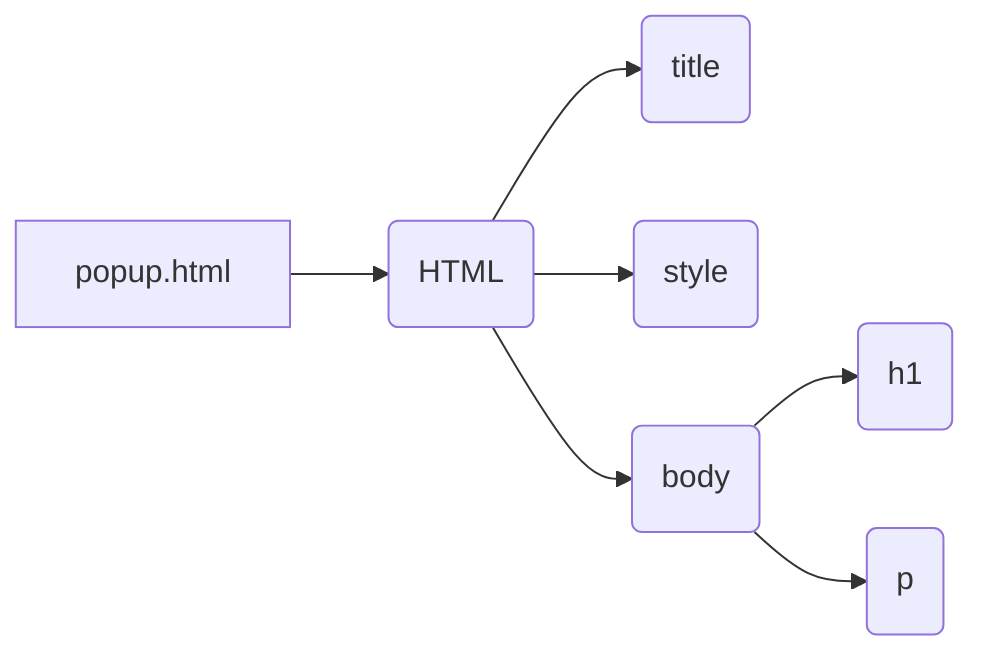

```MD
# Code Explanation for popup.html

## <input code>

```html
## \file hypotez/src/webdriver/chrome/extentions/test_extention/html/popup.html
# -*- coding: utf-8 -*-\


""" module: src.webdriver.chrome.extentions.test_extention.html """
MODE = 'debug'
<!-- popup.html -->

<!DOCTYPE html>
<html>
<head>
    <title>hypotez</title>
    <style>
        body {
            width: 200px;
            padding: 10px;
        }
    </style>
</head>
<body>
    <h1>hypotez</h1>
    <p>Click the extension icon to collect data from the current webpage.</p>
</body>
</html>
```

## <algorithm>

This code is a simple HTML file, defining the content of a Chrome extension popup.  There's no algorithm as such, in the traditional programming sense. It's a static webpage.

Data flow is not applicable as there's no dynamic processing of data.


## <mermaid>



**Dependencies:**

This HTML file doesn't import any external libraries or files.  It's a self-contained HTML document. The only implicit dependency is on the Chrome extension framework, which will handle loading and displaying this page.


## <explanation>

This file is an HTML document, used as a part of a Chrome extension.

* **Imports:** There are no imports in the traditional sense of Python or other programming languages. HTML doesn't rely on external libraries in the same way.
* **Classes:** No classes are defined in this HTML file. HTML utilizes a document structure, rather than OOP concepts.
* **Functions:** No functions are present, as it is a static webpage.
* **Variables:** The only variable is `MODE` which is set to `'debug'`.  Its purpose is likely for debugging within the extension's codebase and is not a part of the rendered HTML.
* **Explanation of the HTML:**
    * `<!DOCTYPE html>`:  Specifies the document type as HTML5.
    * `<html>`: Root element of the page.
    * `<head>`: Contains meta-information about the page.
        * `<title>hypotez</title>`: Sets the title that appears in the browser tab.
        * `<style>`: Contains CSS rules to style the page.
            * `body { width: 200px; padding: 10px; }`:  Styles the page's body with a fixed width and padding.
    * `<body>`: Contains the visible content of the page.
        * `<h1>hypotez</h1>`: Displays a heading.
        * `<p>Click the extension icon to collect data from the current webpage.</p>`: Provides instructions to the user.

**Relationship to other parts of the project:**

This `popup.html` file is likely part of a Chrome extension.  It will be triggered by actions within the extension's JavaScript code.  The JavaScript code in the extension likely handles the "click the extension icon" action, initiating communication with the web page to collect data and possibly updating the popup content.  The Python code that manages the extension could be a separate component, handling the background tasks.  There's an implied relationship with Javascript files that will manage user interaction and communications with the browser.

**Potential Errors/Improvements:**

* **Error:** There is no JavaScript logic or framework present in this HTML code. This alone isn't an error, but it's important to recognize this to fully understand the component's role within a Chrome extension. It would need Javascript to respond to user interactions (like clicking the icon).

* **Improvement:** Adding JavaScript in a separate `.js` file to handle events (like the click) would enhance the popup.  This is the typical structure for interactive browser extensions.
```