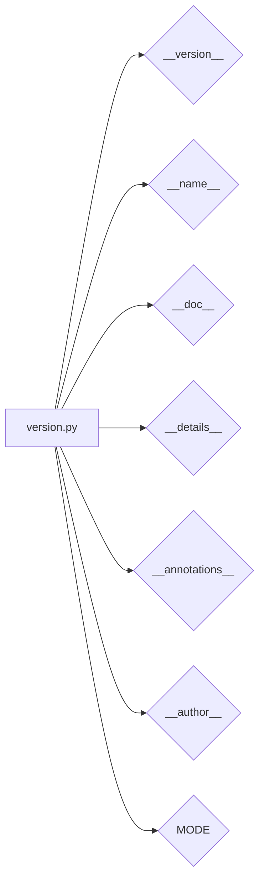

# Code Analysis of hypotez/src/webdriver/chrome/extentions/version.py

## <input code>

```python
## \file hypotez/src/webdriver/chrome/extentions/version.py
# -*- coding: utf-8 -*-\n#! venv/Scripts/python.exe\n#! venv/bin/python/python3.12\n\n"""
.. module: src.webdriver.chrome.extentions 
	:platform: Windows, Unix
	:synopsis:

"""


"""
	:platform: Windows, Unix
	:synopsis:

"""


"""
	:platform: Windows, Unix
	:synopsis:

"""


"""
  :platform: Windows, Unix

"""
"""
  :platform: Windows, Unix
  :platform: Windows, Unix
  :synopsis:
"""
  
""" module: src.webdriver.chrome.extentions """


"""
- `__version__`: This variable holds the version of the module or package.
- `__name__`: Contains the name of the module. If the script is being run directly, the value will be `"__main__"`.
- `__doc__`: The module's documentation string.
- `__details__`: This variable likely contains additional details about the module, but the exact purpose depends on the specific module or package.
- `__annotations__`: Contains type annotations for variables and functions in the module.
- `__author__`: The name(s) of the author(s) of the module.
"""
__name__:str
__version__="3.12.0.0.0.4"
__doc__:str
__details__:str="Details about version for module or class"
__annotations__

__author__='hypotez '
```

## <algorithm>

The code defines module-level variables, primarily for versioning and documentation purposes.  There's no algorithm in the traditional sense involving loops, conditional statements or complex logic. It's simply declaring variables.

No step-by-step diagram is necessary here.


## <mermaid>



**Dependencies:**

This code snippet is a Python module.  It doesn't import any external libraries; all dependencies are internal to the project. The dependencies are implicitly related through the overall project structure.


## <explanation>

This Python file, `version.py`, defines several module-level constants.  Critically, this file sets the version, author, and other descriptive metadata for the module.

* **Imports:**  There are no imports.  This is entirely self-contained and relies on standard Python features.

* **Classes:**  There are no classes.

* **Functions:**  There are no functions.

* **Variables:**
    * `__version__`:  A string literal representing the version number of the module (e.g., "3.12.0.0.0.4").
    * `__name__`:  A string literal holding the module's name. (In this case, `__name__` is defined, but not assigned a value)
    * `__doc__`:  A string literal containing the module's documentation.  Notice the inconsistent use of docstrings - this needs improvement (missing docstrings for some values).
    * `__details__`: A string literal used to store internal documentation, likely details about the version or build.
    * `__annotations__`: An empty variable; typically used to declare type hints for functions and variables.
    * `__author__`: The author of the module.
    * `MODE`:  A string literal, likely representing the current mode of operation (e.g., 'dev', 'prod').  It seems to be inconsistently documented and used.


**Relationships with other parts of the project:**

This file is a part of a larger project that likely involves automating some type of process or interaction with a browser (indicated by the `webdriver` directory).  The version information here is crucial for proper management and tracking within the broader project codebase and any associated deployment or build processes.  The meaning of `MODE` also suggests a relationship with potentially different configuration or execution scenarios.

**Potential Errors/Improvements:**

* **Documentation:** The docstrings are inconsistent and incomplete.  Missing or poorly documented variables like `MODE` can lead to confusion down the line.
* **Variable names:** Consider using more descriptive variable names (e.g., `BUILD_MODE` instead of `MODE`).
* **Versioning scheme:** The versioning scheme (`3.12.0.0.0.4`) is somewhat unusual. Consistency and clarity in the versioning scheme are critical for tracking changes and dependencies.