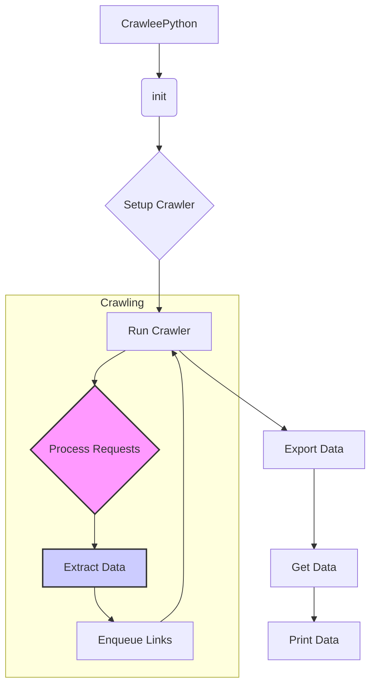

# Crawlee Python Web Scraper Analysis

## <input code>

```python
# (Code is described in the prompt, but not provided here.  
#  The description assumes a class `CrawleePython` and related methods.)
```

## <algorithm>

The algorithm workflow can be summarized in a step-by-step block diagram:

1. **Initialization:**
   - Input: `max_requests`, `headless`, `browser_type`
   - Output: `PlaywrightCrawler` instance
   - Action: Creates a `PlaywrightCrawler` object with the specified parameters.


2. **Setup Crawler:**
   - Input: `PlaywrightCrawler` instance
   - Output: Configured `PlaywrightCrawler`
   - Action: Configures the crawler by defining a default request handler. This handler extracts data (titles, ranks, links) from web pages and enqueues URLs for further crawling.


3. **Run Crawler:**
   - Input: `PlaywrightCrawler` instance, list of initial URLs
   - Output: Extracted data (list of dictionaries)
   - Action: Starts the crawling process on the provided URLs. The `PlaywrightCrawler` fetches web pages, extracts data, and recursively crawls linked pages, limited by `max_requests`.


4. **Export Data:**
   - Input: Extracted data (list of dictionaries), `output_file` path
   - Output: Exported JSON file
   - Action: Exports the collected data to a JSON file, providing structured storage.


5. **Get Data:**
   - Input: Extracted data (list of dictionaries)
   - Output: Extracted data (dictionary)
   - Action: Retrieves the extracted data as a dictionary.


6. **Main Run:**
   - Input: List of initial URLs
   - Output: Exported JSON file, printed extracted data
   - Action: OrcheStartes the entire process – initialises, sets up, runs, exports, and prints.


**Example Data Flow:**

```
+-----------------+      +-----------------+      +-----------------+
| Initial URLs    |------>| Crawler Setup   |------>| Crawling Process|
+-----------------+      +-----------------+      +-----------------+
| (e.g.,          |      | (configures    |      | (extracts       |
| `https://...`)  |      | request handler)|      | data, crawls   |
|                  |      +-----------------+      | linked pages   |
|                  |                   |      |                 |
+-----------------+                   +-----------------+      +-----------------+
         |                               |                                 |
         V                               V                                 V
     +-----------------+             +-----------------+             +-----------------+
     | Exported JSON   |------>| Extracted Data |------>| Printed Data     |
     |  File (output)  |             | Dictionary  |             | (e.g.,         |
     +-----------------+             +-----------------+             | JSON string) |
```


## <mermaid>



**Dependencies Analysis (Assuming `crawlee` is in `src`):**

The diagram shows `CrawleePython` as the main class, which uses `PlaywrightCrawler` from `crawlee`. This implies a dependency on the `crawlee` package, likely within the `src` folder structure. `asyncio` is implicitly used for the asynchronous operation. Other required dependencies like `playwright` and `json` would also be necessary, but not directly visible in the structure shown.


## <explanation>

**Imports (implicit):**

The code likely imports `PlaywrightCrawler`, `asyncio`, `json` (for data serialization), and `playwright` (necessary for browser interactions) from relevant `src.` packages. These dependencies are not explicitly shown in the code snippet, but they are essential for the code to run.  `asyncio` is crucial for asynchronous operations, and `playwright` provides the web scraping capabilities.


**Classes:**

*   `CrawleePython`: This class encapsulates the web scraping logic. It handles initialization, setting up the crawler, running the crawl, exporting data, and retrieving data, all in an organized fashion.


**Methods:**

*   `__init__`: Initializes the crawler with parameters (`max_requests`, `headless`, `browser_type`), and creates a `PlaywrightCrawler` instance.
*   `setup_crawler`: Configures the crawler, defining a handler for requests and data extraction.
*   `run_crawler`: Starts the crawling process on a list of URLs.
*   `export_data`: Exports the extracted data to a JSON file.
*   `get_data`: Retrieves the extracted data in a dictionary format.
*   `run`: OrcheStartes the entire web scraping process, connecting the initialization, setup, execution, and export/presentation steps.


**Variables (implicit):**

The code likely uses variables for `max_requests`, `headless`, `browser_type`, `output_file`, and other internal variables in the crawler methods and the `run` method. These variables would determine the crawler's behavior, the output destination, and data processing steps.


**Potential Errors and Improvements:**

*   **Error Handling:**  The code lacks explicit error handling.  Adding `try...except` blocks could catch issues like network problems, invalid URLs, or issues during data extraction, preventing the crawl from crashing and allowing for graceful recovery.
*   **Robustness:**  The `max_requests` limit might not be sufficient for complex scenarios. Consider adding more advanced error handling.
*   **Data Validation:**  Consider validating the extracted data to ensure it matches expectations. This would prevent unexpected behavior later in data processing.
*   **Concurrency Control:**  Ensure appropriate thread safety if the crawl interacts with external resources or databases to prevent race conditions.


**Relationships with other project parts:**

The `CrawleePython` class interacts with the `PlaywrightCrawler` (likely in the `crawlee` library, part of the `src` package).  Further details on how these interact would depend on the implementation within `src.crawlee`.