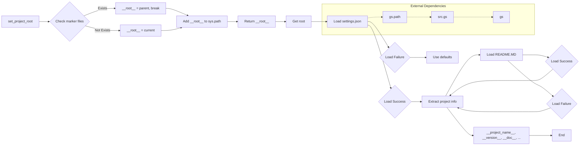

# Code Explanation for hypotez/src/webdriver/crawlee_python/header.py

## <input code>

```python
## \file hypotez/src/webdriver/crawlee_python/header.py
# -*- coding: utf-8 -*-
#! venv/Scripts/python.exe
#! venv/bin/python/python3.12

"""
.. module: src.webdriver.crawlee_python 
	:platform: Windows, Unix
	:synopsis:

"""
MODE = 'dev'


import sys
import json
from packaging.version import Version

from pathlib import Path
def set_project_root(marker_files=('__root__')) -> Path:
    """
    Finds the root directory of the project starting from the current file's directory,
    searching upwards and stopping at the first directory containing any of the marker files.

    Args:
        marker_files (tuple): Filenames or directory names to identify the project root.
    
    Returns:
        Path: Path to the root directory if found, otherwise the directory where the script is located.
    """
    __root__:Path
    current_path:Path = Path(__file__).resolve().parent
    __root__ = current_path
    for parent in [current_path] + list(current_path.parents):
        if any((parent / marker).exists() for marker in marker_files):
            __root__ = parent
            break
    if __root__ not in sys.path:
        sys.path.insert(0, str(__root__))
    return __root__


# Get the root directory of the project
__root__ = set_project_root()
"""__root__ (Path): Path to the root directory of the project"""


from src import gs

settings:dict = None
try:
    with open(gs.path.root / 'src' / 'settings.json', 'r') as settings_file:
        settings = json.load(settings_file)
except (FileNotFoundError, json.JSONDecodeError):
    ...

doc_str:str = None
try:
    with open(gs.path.root / 'src' / 'README.MD', 'r') as settings_file:
        doc_str = settings_file.read()
except (FileNotFoundError, json.JSONDecodeError):
    ...


__project_name__ = settings.get("project_name", 'hypotez') if settings  else 'hypotez'
__version__: str = settings.get("version", '')  if settings  else ''
__doc__: str = doc_str if doc_str else ''
__details__: str = ''
__author__: str = settings.get("author", '')  if settings else ''
__copyright__: str = settings.get("copyrihgnt", '')  if settings else ''
__cofee__: str = settings.get("cofee", "Treat the developer to a cup of coffee for boosting enthusiasm in development: https://boosty.to/hypo69")  if settings else "Treat the developer to a cup of coffee for boosting enthusiasm in development: https://boosty.to/hypo69"
```

## <algorithm>

1. **`set_project_root` Function:**
   - Takes a tuple of marker files as input.
   - Starts at the current file's directory.
   - Iterates up the directory tree (current directory and its parents).
   - Checks if any of the marker files exist in the current directory.
   - If found, sets `__root__` to the parent directory and breaks the loop.
   - If not found after all, `__root__` remains the original file's location.
   - Adds the project root to `sys.path` if it's not already present.
   - Returns the `__root__` Path object.

   **Example:** If `__file__` points to `/project/webdriver/crawlee_python/header.py`, and `pyproject.toml` exists in `/project`, `__root__` will be `/project` after calling the function.

2. **Project Root Determination:** Calls `set_project_root` to get the root directory of the project.

3. **Settings Loading:**
   - Attempts to load settings from `gs.path.root / 'src' / 'settings.json'`.
   - Handles `FileNotFoundError` and `json.JSONDecodeError` gracefully.

4. **Documentation Loading:**
   - Attempts to load documentation from `gs.path.root / 'src' / 'README.MD'`.
   - Handles `FileNotFoundError` and `json.JSONDecodeError` gracefully.

5. **Project Information Extraction:**
   - Extracts `__project_name__`, `__version__`, `__doc__`, `__author__`, `__copyright__`, `__cofee__` from the `settings` dictionary or defaults if not present.

## <mermaid>



**Dependencies Analysis:**

- `sys`: Built-in module for interacting with the Python runtime environment.
- `json`: Standard library for working with JSON data.
- `packaging.version`: For handling and comparing software version numbers.
- `pathlib`: For working with file paths in a more object-oriented way.
- `src.gs`: Assumed to be a custom module or package within the project.  The diagram shows a dependency between it and `gs.path`, likely a class or a function in `gs` that provides path manipulation.


## <explanation>

- **Imports**: `sys`, `json`, `Version` from `packaging.version`, and `Path` from `pathlib`. `gs` is imported from the `src` package, implying it's a part of the project's internal libraries. `gs`'s path module (potentially an attribute of a `gs` class) is likely used to obtain file system paths.

- **Classes**: There are no classes defined in this file.

- **Functions**: `set_project_root`: Finds the project root directory by checking for specific marker files (like `pyproject.toml`) in parent directories starting from the current file's location. This is crucial for ensuring that the correct paths are used when importing other modules within the project.

- **Variables**:
    - `MODE`: A string that likely controls different operation modes.
    - `__root__`: The determined project root directory (a `Path` object).
    - `settings`: A dictionary containing project settings loaded from `settings.json`.
    - `doc_str`: A string containing the project's documentation (from `README.MD`).
    - `__project_name__`, `__version__`, etc.:  Variables storing project information extracted from `settings`.


- **Potential Errors/Improvements**:
    - Error handling is present for loading `settings.json` and `README.MD`.  However, more specific error messages might be helpful for debugging.
    - The use of `...` in the exception blocks might not provide sufficient error context during development.  Consider logging or raising more informative exceptions.
    - The `__root__` is added to `sys.path` which can be useful. However, care must be taken not to create a circular import or other issues from having multiple directories loaded on the path.


**Relationship Chain**:

This script establishes the project root and loads essential data (settings, documentation) to initialize the project.  It depends on the `gs` package to provide paths and likely other utility functions (`gs.path` in this case). Other parts of the `src` package would rely on this information to function correctly. Thus, the dependency chain is essential for initializing the project environment and providing a reliable source of information for other components to use.