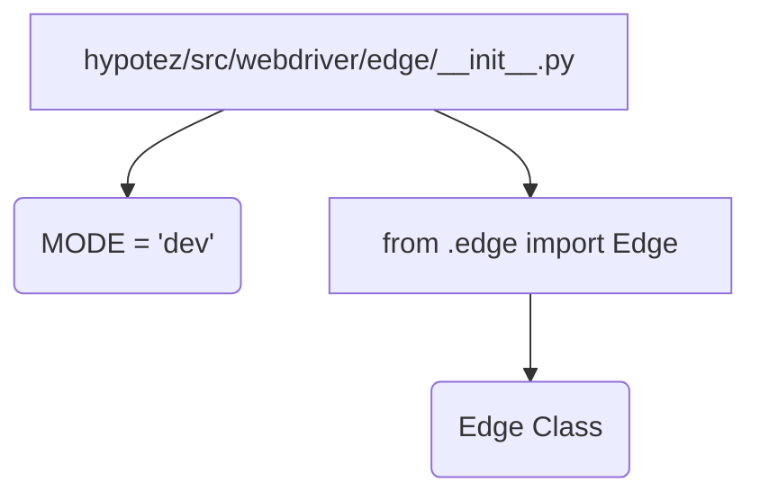

```MD
# Code Explanation for hypotez/src/webdriver/edge/__init__.py

## <input code>

```python
## \file hypotez/src/webdriver/edge/__init__.py
# -*- coding: utf-8 -*-\
#! venv/Scripts/python.exe
#! venv/bin/python/python3.12

"""
.. module: src.webdriver.edge 
	:platform: Windows, Unix
	:synopsis:

"""
MODE = 'dev'

from .edge import Edge
```

## <algorithm>

This file appears to be an initialization module for a package related to interacting with Microsoft Edge web browser using a webdriver. The main action is importing a class named `Edge` from another module (`./edge`).

**Step-by-step Workflow (Block Diagram):**

1. **Initialization:** The file initializes a global variable `MODE` with the string value 'dev'. This likely signifies a development mode.
2. **Import:** The code imports the `Edge` class from a submodule named `edge`.

**Data Flow:**

No explicit data flow is depicted in this init file, as it primarily handles module imports and initialization of a variable.

**Example:**

```python
# Example usage (outside this init file)
from hypotez.src.webdriver.edge import Edge
# ... further code using the Edge class
```


## <mermaid>



**Dependency Analysis:**

The mermaid diagram shows a simple dependency relationship. `hypotez/src/webdriver/edge/__init__.py` directly imports `Edge` class from `./edge` module, implying `./edge` module (which is likely to have `Edge` class definition) should reside in the same directory as this `__init__.py` file.


## <explanation>

### Imports:

- `from .edge import Edge`: This imports the `Edge` class from the module named `edge` located within the same directory as the current file. This is a standard Python import mechanism for modules in the same package, denoted by the `.`. This import is crucial for using the `Edge` class in this package.  The `__init__.py` file is essential for Python to recognize the directory as a package.


### Classes:

- `Edge`: This class, defined in the `hypotez/src/webdriver/edge/edge.py` module, likely represents an object for interacting with the Microsoft Edge web browser.  Crucially, this `__init__.py` module does not define any class or function, but instead provides an entry point to the functionality defined in other modules of the `edge` subpackage.


### Functions:

No functions are defined in this `__init__.py`.


### Variables:

- `MODE = 'dev'`: This global variable stores a string ('dev'). It is likely used for configuring the behaviour or settings of the `Edge` class or the related functions in the `edge` module.   


### Potential Errors or Improvements:

- **Missing documentation:** The docstrings (the `"""..."""` blocks) are not very descriptive. They don't explain the specific purpose of the `MODE` variable or the `Edge` class.  Adding more detailed documentation would improve maintainability and understanding.
- **Error handling:** The code lacks error handling.  Adding `try...except` blocks around the import could prevent the script from crashing if the `edge.py` module isn't found or if an error occurs during class initialization.
- **Import path:**  The use of `#! venv/Scripts/python.exe` and `#! venv/bin/python/python3.12` at the top of the file is unusual.  These are likely shebang lines for specifying the interpreter, but typically it's enough to have just the `#!/usr/bin/env python3` line for modern setups, and these specific references might be platform-specific, or due to a specific project setup (a virtual environment).


### Relationships to Other Parts of the Project:

This file serves as an entry point for interacting with Microsoft Edge webdriver functionalities from the `hypotez` project. The `Edge` class (in `edge.py`) would likely interact with browser drivers, handling actions like opening browsers, navigating to URLs, and executing commands.  This `__init__.py` file likely sits within a larger package structure (e.g. `hypotez/src/webdriver`), which may define other webdriver classes for other browsers (Chrome, Firefox, etc.).
```