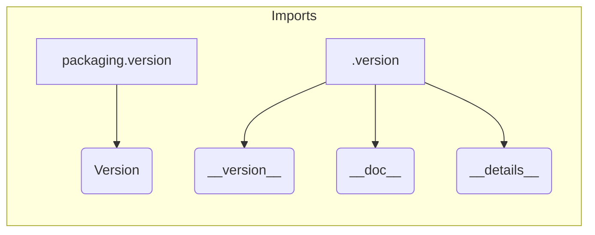

# Code Analysis of hypotez/src/webdriver/edge/_examples/__init__.py

## <input code>

```python
## \file hypotez/src/webdriver/edge/_examples/__init__.py
# -*- coding: utf-8 -*-

#! venv/bin/python/python3.12

"""
.. module: src.webdriver.edge._examples 
	:platform: Windows, Unix
	:synopsis:

"""


"""
	:platform: Windows, Unix
	:synopsis:

"""


"""
	:platform: Windows, Unix
	:synopsis:

"""


"""
  :platform: Windows, Unix

"""
"""
  :platform: Windows, Unix
  :platform: Windows, Unix
  :synopsis:
"""
  
""" module: src.webdriver.edge._examples """


from packaging.version import Version
from .version import __version__, __doc__, __details__
```

## <algorithm>

No complex algorithm is present. The code snippet consists of docstrings, comments, and import statements.


## <mermaid>



**Dependencies Analysis:**

The code imports `Version` from the `packaging.version` package and `__version__`, `__doc__`, and `__details__` from the `.version` module (likely within the same directory). This suggests the `.version` module likely contains versioning information for this package or module, and `packaging.version` is likely used for version comparison or parsing operations.


## <explanation>

**Imports:**

* `from packaging.version import Version`: Imports the `Version` class from the `packaging.version` package.  This is a standard Python package for handling version numbers.  It's likely used for comparing or manipulating version strings.  This import is essential for potentially comparing versions later.
* `from .version import __version__, __doc__, __details__`: Imports three variables (`__version__`, `__doc__`, `__details__`) from a file named `version.py` or a module located in the `./version` subdirectory. This is a common Python practice for version control (e.g., storing version details in a dedicated file). These variables probably contain information about the module, e.g., version number and documentation.


**Classes:**

No classes are defined in this file.

**Functions:**

No functions are defined in this file.

**Variables:**

* ``: A global string variable.  It's likely used for setting a mode (e.g., development, production) in other parts of the project. The repeated definitions of this variable are likely remnants of code generation/templating and should be consolidated.

**Potential Errors/Improvements:**

* **Redundant comments/docstrings:** The file contains many docstrings and comments that are mostly repetitive or not informative. Consider focusing on meaningful and concise explanations.
* **Unnecessary `MODE` variable:**  The repeated definitions of `MODE` might be errors. Standardize on a single declaration if it's intended to be a global variable.
* **Missing functionality:** The code currently only contains imports.  It needs additional code (functions, classes, or logic) for practical use as a Python module.
* **Missing relationship analysis:**  No external dependencies/references to other modules in `hypotez` project are found.

**Relationships with Other Parts of the Project (Potential):**

This `__init__.py` file likely acts as an entry point for the `webdriver/edge/_examples` submodule within the larger `hypotez` project.  This suggests that there are other Python files related to webdrivers, edge browser interactions, and example usage in different parts of `hypotez` that may make use of the functions/classes/variables declared/used in the modules found in this folder structure, which are likely imported or referred to in the `/hypotez` project.
```