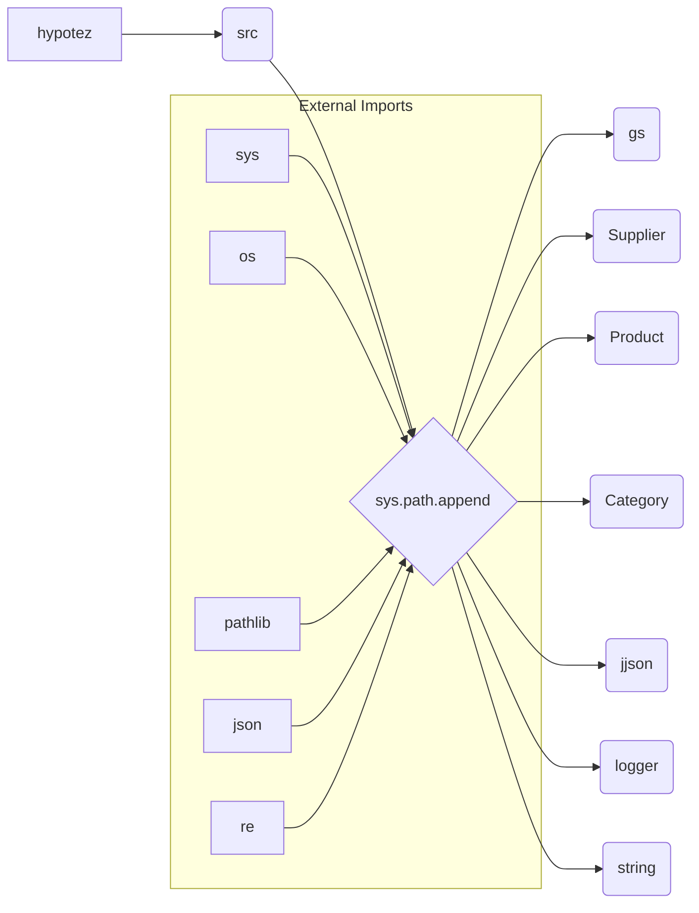

# Code Explanation for hypotez/src/webdriver/edge/_examples/header.py

## <input code>

```python
## \file hypotez/src/webdriver/edge/_examples/header.py
# -*- coding: utf-8 -*-

#! venv/bin/python/python3.12

"""
.. module: src.webdriver.edge._examples 
	:platform: Windows, Unix
	:synopsis:

"""


"""
	:platform: Windows, Unix
	:synopsis:

"""


"""
	:platform: Windows, Unix
	:synopsis:

"""


"""
  :platform: Windows, Unix

"""
"""
  :platform: Windows, Unix
  :platform: Windows, Unix
  :synopsis:
"""
  
""" module: src.webdriver.edge._examples """


import sys
import os
from pathlib import Path

dir_root : Path = Path (os.getcwd()[:os.getcwd().rfind('hypotez')+11])
sys.path.append (str (dir_root) )  # Добавляю корневую папку в sys.path
dir_src = Path (dir_root, 'src')
sys.path.append (str (dir_root) ) 
...

print(dir_root)
# ----------------
from pathlib import Path
import json
import re
# ----------------

from src import gs
from src.suppliers import Supplier
from src.product import Product, ProductFields, ProductFieldsLocators
from src.category import Category
from src.utils.jjson import j_dumps, j_loads,   pprint, save_text_file
from src.logger import logger
from src.utils.string import StringFormatter, StringNormalizer, ProductFieldsValidator
...
```

## <algorithm>

No clear algorithm or workflow can be described from this header file. It's a collection of imports and variable declarations. The primary logic is external to this file, presumably in other Python files.


## <mermaid>



**Explanation of Dependencies:**

* **`sys`**: Provides access to system-specific parameters and functions, crucial for modifying the Python runtime environment, including `sys.path`.
* **`os`**: Offers interactions with the operating system, like retrieving the current working directory (`getcwd`).
* **`pathlib`**: Allows working with file paths in an object-oriented way, simplifying path manipulation.
* **`json`**: For handling JSON data.
* **`re`**: For regular expression operations.
* **`src.*`**:  These are likely modules or packages within the `hypotez` project.  Import statements indicate a dependency on custom components: `gs`, `Supplier`, `Product`, `Category`, `jjson`, `logger`, and `string` modules/packages.  The `src` folder presumably contains related code.

## <explanation>

* **Imports**:
    * `sys`, `os`, `pathlib`: Standard Python libraries for system interaction and path management.
    * `json`, `re`: Standard Python libraries for JSON handling and regular expressions.
    * `gs`, `Supplier`, `Product`, `ProductFields`, `ProductFieldsLocators`, `Category`: Likely custom modules/classes related to data handling (e.g., accessing data sources, defining data structures), probably part of a larger data processing or e-commerce project.
    * `j_dumps`, `j_loads`, `pprint`, `save_text_file`: Functions for JSON encoding/decoding, pretty printing, and saving text files. Part of a `src.utils.jjson` package likely used for serialization and data output.
    * `logger`: A custom logging module, used for recording events and debugging messages.
    * `StringFormatter`, `StringNormalizer`, `ProductFieldsValidator`: Classes or functions for string manipulation, normalization, and validation, part of a `src.utils.string` package.


* **Variables:**
    * `MODE`: A string variable likely specifying a mode of operation (e.g., 'dev', 'prod').
    * `dir_root`, `dir_src`:  `Path` objects representing the root directory of the project and the `src` folder, respectively.  The code dynamically modifies `sys.path` to add these paths, allowing the script to import modules within its project structure. This is a common technique for Python projects with module dependencies.


* **Potential Errors/Improvements:**
    * The `sys.path.append` calls for `dir_root` are redundant. Only one call should be enough.
    * The `...` indicate that the code is incomplete.  The meaning and behavior of the code depends on what comes after these `...` sections. Without the full code, it's impossible to give a precise analysis.
    * The comments are extensive but repetitive and not very helpful for understanding the code's functionality.  Improve the comments with specifics about the program's flow and purpose.

* **Relationship with Other Parts:**
The code clearly establishes dependencies on the `src` package and subpackages like `utils`, `suppliers`, `product`, etc. This indicates a larger project architecture where different parts of the program interact through well-defined interfaces (modules and classes).