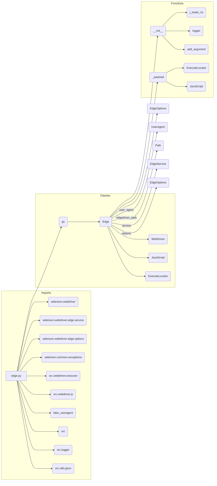

# Code Explanation for hypotez/src/webdriver/edge/edge.py

## <input code>

```python
# -*- coding: utf-8 -*-\n\n#! venv/bin/python/python3.12\n\n"""\n.. module:: src.webdriver.edge\n   :platform: Windows, Unix\n   :synopsis: Custom Edge WebDriver class with simplified configuration using fake_useragent.\n\n"""\n\nMODE = \'dev\'\n\nimport os\nfrom pathlib import Path\nfrom typing import Optional, List\nfrom selenium.webdriver import Edge as WebDriver\nfrom selenium.webdriver.edge.service import Service as EdgeService\nfrom selenium.webdriver.edge.options import Options as EdgeOptions\nfrom selenium.common.exceptions import WebDriverException\nfrom src.webdriver.executor import ExecuteLocator\nfrom src.webdriver.js import JavaScript\nfrom fake_useragent import UserAgent\nfrom src import gs\nfrom src.logger import logger\nfrom src.utils.jjson import j_loads_ns\n\n\nclass Edge(WebDriver):\n    """\n    Custom Edge WebDriver class for enhanced functionality.\n\n    Attributes:\n        driver_name (str): Name of the WebDriver used, defaults to \'edge\'.\n    """\n    driver_name: str = \'edge\'\n\n    def __init__(self, user_agent: Optional[dict] = None, *args, **kwargs) -> None:\n        """\n        Initializes the Edge WebDriver with the specified user agent and options.\n\n        :param user_agent: Dictionary to specify the user agent. If `None`, a random user agent is generated.\n        """\n        self.user_agent = user_agent or UserAgent().random\n        settings = j_loads_ns(Path(gs.path.src / \'webdriver\' / \'edge\' / \'edge.json\'))\n\n        options = EdgeOptions()\n        options.add_argument(f\'user-agent={self.user_agent}\')\n\n        try:\n            logger.info(\'Starting Edge WebDriver\')\n            edgedriver_path = settings.executable_path.default  # Ensure this is correctly defined in your JSON file\n            service = EdgeService(executable_path=str(edgedriver_path))\n            super().__init__(options=options, service=service)\n            self._payload()\n        except WebDriverException as ex:\n            logger.critical(\'Edge WebDriver failed to start:\', ex)\n            ...\n            return\n        except Exception as ex:\n            logger.critical(\'Edge WebDriver crashed. General error:\', ex)\n            ...\n            return\n\n    def _payload(self) -> None:\n        """\n        Load executors for locators and JavaScript scenarios.\n        """\n        ...\n        j = JavaScript(self)\n        self.get_page_lang = j.get_page_lang\n        self.ready_state = j.ready_state\n        self.get_referrer = j.ready_state\n        self.unhide_DOM_element = j.unhide_DOM_element\n        self.window_focus = j.window_focus\n\n        execute_locator = ExecuteLocator(self)\n        self.execute_locator = execute_locator.execute_locator\n        self.get_webelement_as_screenshot = execute_locator.get_webelement_as_screenshot\n        self.get_webelement_by_locator = execute_locator.get_webelement_by_locator\n        self.get_attribute_by_locator = execute_locator.get_attribute_by_locator\n        self.send_message = self.send_key_to_webelement = execute_locator.send_message\n\n    def set_options(self, opts: Optional[List[str]] = None) -> EdgeOptions:  \n        """  \n        Create and configure launch options for the Edge WebDriver.  \n\n        :param opts: A list of options to add to the Edge WebDriver. Defaults to `None`.  \n        :return: Configured `EdgeOptions` object.  \n        """  \n        options = EdgeOptions()  \n        if opts:  \n            for opt in opts:  \n                options.add_argument(opt)  \n        return options  \n```

## <algorithm>

```mermaid
graph TD
    A[Initialize Edge] --> B{Get User Agent};
    B -- Random/Provided --> C[Load Settings];
    C --> D[Create Edge Options];
    D --> E[Add User Agent];
    E --> F[Start Edge WebDriver];
    F --> G[Payload Initialization];
    G --> H[Create JavaScript Object];
    H --> I[Bind JavaScript Methods];
    I --> J[Create ExecuteLocator Object];
    J --> K[Bind ExecuteLocator Methods];
    F -- Success --> L[WebDriver Initialized];
    F -- Failure --> M[Log Error & Exit];
    L --> N[Method Calls];
    
    subgraph  "Payload Initialization"
        G --> H;
    end
    
    subgraph  "Bind JavaScript Methods"
        H --> I;
        I -->  self.get_page_lang
        I --> self.ready_state
        I --> self.get_referrer
        I --> self.unhide_DOM_element
        I --> self.window_focus
    end
    subgraph  "Bind ExecuteLocator Methods"
       J --> K;
       K --> self.execute_locator
       K --> self.get_webelement_as_screenshot
       K --> self.get_webelement_by_locator
       K --> self.get_attribute_by_locator
       K --> self.send_message (send_key_to_webelement)

    end

```
*   **Initialize Edge**: The `__init__` method starts by getting a user agent (either random or provided).
*   **Get User Agent**:  The code retrieves a user-agent string from `fake_useragent` or uses the provided one.
*   **Load Settings**: It loads settings from the `edge.json` file using `j_loads_ns`.
*   **Create Edge Options**: It initializes `EdgeOptions` to configure the webdriver.
*   **Add User Agent**: The `user-agent` is added to the options.
*   **Start Edge WebDriver**: An attempt is made to start the Edge WebDriver.  The `edgedriver_path` is loaded from the `settings.json`.  If unsuccessful, errors are logged.
*   **Payload Initialization**:  The WebDriver is initialized, and the `_payload` method is called.
*   **Create JavaScript Object**: A `JavaScript` object is created to interact with the page.
*   **Bind JavaScript Methods**: Methods from the `JavaScript` object are bound to the `Edge` class for easier access.
*   **Create ExecuteLocator Object**: An `ExecuteLocator` object is instantiated.
*   **Bind ExecuteLocator Methods**: Methods from the `ExecuteLocator` object are bound to the `Edge` class.
*   **Method Calls**: The `Edge` object can now use these bound methods to execute various tasks on the webpage.

## <mermaid>



## <explanation>

### Imports:

*   `selenium.webdriver`:  Provides the core WebDriver functionality.
*   `selenium.webdriver.edge.service`: Contains classes for managing the Edge WebDriver service.
*   `selenium.webdriver.edge.options`:  Offers classes for configuring Edge WebDriver options.
*   `selenium.common.exceptions`:  Handles WebDriver exceptions, crucial for robust error handling.
*   `src.webdriver.executor`:  Contains the `ExecuteLocator` class, likely for web element manipulation.
*   `src.webdriver.js`:  Likely contains classes for interacting with the browser through JavaScript.
*   `fake_useragent`: Used to generate a random user agent, enhancing web scraping resistance.
*   `src`:  A package likely containing shared project utilities.
*   `gs`:  A variable or function from the `src` module that likely manages paths.
*   `src.logger`: Logging module, likely providing formatted output.
*   `src.utils.jjson`:  Handles JSON loading and parsing.  It's important for working with configurations.

### Classes:

*   `Edge`: A custom class extending `selenium.webdriver.Edge`.  This class handles Edge WebDriver initialization and offers methods for interacting with the browser.
*   `JavaScript`: This class likely contains methods for executing JavaScript code within the Edge WebDriver session.
*   `ExecuteLocator`:  Implements methods for locating and interacting with web elements.
*   `EdgeOptions`:  Handles options related to the Edge browser.

### Functions:

*   `__init__`: Initializes the `Edge` object. Takes an optional `user_agent` (dict), and other arguments (`*args`, `**kwargs`) for customization. It sets up the WebDriver, initializes related objects (JavaScript, ExecuteLocator), and logs startup. Importantly, it loads settings from a JSON file (`edge.json`).  Potential Error: The code relies on `settings.executable_path.default`.  This assumes a specific structure in the JSON file, which should be thoroughly documented.
*   `_payload`: Loads essential functions for interacting with the browser through JavaScript and locators from the `ExecuteLocator`. This method ensures initialization of necessary classes and their associated methods for browser interaction.
*   `set_options`: Creates and configures Edge browser options. Accepts a list of strings (`opts`) for custom options and returns the configured `EdgeOptions` object.

### Variables:

*   `MODE`: A global variable (string).  Likely for deployment configurations, such as 'dev' or 'prod'.
*   `user_agent`: Stores the user-agent string (string).  Used to imitate different browsers.
*   `settings`: Holds the parsed JSON configuration data (object). Critical for dynamic behavior.

### Potential Errors & Improvements:

1.  **Error Handling**: While the code includes `try...except` blocks, the `...` in the `except` clauses should be replaced with specific exception handling logic, such as logging the error and exiting gracefully, preventing program crash.  More informative exception details could be provided.
2.  **JSON Validation**:  The code assumes the `edge.json` file has a specific structure. Add validation to ensure the required `executable_path` field exists and is correctly formatted within the `settings` object.
3.  **Clearer Naming**: Using more descriptive variable names (e.g., `edgedriver_path` instead of just `edgedriver_path`) can improve code readability.


### Relationship with other parts of the project:

The code depends on modules in the `src` package, indicating that it's part of a larger project.   `gs` is likely a utility function or class used to locate file paths in the project.  `logger` is likely a central logging mechanism used throughout the project. This structured relationship is important for understanding the code's integration into the overall project design.