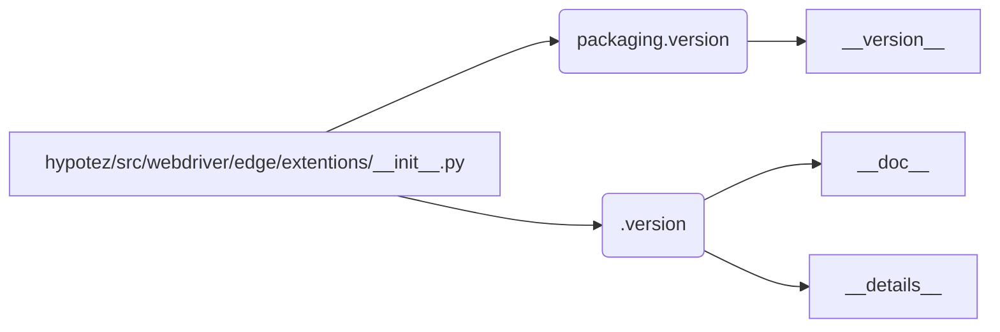

# Code Explanation for hypotez/src/webdriver/edge/extentions/__init__.py

## <input code>

```python
## \file hypotez/src/webdriver/edge/extentions/__init__.py
# -*- coding: utf-8 -*-\
#! venv/Scripts/python.exe
#! venv/bin/python/python3.12

"""
.. module: src.webdriver.edge.extentions 
	:platform: Windows, Unix
	:synopsis:

"""
MODE = 'dev'

"""
	:platform: Windows, Unix
	:synopsis:

"""


"""
	:platform: Windows, Unix
	:synopsis:

"""


"""
  :platform: Windows, Unix

"""
"""
  :platform: Windows, Unix
  :platform: Windows, Unix
  :synopsis:
"""MODE = 'dev'
  
""" module: src.webdriver.edge.extentions """


from packaging.version import Version
from .version import __version__, __doc__, __details__
```

## <algorithm>

The algorithm is very simple. This file initializes a module for extensions. It only imports necessary functionality from the `packaging.version` and `./version` modules.  There is no complex step-by-step logic here.  No data flow diagram is needed.

## <mermaid>



**Dependency Analysis and Explanation:**

*   **packaging.version**: This is an external library for handling software versions. It's used to import specific version handling functions, suggesting the code might involve version-checking.
*   **.version**: This is likely a module (`version.py`) within the same package (`src.webdriver.edge.extentions`). It contains information about the extension's version, documentation, and potentially details about the extension itself. The import of `__version__`, `__doc__`, and `__details__` indicates that this file potentially defines these variables to provide information about the extension.

## <explanation>

*   **Imports**:
    *   `from packaging.version import Version`: Imports the `Version` class from the `packaging.version` package.  This suggests the code might be dealing with version numbers and comparisons. The `packaging` library is commonly used for consistent package version handling, allowing for comparisons and checks related to software versions. This import is critical for the intended task in the file.
    *   `from .version import __version__, __doc__, __details__`: Imports `__version__`, `__doc__`, and `__details__` from the local `version.py` file.  This is common Python practice to define module-level metadata for the extension. This implicitly refers to the `__version__`, `__doc__`, and `__details__` module-level variables within a `.py` module.

*   **Classes**: There are no classes defined in this file.

*   **Functions**: There are no functions defined in this file.

*   **Variables**:
    *   `MODE = 'dev'`: A string variable likely used to indicate the current mode (e.g., development mode, production mode).  A very basic variable, but important for potential different implementation/configurations within the extension.

*   **Potential Errors/Improvements**:
    *   The file contains a lot of empty docstrings.  This might be a placeholder or intentional, to support the extension's future structure.
    *   The `MODE` variable could benefit from being documented better.  The intended purpose of having a variable named `MODE` is not entirely clear from the code itself. A more descriptive name and a proper documentation explaining its usage would be helpful to maintainers or future developers working on this code.

*   **Relationships with Other Parts**: The code imports from a `version.py` module which is expected to exist in the same directory structure (`src.webdriver.edge.extentions`). This establishes a clear relationship, with `__init__.py` acting as a module initializer for the extension related code.  It depends on the `version.py` module for version information; without the `version.py` module, there would be an import error when executing the `__init__.py` file.


```