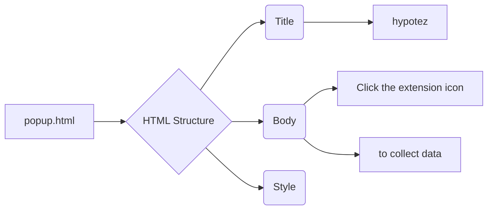

# Code Explanation for popup.html

## <input code>

```html
## \file hypotez/src/webdriver/edge/extentions/test_extention/html/popup.html
# -*- coding: utf-8 -*-\n\n\n""" module: src.webdriver.edge.extentions.test_extention.html """\nMODE = 'debug'\n<!-- popup.html -->\n\n<!DOCTYPE html>\n<html>\n<head>\n    <title>hypotez</title>\n    <style>\n        body {\n            width: 200px;\n            padding: 10px;\n        }\n    </style>\n</head>\n<body>\n    <h1>hypotez</h1>\n    <p>Click the extension icon to collect data from the current webpage.</p>\n</body>\n</html>
```

## <algorithm>

This code is an HTML file, defining the visual structure for a web page.  It doesn't contain a step-by-step algorithm in the sense of procedural code logic. Its purpose is to display a user-friendly popup when the extension icon is clicked.


## <mermaid>



This mermaid code describes a simple HTML document structure with no specific actions or interactions. It clearly labels the key components of an HTML file (Title, Body, Style).

## <explanation>

This HTML file defines the content of a popup window that appears when a browser extension (likely part of the `hypotez` project) is activated.  It doesn't contain any JavaScript or backend logic. It simply presents a basic HTML structure:


* **Imports**:  There are no imports in the traditional sense. This file is purely an HTML document.

* **Classes**: There are no classes defined.


* **Functions**: There are no functions.


* **Variables**: The only variable is `MODE = 'debug'`. This is a simple constant string, typically used for debugging purposes.


* **Potential Errors/Improvements**:
    * **Missing JavaScript**:  The HTML file likely expects JavaScript to handle user interactions (like the "collect data" action).  Without JavaScript, the displayed message won't trigger any action.
    * **No Interaction Logic**:  The page simply displays a message; it doesn't initiate any data collection or interaction with the browser.

**Relationships**: This HTML file is part of a larger `hypotez` project that includes a browser extension. It's likely that a script, probably JavaScript, hosted in the extension will handle the user's click on the extension icon and potentially interact with the browser to retrieve data from the currently open webpage.  The `MODE = 'debug'` variable likely configures how the extension operates in development versus production.

**Data Flow:**  The data flow is not well-defined within this file. The file itself only presents a user interface and does not handle the logic behind data collection or any dynamic changes.  Interaction with the browser or the collection of data would be handled by other parts of the extension code, and not directly by this `popup.html` file.


```