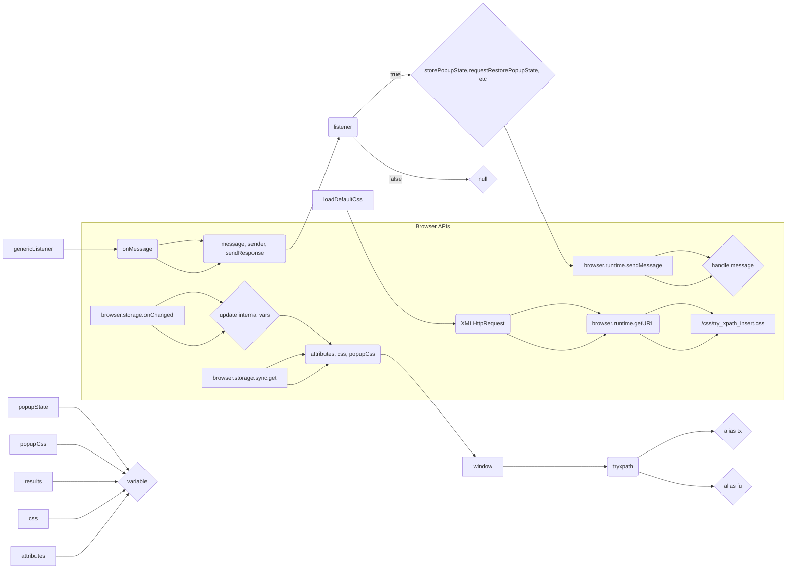

# Code Explanation for try_xpath_background.js

## <input code>

```javascript
/* This Source Code Form is subject to the terms of the Mozilla Public
 * License, v. 2.0. If a copy of the MPL was not distributed with this
 * file, You can obtain one at http://mozilla.org/MPL/2.0/. */

(function (window, undefined) {
    "use strict";

    // alias
    var tx = tryxpath;
    var fu = tryxpath.functions;

    var popupState = null;
    var popupCss = "body{width:367px;height:auto;}";
    var results = {};
    var css = "";
    var attributes = {
        "element": "data-tryxpath-element",
        "context": "data-tryxpath-context",
        "focused": "data-tryxpath-focused",
        "focusedAncestor": "data-tryxpath-focused-ancestor",
        "frame": "data-tryxpath-frame",
        "frameAncestor": "data-tryxpath-frame-ancestor"
    };

    function loadDefaultCss() {
        return new Promise((resolve, reject) => {
            var req = new XMLHttpRequest();
            req.open("GET",
                     browser.runtime.getURL("/css/try_xpath_insert.css"));
            req.responseType = "text";
            req.onreadystatechange = function () {
                if (req.readyState === XMLHttpRequest.DONE) {
                    resolve(req.responseText);
                }
            };
            req.send();
        });
    }

    // ... (rest of the code)
```

## <algorithm>

This code defines a background script for a Chrome extension.  Its primary function is to handle messages from content scripts, manage popup state, load CSS, and update extension settings.

**Step 1: Initialization**

- Assigns aliases to `tryxpath` and `tryxpath.functions` for conciseness.
- Initializes `popupState`, `popupCss`, `results`, `css`, and `attributes`.  `attributes` holds CSS class names for element highlighting.

**Step 2: Loading Default CSS**

- `loadDefaultCss()` fetches styles from `"/css/try_xpath_insert.css"` using `XMLHttpRequest`.

**Step 3: Message Handling (genericListener)**

- `genericListener` acts as a central message handler.
- Checks for the existence of a listener for a given message event type.
- **Message types and handlers:** The `genericListener` object maps different message events to specific handler functions like `storePopupState`, `requestRestorePopupState`, etc.


**Step 4:  Specific Message Handlers:**

- **Storing and restoring popup state**
- **Updating CSS in the popup** (e.g., changing the layout, responsiveness).
- **Showing all results:** Extracts relevant data and opens a new tab displaying search results (`/pages/show_all_results.html`).
- **Loading results:** Retrieves search results.
- **Update CSS in tabs:** Removes and inserts CSS in different tabs based on the `message.expiredCssSet` received.  Uses asynchronous operations (`then` and `catch`) to manage the tab communication, important for handling potential errors during CSS update.
- **Load Options:** Returns attributes, CSS, and popupCSS for the options page.
- **Request Set Content Info:** Sends content information to the active tab.

**Step 5: Storage Handling**

- Listens for storage changes (`browser.storage.onChanged`).
- Updates internal variables based on changes from the storage area.
- Retrieves default/current values from sync storage (`browser.storage.sync.get`).

**Step 6: CSS Loading and Setting**

- The `get` promise fetches values from `browser.storage.sync`.
- If `css` is already loaded, it directly uses it.
- Otherwise, it loads `loadDefaultCss()` and sets it.


## <mermaid>



**Dependencies Analysis:**

- `browser`: This is a Chrome extension API for interacting with the browser's features, including sending messages, accessing storage, and manipulating tabs.
- `tryxpath` and `tryxpath.functions`:  These are likely internal modules within the extension for handling Try XPath related functionality. This implies a strong dependency on Try XPath's codebase.


## <explanation>

**Imports:**

- `browser`:  This is a crucial import that provides access to extension functions like `runtime.getURL`, `runtime.sendMessage`, `tabs.create`, `tabs.insertCSS`, `tabs.removeCSS`, and `tabs.sendMessage`. It's a part of the browser extension API. These functions enable interaction between the background script and browser features.

**Classes:**

- This code doesn't define any classes. It uses standard JavaScript objects.

**Functions:**

- `loadDefaultCss()`: This function retrieves the default CSS file (`try_xpath_insert.css`). It uses `XMLHttpRequest` to make an asynchronous request and returns a `Promise`. This is important for handling asynchronous operations correctly.

- `genericListener()`: This is a central function for handling messages from content scripts. It receives messages, checks for handlers, and calls the respective handler function. This is a crucial function for handling different events from various parts of the extension.

- **Specific listeners**: Each of the `genericListener.listeners` (e.g., `storePopupState`, `updateCss`, `loadResults`) handles specific events sent from content scripts.  This approach enhances code organization and maintainability.

- **Potential errors or areas for improvement:** The use of `.then` and `.catch` around asynchronous operations is good practice. However, `fu.onError` needs further context; what error handling is performed by this custom error handling function?  Knowing the definition of `fu.onError` would be crucial for a complete assessment.

**Variables:**

- `popupState`, `popupCss`, `results`, `css`, `attributes`: These variables store state information, CSS rules, results, and attributes used by the extension.


**Relationships:**

- This background script communicates with content scripts (in browser tabs) and the browser itself. It relies on `tryxpath` and related functions (implied by the code), establishing a tight connection with that extension module and functionality.  The calls to `browser.tabs.sendMessage` and `browser.runtime.sendMessage` illustrate the communication channels.


**Overall:** This code appears well-structured for handling different messages from content scripts and responding in a synchronized way via promises. However, the lack of context for `fu.onError` potentially hinders proper error handling in case of any issues with the asynchronous calls.