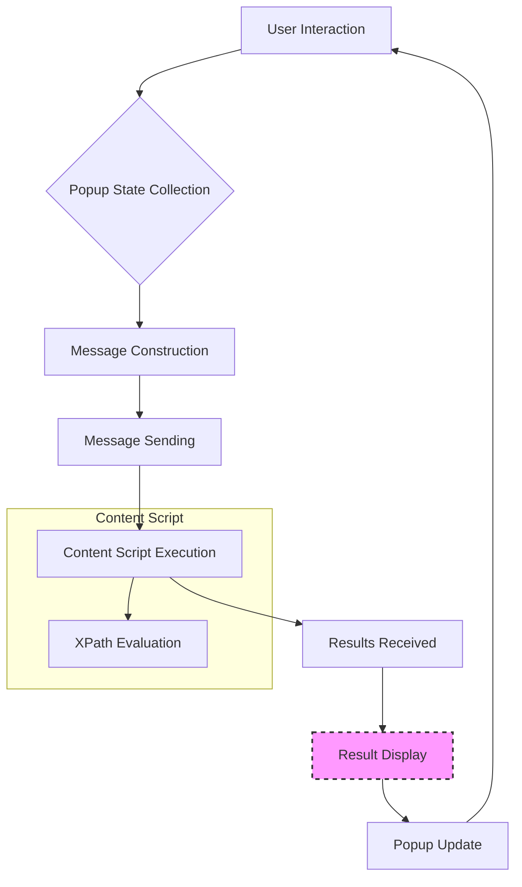

# Code Explanation for try_path_1.3.5 popup.js

## <input code>

```javascript
/* This Source Code Form is subject to the terms of the Mozilla Public
 * License, v. 2.0. If a copy of the MPL was not distributed with this
 * file, You can obtain one at http://mozilla.org/MPL/2.0/. */

(function (window) {
    "use strict";

    // alias
    var tx = tryxpath;
    var fu = tryxpath.functions;

    var document = window.document;

    // ... (rest of the code)
```

## <algorithm>

This JavaScript code manages a popup for a web extension that facilitates XPath expression evaluation.  The workflow involves user interaction with the popup UI elements, communication with the content script running in the active tab (or a specified frame), and displaying results.

**1. Initialization:**

*   Variables are initialized to represent default states (e.g., `invalidTabId`, `invalidFrameId`, `resultedDetails` empty) and UI elements are referenced by their IDs using `document.getElementById()`.
*   Event listeners are added to various UI elements (buttons, input fields, checkboxes).
*   A `genericListener` is set up to receive messages from the content script.

**2. User Interaction:**

*   The user interacts with input fields (e.g., XPath expressions, frame IDs) and controls (buttons).
*   Event handlers process these interactions and trigger actions like sending messages to the content script.

**3. Message Sending and Receiving:**

*   `sendToActiveTab()` and `sendToSpecifiedFrame()` functions send messages to the active tab or a specific frame. These messages contain instructions for the content script.  Messages include `"execute"`, `"initializeBlankWindows"`, `"focusFrame"`, etc.
*   `genericListener` handles messages from the content script, such as results (`showResultsInPopup`) or restoration of the popup state (`restorePopupState`).
*   The `handleExprEnter` function sends an execution request when the user presses Enter in an expression field.


**4. Data Processing and Display:**

*   `collectPopupState()` captures the current state of the popup's UI elements.
*   Various functions (`changeContextVisible`, `changeResolverVisible`, etc.) update the UI visibility based on the state of checkboxes.
*   `makeExecuteMessage()` constructs a message containing the XPath expression and other relevant data to be sent to the content script.
*   `showError()` handles errors, clears results, and updates the display accordingly.
*   `showDetailsPage()` updates the result table on display by calling `fu.updateDetailsTable`.

**5. State Management and Persistence:**

*   `collectPopupState()` gathers the current state of popup elements.
*   `genericListener`'s `restorePopupState()` restores the saved state of the popup.


**Example Data Flow:**

```
User enters XPath in mainExpression -> handleExprEnter() -> sendExecute() -> sendToSpecifiedFrame() (message containing XPath) -> content script executes XPath -> content script sends results back to popup via genericListener -> showResultsInPopup() -> Results displayed on the table.
```


## <mermaid>



**Explanation of Dependencies:**

The diagram shows a basic interaction.  The exact implementation depends heavily on `tryxpath` and `tryxpath.functions`.  These are likely internal packages or modules that handle the actual XPath evaluation, error handling, and UI updating within the extension. The `browser` object and the `genericListener` demonStarte the extension's communication mechanism with the browser's messaging system for interaction with the content page and the background script.


## <explanation>

**Imports:**

*   `tx` and `fu` are aliases for the `tryxpath` and `tryxpath.functions` objects. These are likely internal to the extension, encapsulating functions for handling XPath evaluation and results manipulation.  No external or standard JavaScript libraries are imported directly from outside the extension.

**Classes:**

No classes are explicitly defined. The code focuses on functions and variables.

**Functions:**

*   `sendToActiveTab(msg, opts)`: Sends a message to the currently active tab. `msg` contains the message payload, and `opts` allows for options like specifying a frame id.

*   `sendToSpecifiedFrame(msg)`: Sends a message to a specific frame, handling cases where the specified frame is invalid.

*   `collectPopupState()`: Creates a JavaScript object containing the values of all controls. This function is crucial for persistent state management.

*   `changeContextVisible()`, `changeResolverVisible()`, `changeFrameIdVisible()`, `changeFrameDesignationVisible()`, `changeHelpVisible()`: These functions toggle visibility of various parts of the popup based on checkbox states.  They are UI manipulators.

*   `makeExecuteMessage()`: Constructs the message to be sent to the content script, containing the XPath expression and other parameters for the content script to use.

*   `getSpecifiedFrameId()`: Extracts and validates the selected frame ID. This ensures correct target frame selection during execution.

*   `execContentScript()`: Executes scripts needed by the content script for handling the evaluation request.

*   `sendExecute()`: Sends the constructed execution message to the content script.

*   `showDetailsPage(index)`: Updates the result table to display a page of results from `resultedDetails`.  This implements pagination and handles possible issues (e.g., invalid index).

*   `showError(message, frameId)`: Shows an error message and clears existing results if there is an error in execution.

*   `genericListener`: This is a custom event listener for handling messages from the content script. It stores the handlers in the `genericListener.listeners` object.

**Variables:**

Many variables store references to DOM elements and hold data, including IDs, result details, index for pagination, and UI states (e.g., visibility).


**Potential Errors/Improvements:**

* **Error Handling:** The code handles some errors (e.g., `showError`), but comprehensive error handling for network issues, invalid XPath expressions, and content script failures could be improved.  More specific error messages would be helpful.
* **Input Validation:** While there's some validation (e.g., parsing frame IDs), more robust validation of user input (e.g., XPath expressions) is crucial.
* **UI Responsiveness:**  For large result sets, consider improving the UI responsiveness (e.g., using asynchronous updates, better loading indicators).

**Relationships:**

This popup.js interacts with the content scripts (`try_xpath_check_frame.js`, `try_xpath_functions.js`, `try_xpath_content.js`) running within the browser tab. It receives results and updates the popup's display.  Crucially, it relies on a background script (not shown) for communication and state persistence. There is likely a `background.js` that acts as a mediator between the popup and the content scripts.