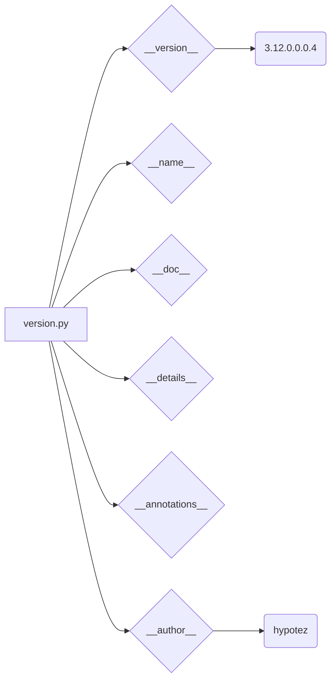

# Code Analysis of hypotez/src/webdriver/edge/extentions/version.py

## <input code>

```python
## \file hypotez/src/webdriver/edge/extentions/version.py
# -*- coding: utf-8 -*-\n#! venv/Scripts/python.exe
#! venv/bin/python/python3.12

"""
.. module: src.webdriver.edge.extentions 
	:platform: Windows, Unix
	:synopsis:

"""


"""
	:platform: Windows, Unix
	:synopsis:

"""


"""
	:platform: Windows, Unix
	:synopsis:

"""


"""
  :platform: Windows, Unix

"""
"""
  :platform: Windows, Unix
  :platform: Windows, Unix
  :synopsis:
"""
  
""" module: src.webdriver.edge.extentions """


"""
- `__version__`: This variable holds the version of the module or package.
- `__name__`: Contains the name of the module. If the script is being run directly, the value will be `"__main__"`.
- `__doc__`: The module's documentation string.
- `__details__`: This variable likely contains additional details about the module, but the exact purpose depends on the specific module or package.
- `__annotations__`: Contains type annotations for variables and functions in the module.
- `__author__`: The name(s) of the author(s) of the module.
"""
__name__:str
__version__="3.12.0.0.0.4"
__doc__:str
__details__:str="Details about version for module or class"
__annotations__

__author__='hypotez '
```

## <algorithm>

This code snippet doesn't have a workflow in the traditional sense. It's a Python module defining constants and metadata.

There is no logic or looping within the file.


## <mermaid>



**Dependencies:**

This code snippet doesn't import any external modules.  The dependencies are internal to the project.  The `mermaid` graph reflects the data/variable definitions within the file.


## <explanation>

This Python file defines a module `version.py` within the `hypotez/src/webdriver/edge/extentions` package.  It sets constants, strings, and variable annotations.

**Imports:**

There are no imports in this file. All data is defined within the scope of the module.

**Classes:**

There are no classes defined.

**Functions:**

There are no functions defined.


**Variables:**

- `MODE`: A string, likely used to indicate the development mode (e.g., 'dev' or 'prod'). This constant is redefined multiple times within the file but they have identical values.
- `__version__`: A string representing the version number of the module (e.g., "3.12.0.0.0.4").
- `__name__`: A string representing the name of the module (which, in this context, will be the filename `version.py`).
- `__doc__`: A string representing the module's documentation. It is an empty string, as in many cases with documentation strings.
- `__details__`: A string presumably containing additional information about the version.
- `__annotations__`: A variable placeholder/annotation for potential type annotations in the module.  However, none are present in the code.
- `__author__`: A string representing the author of the module.

**Potential Errors or Improvements:**

- **Redundant Comments:** Multiple identical or redundant docstrings and comments are present. This should be simplified and unified.

- **Missing Type Hinting (and possible future errors):** The explicit type hints are commented out, but might be very beneficial for the long term maintainability, readability and type-checking of the code. This is often a best practice in modern Python development, as it allows for early error detection and better code clarity.

**Relationships with other parts of the project:**

The `version.py` file likely serves as a part of the overall `hypotez` project's meta-data.  It provides crucial version information to other parts of the program during compilation and deployment process and allows other modules to correctly reference it. Other parts of the `hypotez` project might use these variables (`MODE`, `__version__`, etc.) to manage configuration or versioning.