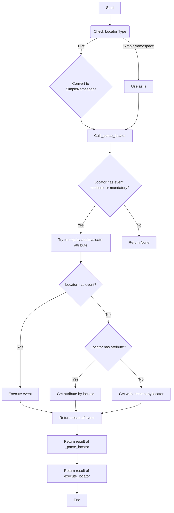
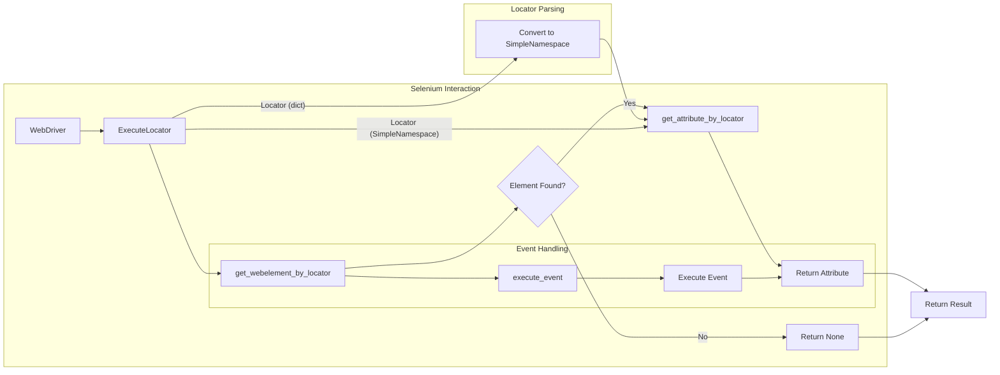

# Code Explanation for hypotez/src/webdriver/executor.py

## <input code>

```python
# -*- coding: utf-8 -*-
#! venv/Scripts/python.exe
#! venv/bin/python/python3.12

"""
.. module: src.webdriver 
	:platform: Windows, Unix
	:synopsis: The purpose of the `executor` module is to perform actions on web elements based on provided configurations, 
known as "locators." These configurations (or "locators") are dictionaries containing information on how to locate and interact with elements on a web page. The module provides the following functionalities:

1. **Parsing and Handling Locators**: Converts dictionaries with configurations into `SimpleNamespace` objects, 
allowing for flexible manipulation of locator data.

2. **Interacting with Web Elements**: Depending on the provided data, the module can perform various actions such as clicks, 
sending messages, executing events, and retrieving attributes from web elements.

3. **Error Handling**: The module supports continuing execution in case of an error, allowing for the processing of web pages 
that might have unstable elements or require a special approach.

4. **Support for Multiple Locator Types**: Handles both single and multiple locators, enabling the identification and interaction 
with one or several web elements simultaneously.

This module provides flexibility and versatility in working with web elements, enabling the automation of complex web interaction scenarios.


"""
# ... (rest of the code)
```

## <algorithm>



**Explanation of the Algorithm Flow:**

1. **Input:** The `execute_locator` function receives a locator (either a dictionary or a `SimpleNamespace` object).
2. **Type Conversion (if needed):** If the locator is a dictionary, it is converted to a `SimpleNamespace` for better handling.
3. **Locator Parsing:** The `_parse_locator` function is called to parse and execute the locator instructions.
4. **Conditional Execution:** The `_parse_locator` checks for the presence of events, attributes, or mandatory elements in the locator. If none are found, it returns `None`.
5. **Error Handling:** A `try...except` block in `_parse_locator` handles potential exceptions during locator processing, logging errors if necessary.
6. **Event Execution:** If an event is present, the `execute_event` function is called to perform the action (e.g., click, send keys).
7. **Attribute Retrieval:** If an attribute is present, `get_attribute_by_locator` retrieves the specified attribute(s).
8. **Element Retrieval:** If neither an event nor an attribute is present, `get_webelement_by_locator` retrieves the web element.
9. **Result Return:** The result of the corresponding operation (event execution, attribute retrieval, or element retrieval) is returned.


## <mermaid>



**Dependencies Analysis:**

- `selenium`:  For interacting with web browsers and locating web elements.  Crucial for this module's functionality.
- `asyncio`: For asynchronous operations. Used for better performance.
- `re`: For regular expression matching (used in `evaluate_locator`).
- `time`: For potentially pausing execution.
- `dataclass`, `Enum`, `Path`, `SimpleNamespace`: Standard Python libraries for structuring data and defining types.
- `gs`: Likely a custom package (part of the hypotez project) – its purpose isn't directly apparent from this file.
- `logger`, `exceptions` (from `src.logger`): Custom logging and exception handling packages, indicating structured logging.
- `jjson`, `pprint`, `image` (from `src.utils`): Custom packages providing JSON manipulation tools, pretty printing, and image saving, indicating support for data processing and interaction with file systems.
- `header`: Likely a custom package (part of the hypotez project) – its exact purpose isn't apparent from this file.

These dependencies reveal a project structure with a clear separation of concerns, potentially for logging, exception handling, data processing, and interaction with external resources.


## <explanation>

**Imports:**

- `asyncio`, `re`, `sys`, `time`, `dataclass`, `Enum`, `Path`, `SimpleNamespace`, `typing`: Standard Python libraries, providing core functionalities for asynchronous programming, regular expressions, system interaction, time management, data structures, and type hinting.
- `selenium.*`: The Selenium library for interacting with web browsers. Necessary for locating and interacting with web elements.
- `header`, `src.gs`, `src.logger`, `src.logger.exceptions`, `src.utils.jjson`, `src.utils.printer`, `src.utils.image`:  Custom packages likely part of the larger Hypotez project, handling logging, JSON data, output formatting, and image processing.  The `src` prefix strongly suggests a package structure, implying a modular design.

**Classes:**

- `ExecuteLocator`: This class handles the execution of locator instructions for web elements. It's designed to work asynchronously using `asyncio`.
   - `driver`: Stores the Selenium WebDriver instance.
   - `actions`: An `ActionChains` instance for interacting with elements (clicks, sending keys, etc.). Initialized based on the `driver` if provided.
   - `by_mapping`: A dictionary mapping locator types (e.g., "XPATH", "ID") to their corresponding Selenium `By` values.
   - `mode`:  A string that can likely control the logging level (`'debug'`, `'dev'`).
   - `execute_locator`: The main method for executing locator instructions. It receives a `locator` (dictionary or `SimpleNamespace`), and handles various actions (clicking, sending messages, etc.).
   - `evaluate_locator`, `get_attribute_by_locator`, `get_webelement_by_locator`, `get_webelement_as_screenshot`, `execute_event`, and `send_message`: Functions implementing specific tasks for locating web elements, getting attributes, executing events, and handling user interaction.


**Functions:**

- `execute_locator`: The core function that takes the locator and executes the associated actions, returning the result.

- `_parse_locator`: A helper function that does the crucial task of processing the `locator` and calls the corresponding subfunctions for attributes and events.

- `evaluate_locator`, `get_attribute_by_locator`, `get_webelement_by_locator`, `get_webelement_as_screenshot`, `execute_event`, and `send_message`: These are detailed in their individual docstrings.  Notice the common use of `SimpleNamespace` for flexible data handling.


**Variables:**

- `MODE`: A string to control the behavior of the class, specifically the logging level.


**Error Handling:**

The code includes extensive `try...except` blocks to catch and handle potential exceptions like `TimeoutException`, `NoSuchElementException`, `ElementClickInterceptedException`, etc.  This robust error handling allows the script to continue execution even if some operations fail.  Log messages for errors are produced using the `logger`.


**Potential Errors/Improvements:**

- **Overuse of `asyncio.to_thread`:** While using `asyncio.to_thread` is necessary for blocking calls in an asynchronous context, there might be an opportunity for further optimization. If the actions on `webelement` were already asynchronous, the need for `asyncio.to_thread` might reduce or even disappear.

- **Concise error handling:** While the error handling is extensive, adding clearer error messages in some cases (e.g., for invalid locator strings) could improve debugging.


**Relationships:**

The `executor` module relies heavily on the `selenium` library for browser interaction and on custom packages (`src.*`) for data handling, logging, and error management, indicating a modular design in the project. The `gs` and `header` packages seem to be part of the overall project and could potentially contain functions or classes to configure and initialize the `ExecuteLocator` and driver.


This detailed explanation provides a comprehensive understanding of the `executor.py` code, its functions, classes, and its integration within the broader Hypotez project.