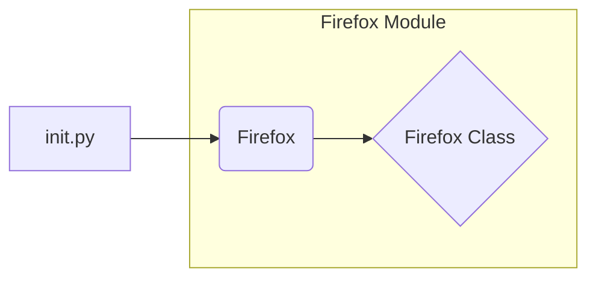

# <input code>

```python
## \file hypotez/src/webdriver/firefox/__init__.py
# -*- coding: utf-8 -*-\

#! venv/bin/python/python3.12

"""
.. module: src.webdriver.firefox 
	:platform: Windows, Unix
	:synopsis:

"""


from .firefox import Firefox
```

# <algorithm>

1. **Initialization:**
   - The file initializes a constant variable `MODE` with the value 'dev'. This likely controls a mode for the webdriver (e.g., development, production).

2. **Import:**
   - The line `from .firefox import Firefox` imports the `Firefox` class from the `firefox.py` module within the same directory. This allows the current file to use the `Firefox` class.

**Example Data Flow:**

```
[MODE='dev'] --> [Import Firefox Class] --> [Possible use of Firefox Class in other modules]
```

# <mermaid>



**Explanation of Dependencies:**

The diagram shows a simple dependency. `init.py` imports the `Firefox` class from the `firefox.py` module, indicating that `firefox.py` likely contains the implementation details for the `Firefox` class.


# <explanation>

- **Imports:**
    - `from .firefox import Firefox`: This line imports the `Firefox` class from the `firefox.py` file located within the same directory. The `.firefox` part is an internal import, meaning that `firefox.py` is expected to be in the same directory as `__init__.py`.  This is a standard Python import practice for structuring modules.  The `firefox.py` likely contains the implementation of the webdriver functionalities for Firefox.

- **Classes:**
    - `Firefox`: This is likely a class for interacting with the Firefox web browser using a WebDriver (like Selenium).  The actual implementation is within `firefox.py`.  It would contain the necessary methods to initiate a browser session, interact with elements, manage cookies, etc.  Without seeing the `firefox.py` file, the exact details of the `Firefox` class are unknown.

- **Functions:**
    - None explicitly defined in `__init__.py`.  Any functions are expected to be defined within the `firefox.py` file to be used by the `Firefox` class.

- **Variables:**
    - ``:  A string variable representing the current mode of the application (likely 'dev' for development, potentially other values for production).  This is a global variable, accessible within any part of the package.


- **Potential Errors/Improvements:**

    - **Missing Error Handling:** The code lacks any error handling.  Importing `Firefox` might fail if `firefox.py` doesn't exist or if there's an issue in `firefox.py`.  Adding `try...except` blocks would make the code more robust.

    - **Unclear Purpose of `MODE`:** While `MODE` is used, the documentation for its potential uses is minimal. Clarifying the exact use of `MODE` in other modules within the project would improve the readability.

    - **Dependency Management:**  The use of `` and `#! venv/bin/python/python3.12` suggests a virtual environment (`venv`).  While these are not errors, properly specifying the interpreter in a `requirements.txt` would be more robust in other project environments and improve maintainability.


- **Relationship with other parts of the project:**
    - The file `__init__.py` serves as a module entry point for the `webdriver/firefox` package.  It exports the `Firefox` class for use by other parts of the project.  Other modules might use this class via `from hypotez.src.webdriver.firefox import Firefox`. This suggests that other modules in the `hypotez.src.webdriver` package or other parts of the project may rely on this driver to automate Firefox tasks.  The project structure suggests a modular design that separates web driver functionalities into a `webdriver` package, and further splits by browser (e.g., `firefox`, `chrome`).