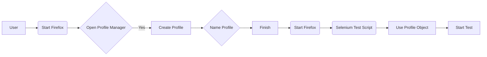

# Code Explanation: Firefox Profile Configuration for Selenium WebDriver

## <input code>

```html
<!-- HTML content from a website (ToolsQA) -->
<!-- Snippet of HTML, not a programming language -->
```

The provided code is entirely HTML, not a programming language like Python or Java. It's the source code of a web page describing steps to configure a Firefox profile for Selenium WebDriver. The code includes a lot of styling for the web page, embedded JavaScript and Google Tag Manager scripts, and links to other web pages.


## <algorithm>

(Since the code is HTML, there's no algorithm in the traditional programming sense)

This HTML describes a process for configuring a Firefox profile for Selenium WebDriver. The page outlines the steps needed to create a new Firefox profile, tailor it for automation, and integrate it into a Selenium test script.

**Step 1: Starting the Profile Manager:**

*   **Action:** Open the Firefox browser and exit it.
*   **Action:** Open the "Run" dialog box (Windows) or equivalent on other OS.
*   **Action:** Type `firefox.exe -p` (Windows) or equivalent command and click OK.
*   **Data Flow:** User interaction triggers opening the Firefox Profile Manager.


**Step 2: Creating a Profile:**

*   **Action:** Click the "Create Profile..." button in the Profile Manager.
*   **Action:** Click "Next" in the Profile Wizard.
*   **Action:** Name the profile (e.g., "profileToolsQA").
*   **Action:** Click "Finish."
*   **Data Flow:** User input (profile name) creates a new profile that will be used for automation.


**Step 3: Using the Custom Profile in Selenium:**

*   **Action:** Use the `ProfilesIni` and `FirefoxProfile` classes (likely in Java) to instantiate the profile and the `FirefoxDriver`.  
*   **Action:** Pass the customized `myprofile` into the `FirefoxDriver` constructor.
*   **Data Flow:** The new profile object is used to configure the Selenium WebDriver, ensuring only the specific profile settings are loaded and applied to the testing environment.


## <mermaid>




**Explanation of Dependencies:**

The diagram doesn't directly show any external dependencies because it's based on a user action (creating a profile) and Java code (that presumably interacts with the browser profile). The Java code would need dependencies such as Selenium libraries and potentially other libraries for interacting with the Firefox profile in a specific manner.  No code is displayed in this response for how this workflow is implemented in Java.


## <explanation>

**Imports:**

The code snippet itself is HTML, and therefore doesn't have imports. Any necessary Java imports (like `org.openqa.selenium.firefox.FirefoxDriver` and `org.openqa.selenium.firefox.FirefoxProfile`) will not be present in the HTML. They are part of the Java programming used to connect Selenium to the new Firefox profile.  The Selenium WebDriver library would provide the classes and methods to instantiate and control the Firefox driver, and to interface with the Firefox profile.

**Classes:**

*   **`ProfilesIni`:**  A class from the Selenium library to manage and interact with Firefox profiles. It helps load and retrieve the profile settings. This class would exist in Selenium WebDriver.
*   **`FirefoxProfile`:** A class from the Selenium library representing a Firefox profile, used for customizing settings (like proxies) for automation purposes. This class would exist in Selenium WebDriver.
*   **`FirefoxDriver`:** From Selenium WebDriver, this is the class used to instantiate and interact with the Firefox browser.  This code shows how to customize the driver's configuration by passing in the customized profile object.

**Functions:**

No functions exist in the HTML. The `ProfilesIni()` call will likely use Java methods to read/load the configuration of the profile.

**Variables:**

*   `profile`: An instance of the `ProfilesIni` class used to access profile data.
*   `myprofile`: An instance of the `FirefoxProfile` class representing the customized profile for automation.
*   `driver`: An instance of the `FirefoxDriver` class configured with the custom Firefox profile `myprofile`.

**Potential Errors and Improvements:**

*   **Error Handling:** The HTML does not demonStarte any error handling if the profile cannot be found or if the creation process fails.  Robust Selenium code would include `try-catch` blocks to handle exceptions during profile instantiation and driver initialization.
*   **Path Validation:** The code to set the profile path might need more validation, particularly on different OS platforms to ensure it's correct.
*   **Code Structure:** Separating the steps into methods would enhance the organization and readability of the Java code.
*   **Profile Creation:** The HTML does not mention how to prevent user interference with the profile during test execution. Ideally, it would be created and managed outside the testing environment.


**Relationships with Other Parts of the Project:**

This HTML describes configuration steps for Selenium WebDriver. This part of the project would rely on other components for execution. For example:

*   **Test Cases:** Selenium test scripts would use this configured `FirefoxDriver` to carry out automation tasks.
*   **Testing Framework:** The test cases would reside within a testing framework (e.g., JUnit) or a project structure.
*   **Test Data:** The test cases would use test data relevant to the automation test scenario.


**Note:** The provided HTML snippet is purely documentation. The actual implementation would be in a programming language (likely Java) used for Selenium WebDriver scripts, which would have more complete code related to imports, error handling, and driver management.