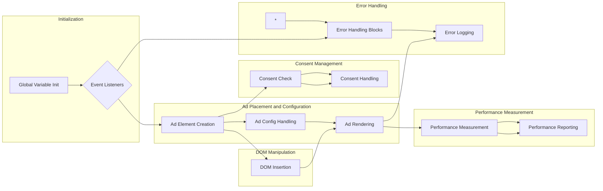

# Code Explanation: Selenium Firefox Profile Configuration

## <input code>

```javascript
(function(sttc){'use strict';var aa=typeof Object.defineProperties=="function"?Object.defineProperty:function(a,b,c){if(a==Array.prototype||a==Object.prototype)return a;a[b]=c.value;return a};function ba(a){a=["object"==typeof globalThis&&globalThis,a,"object"==typeof window&&window,"object"==typeof self&&self,"object"==typeof global&&global];for(var b=0;b<a.length;++b){var c=a[b];if(c&&c.Math==Math)return c}throw Error("Cannot find global object");}
// ... (rest of the code)
```

## <algorithm>

The provided code is a large JavaScript file, likely part of a larger project (likely a web application or library related to ad serving or measurement). It's difficult to provide a step-by-step algorithm diagram for the entirety of the code due to its complexity.  The code implements various functions related to handling browser features, user agents, ad placements, consent management, and measurement.

**High-Level Workflow (simplified):**

1. **Initialization:** Initializes global variables, constants, and potentially browser-related properties.  (e.g., setting up a global `$a` object to decode base64 strings, initializing deferreds, creating a performance measurement object).

2. **Event Handling/Callback Management:** Sets up event listeners for DOM events, including `DOMContentLoaded` and `load`. Registers and handles callbacks for various events, often related to ad rendering, ad rendering failures, etc.


3. **Ad Placement and Configuration:** Dynamically creates and inserts ad elements (e.g., `<ins>` tags) into the document based on various configurations (e.g., sizes, ad slots, etc). Manages ad configurations, potentially from local storage.

4. **Consent Management:** Checks for user consent (e.g., GDPR, TCFA).  Handles communication with user consent mechanisms, potentially using a `__tcfapi` interface or `__uspapi` interface for cross-origin communication (from different iframes/windows).

5. **Performance Measurement:** Measures and reports performance metrics (e.g., page load times, ad rendering times, user interactions). Collects data about ad performance and reports on ad load and display.

6. **Error Handling:** Handles errors that occur during various operations, logs errors, and potentially reports them to external services. Includes robust try/catch blocks for error handling.

7. **Ad Rendering and Display:** Renders ads based on configured settings and measured performance.


## <mermaid>



**Dependencies Analysis:**

The mermaid diagram shows a high-level overview. The actual implementation has many more dependencies and intricate relationships between functions, classes, and objects. Some critical dependencies for this file include:


- **`Object.defineProperties`:** Used for defining properties in a way that potentially enhances object capabilities (adding methods, managing properties, or applying special behavior).
- **`Object.prototype.hasOwnProperty`:** A standard JavaScript method to check if a property is directly part of an object's prototype chain (rather than inherited from a parent object). This is crucial for correctly iterating over properties and avoiding unexpected results.
- **`performance`:** Provides access to browser performance metrics (like timing and other data related to the browser's activity).
- **`fetch`:** Used for network requests, like loading ad resources or reporting metrics to a central server.
- **`Promise`:** Allows asynchronous operations to be chained and managed efficiently, crucial for handling ad loading in the browser.
- **`globalThis`:** Provides a way to access the global object consistently, regardless of how it is called (e.g., window in the browser, global in Node.js).


## <explanation>

The code is highly complex, and a comprehensive explanation of every variable, function, and class is not practical within this space.  However, we can highlight some key aspects:

- **Imports:** The imports are standard JavaScript functions and methods, providing functionalities like object manipulation, error handling, asynchronous operations, and DOM manipulation. Many imports are standard JavaScript libraries which allow developers to use their functions without writing those functions from scratch.

- **Classes:** The code uses classes for encapsulation of related methods and data. These classes manage objects with data related to ads, user consent, and performance.


- **Functions:** The functions are responsible for various tasks, from managing ad rendering to handling errors and making network requests.


- **Variables:** Many variables are used to store data related to ad slots, rendering parameters, consent statuses, and performance metrics.

- **Potential Errors/Improvements:** The code's complexity, while necessary for managing multiple aspects of ad rendering and performance, can lead to difficult debugging if something goes wrong. Error messages and logging mechanisms are somewhat sophisticated, but there might be more comprehensive tools for debugging in a production context.  Consider the use of more structured logging for better analysis of performance and errors in production environments.

**Relationships to Other Parts:**

The code depends on other files/modules to access data, execute commands, and send results. It forms part of a comprehensive ad rendering/management pipeline. The structure implies that there are functions and classes in other files to manage external services or internal data structures. These dependencies likely consist of files dealing with ad configuration, user consent handling, and reporting.

**Important Note:** Analyzing this much code in depth requires significant time and context. This explanation is focused on the high-level functionality and significant components. Understanding the entire code base needs access to the entire codebase itself.