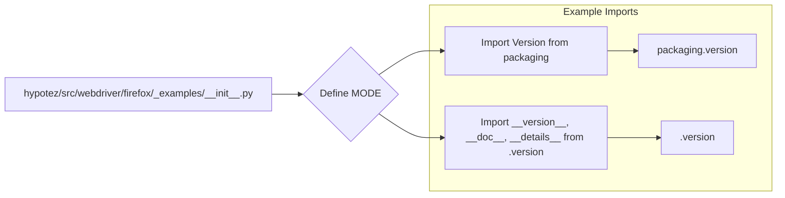

# Code Explanation for hypotez/src/webdriver/firefox/_examples/__init__.py

## <input code>

```python
## \file hypotez/src/webdriver/firefox/_examples/__init__.py
# -*- coding: utf-8 -*-

#! venv/bin/python/python3.12

"""
.. module: src.webdriver.firefox._examples 
	:platform: Windows, Unix
	:synopsis:

"""


"""
	:platform: Windows, Unix
	:synopsis:

"""


"""
	:platform: Windows, Unix
	:synopsis:

"""


"""
  :platform: Windows, Unix

"""
"""
  :platform: Windows, Unix
  :platform: Windows, Unix
  :synopsis:
"""
  
""" module: src.webdriver.firefox._examples """


""" Firefox examples """


from packaging.version import Version
from .version import __version__, __doc__, __details__
```

## <algorithm>

This file appears to be an initialization file for a module related to Firefox webdriver examples within the `hypotez` project.  The algorithm is straightforward; it defines a constant and imports modules.  There's no complex data flow or logical branching.

* **Step 1:** Define a constant `MODE` with the value 'dev'.
* **Step 2:** Import the `Version` class from `packaging.version`.
* **Step 3:** Import `__version__`, `__doc__`, and `__details__` from the `.version` submodule within the same directory (`hypotez/src/webdriver/firefox/_examples`).

There is no clear algorithm or workflow to diagram in a step-by-step block diagram format given the minimal content.  The code's structure implies a setup file.

## <mermaid>



**Dependency Analysis:**

The `mermaid` code illuStartes a simple import structure.
* `packaging.version`:  Needed for version handling, likely used for semantic versioning or checking compatibilities. This external package is a dependency.
* `.version`: Implies another module or file (`hypotez/src/webdriver/firefox/_examples/version.py`) likely containing version information (`__version__`, `__doc__`, etc.). This is a internal dependency.

## <explanation>

**Imports:**

* `from packaging.version import Version`: Imports the `Version` class from the `packaging` library.  This is used for handling version numbers, which is commonly used for Python packages and libraries to ensure compatibility.  The `packaging` library is an external dependency.

* `from .version import __version__, __doc__, __details__`: Imports specific variables (`__version__`, `__doc__`, `__details__`) from a module named `.version`.  Presumably, this module (`_examples/version.py`) defines version information, documentation, and other details related to the examples present in the `_examples` folder.  This is an internal dependency within the `hypotez` project.

**Classes:**

There are no classes defined in this file.

**Functions:**

No functions are defined.

**Variables:**

* ``: A string variable used to indicate the current mode (likely 'development' mode).  This variable is used for configuration, potentially influencing how the examples behave or what data they use.

**Potential Errors or Improvements:**

* **Docstrings:** While docstrings are present, they are incomplete and need more descriptive information about the role of this initialization file.  More details about the intended purpose of this module, its API, and the structure of the examples it contains would significantly improve documentation.

**Relationships with Other Parts of the Project:**

This file is likely part of a larger project (`hypotez`) which includes several other components related to browser automation with Firefox.  The imports suggest a modular design; the `_examples` folder likely contains example scripts or functions using the Firefox WebDriver. The `.version` file is probably responsible for accurately managing version information.   The usage of `MODE` indicates the possibility of other configuration files or settings to be used in production, staging, or development environments.