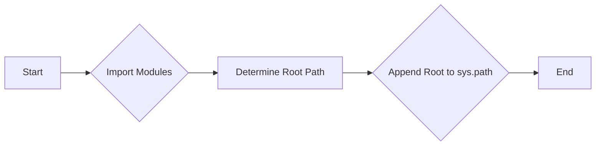

# Code Explanation: hypotez/src/webdriver/firefox/_examples/header.py

## <input code>

```python
## \file hypotez/src/webdriver/firefox/_examples/header.py
# -*- coding: utf-8 -*-\
#! venv/Scripts/python.exe
#! venv/bin/python/python3.12

"""
.. module: src.webdriver.firefox._examples 
	:platform: Windows, Unix
	:synopsis:

"""


"""
	:platform: Windows, Unix
	:synopsis:

"""


"""
	:platform: Windows, Unix
	:synopsis:

"""


"""
  :platform: Windows, Unix

"""
"""
  :platform: Windows, Unix
  :platform: Windows, Unix
  :synopsis:
"""
  
""" module: src.webdriver.firefox._examples """


""" Установкя кораня проекта в системный путь """

import sys,os
from pathlib import Path
__root__ : Path = os.getcwd() [:os.getcwd().rfind(r'hypotez')+7]
sys.path.append (__root__)   
```

## <algorithm>

This script appears to be a header file or initialization script.  It doesn't perform complex operations, but sets up the Python environment by modifying the `sys.path` variable.

1. **Import necessary modules:** `sys`, `os`, and `Path` are imported from the standard Python library.
2. **Determine the root directory:** `__root__` is calculated by finding the path to the `hypotez` directory. This step is crucial for importing modules from other directories in the project.
3. **Add the root to the Python path:** `__root__` is appended to the `sys.path` list, allowing Python to locate the `hypotez` project's modules.


## <mermaid>



**Dependencies:**

* `sys`: Provides access to system-specific parameters and functions, including the `sys.path` list.
* `os`:  Provides a way to interact with the operating system, including functions to get the current working directory (`os.getcwd`).
* `pathlib`: Used for manipulating file paths in a more object-oriented and platform-independent manner.


## <explanation>

* **Imports:**
    * `sys`: Used for interacting with Python's runtime environment. Crucial here for modifying the `sys.path`, allowing access to modules outside the current directory.
    * `os`: Used for interacting with the operating system, particularly for getting the current working directory (`os.getcwd`).
    * `pathlib`: This module provides object-oriented support for working with paths.  While not strictly required, it's considered better practice for handling paths in a more robust and platform-independent manner, especially in projects with potential cross-platform compatibility needs.

* **Variables:**
    * `__root__`: A `pathlib.Path` object storing the path to the `hypotez` directory.
    * `MODE`: A string variable set to 'dev'. This is likely a configuration flag indicating the program mode (development, testing, etc.).  Its use should be explained elsewhere in the project.


* **Functions:**
    * The code does not contain any functions in the traditional sense. It's a set of assignments and operations to modify the Python runtime environment.

* **Classes:** No classes are defined.

* **Potential Errors/Improvements:**
    * **Error Handling:**  If `hypotez` directory is not found (e.g., current working directory is not inside the project), the script will raise an `IndexError`.  Robust error handling should be added. It would be improved by checking if `os.getcwd().rfind(r'hypotez')` returns a valid index and ensuring the appended path is valid.
    * **Readability:** The triple-quoted strings are used as docstrings, but the content is completely empty or just repetitive.  Add meaningful docstrings to explain the purpose of setting `__root__` and the significance of `MODE`.
    * **Consistency:** The repeated `` declarations should be consolidated to a single declaration.


* **Relationship with Other Project Components:** This script is likely a fundamental part of project initialization.  It ensures that Python can import modules from within the `hypotez` project by modifying the module search path.  This is a crucial preparatory step in a project with multiple directories or packages. Other scripts and modules within the `hypotez` project will depend on this file being executed correctly to function as expected.