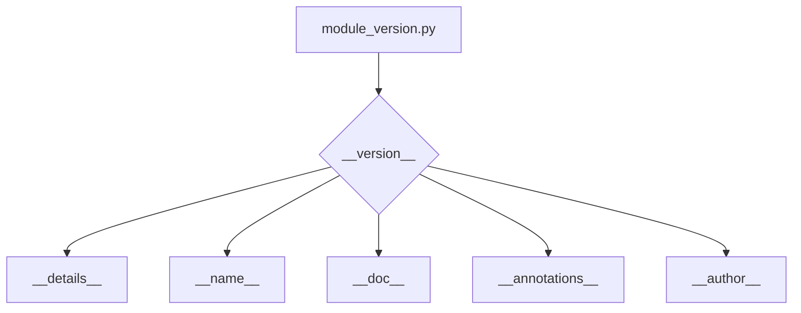

# Code Explanation for `hypotez/src/webdriver/firefox/_examples/version.py`

## <input code>

```python
# -*- coding: utf-8 -*-\

#! venv/bin/python/python3.12

"""
.. module: src.webdriver.firefox._examples 
	:platform: Windows, Unix
	:synopsis:

"""


"""
	:platform: Windows, Unix
	:synopsis:

"""


"""
	:platform: Windows, Unix
	:synopsis:

"""


"""
  :platform: Windows, Unix

"""
"""
  :platform: Windows, Unix
  :platform: Windows, Unix
  :synopsis:
"""
  
""" module: src.webdriver.firefox._examples """


"""
- `__version__`: This variable holds the version of the module or package.
- `__name__`: Contains the name of the module. If the script is being run directly, the value will be `"__main__"`.
- `__doc__`: The module's documentation string.
- `__details__`: This variable likely contains additional details about the module, but the exact purpose depends on the specific module or package.
- `__annotations__`: Contains type annotations for variables and functions in the module.
- `__author__`: The name(s) of the author(s) of the module.
"""
__name__:str
__version__="3.12.0.0.0.4"
__doc__:str
__details__:str="Details about version for module or class"
__annotations__

__author__='hypotez '
```

## <algorithm>

This code snippet doesn't have a clear algorithm in the sense of processing data or performing complex operations. Instead, it defines module-level metadata (version, author, documentation).  There is no data flow to trace.

## <mermaid>



**Dependencies:** This code snippet has no imports and thus no external dependencies to be analyzed. The diagram shows the relationships within the module itself, demonStarting the structure of the module-level variables.

## <explanation>

This Python file defines metadata for a module, likely part of a larger project within the `hypotez` package.

**Imports:** There are no imports in this file.

**Classes:** There are no classes.

**Functions:** There are no functions.

**Variables:**
* `MODE`: A string variable, likely used for defining a mode (e.g., 'dev', 'prod').  Its repeated definition does not affect the final result.
* `__version__`: A string variable holding the version number of the module.
* `__name__`: A string variable representing the module's name. Its value will be `"__main__"` if the file is run directly.
* `__doc__`: A string variable containing the module's documentation string.
* `__details__`: A string variable containing additional details about the module.
* `__annotations__`: A variable. (likely empty or containing type hints).
* `__author__`: A string containing the author's name.


**Potential Errors/Improvements:**

* **Redundant `MODE` definition:** The variable `MODE` is defined multiple times, which is likely a typo or an oversight. One definition is sufficient.
* **Missing type hints (annotations):** The variable `__annotations__` is declared but not initialized.  It should be assigned a suitable value or left blank if no type annotations are needed for the module.


**Relationships with other parts of the project:** This file is likely part of a larger project involving `webdriver`, potentially for automating interactions with a web browser (Firefox in this instance). The metadata stored here would help manage and track different versions, documentation, and author information for this particular `webdriver` module or class within the `hypotez` project.