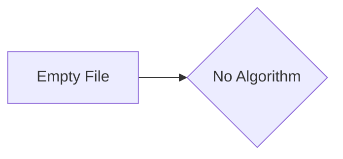

```MD
# Code Analysis of hypotez/src/webdriver/firefox/_pytest/test_firefox.py

## <input code>

```python
## \file hypotez/src/webdriver/firefox/_pytest/test_firefox.py
# -*- coding: utf-8 -*-\n\n#! venv/bin/python/python3.12\n\n"""\n.. module: src.webdriver.firefox._pytest \n\t:platform: Windows, Unix\n\t:synopsis:\n\n"""\n\n\n"""\n\t:platform: Windows, Unix\n\t:synopsis:\n\n"""\n\n"""\n\t:platform: Windows, Unix\n\t:synopsis:\n\n"""\n\n"""\n  :platform: Windows, Unix\n\n"""\n"""\n  :platform: Windows, Unix\n  :platform: Windows, Unix\n  :synopsis:\n"""\n  \n""" module: src.webdriver.firefox._pytest """\n\n\n\n```

## <algorithm>

This code file appears to be a Python file intended for testing, specifically for a Firefox webdriver component within the `hypotez` project. However, it's currently empty. There's no defined workflow, algorithm, or data flow as there is no executable code.


## <mermaid>



**Dependencies Analysis:**

There are no imports, functions, or classes present. Therefore, there are no dependencies to analyze.

## <explanation>

**Imports:**

No imports are present in the file, preventing us from analyzing their purpose or relationship with other packages within the `src` directory.

**Classes:**

No classes are defined.

**Functions:**

No functions are defined.

**Variables:**

A single variable `MODE` is declared, holding the string value `'dev'`. Its purpose is likely to define a mode for the webdriver test suite.

**Potential Errors or Areas for Improvement:**

The file is completely empty.  It's not a functional test file.  In order to execute and test Firefox webdriver behavior, significant additional code (setup, test cases, assertions, etc.) would be needed.


**Relationship with other project parts:**

Without any code, it's impossible to determine the relationship with other parts of the project.  This file is intended to be a test suite file; without tests it serves no purpose for testing.  A functioning test suite would likely depend on classes/functions in other files.


**Conclusion:**

This file is currently a placeholder and requires substantial addition of tests and related functions to be of any use.