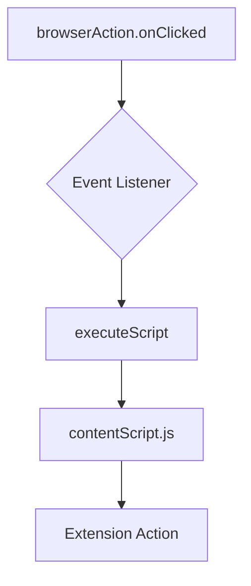

# Code Explanation for background.js

## <input code>

```javascript
// background.js

browser.browserAction.onClicked.addListener((tab) => {
    browser.scripting.executeScript({
        target: { tabId: tab.id },
        files: ["contentScript.js"],
    });
});
```

## <algorithm>

1. **Event Listener:** The code listens for the `browserAction.onClicked` event.  This event is triggered when the browser extension's icon is clicked.

   * **Example:** A user clicks the extension icon on a web page.

2. **Execute Script:** When the event occurs, the code executes a script within the current tab.

   * **Example:**  The code sends a message to the `contentScript.js` located in a specified `tabId`.

3. **Script Execution:**  The `browser.scripting.executeScript` function loads and executes `contentScript.js` in the specified `tab` context.

   * **Example:** `contentScript.js` will then handle the extension action.  This could be anything from displaying a dialog box, modifying the webpage, or communicating with the extension's background process.


## <mermaid>



**Dependencies Analysis:**

The mermaid code describes a simple flow. It doesn't explicitly show dependencies but implies a connection between the background script (`background.js`) and a content script (`contentScript.js`). The critical dependency is the `contentScript.js` file itself.


## <explanation>

**Imports:**

There are no explicit imports in this code snippet.  However, implicitly, the `browser` object is a critical import from the browser extension APIs.

**Classes:**

No classes are defined in this code snippet.

**Functions:**

* `browser.browserAction.onClicked.addListener((tab) => { ... });`: This is an event listener function.  It listens for clicks on the browser action icon (the extension's icon in the browser toolbar).
    * `tab`: An object containing information about the current tab. Key information in `tab` will include the `tabId`, used to target the correct tab for execution.
    *  Example usage:  `tab.id` would return a unique identifier for the clicked tab.
* `browser.scripting.executeScript({...});`: This function executes a script in a specified tab.
    * `target: { tabId: tab.id }`: This specifies that the script should be executed in the tab with the `tabId` provided by the `tab` object.
    * `files: ["contentScript.js"]`: This array specifies the JavaScript file to be loaded and executed in the context of the target tab. This is likely where your extension's logic for interacting with the page resides.

**Variables:**

* `tab`: Represents the tab object passed to the listener function, used to get the `tabId`.  It is a passed in object, not explicitly declared in the code.


**Potential Errors or Improvements:**

* **Error Handling:** There's no error handling in the code. If `browser.scripting.executeScript` fails for any reason (e.g., the tab is closed, the file is not found), the error will not be caught or logged, potentially causing issues.
* **Security:**  If `contentScript.js` does anything sensitive (like accessing user data), there are additional security considerations. Proper authorization and scope would be important in a production application.
* **Asynchronous Operations:** While not explicitly stated here, the call to `browser.scripting.executeScript` is potentially asynchronous.  The background script might continue without waiting for the content script to complete. This needs to be considered if `contentScript.js` performs actions that need to complete before the background script continues.

**Relationships with Other Parts of the Project:**

This `background.js` file relies on the existence of a `contentScript.js` file.  `contentScript.js` is likely responsible for interacting with the webpage itself to perform the extension's intended task.  This represents a client-server relationship: the background script sends the message, and the content script handles it. The extension's functionality is split between these two files.
```