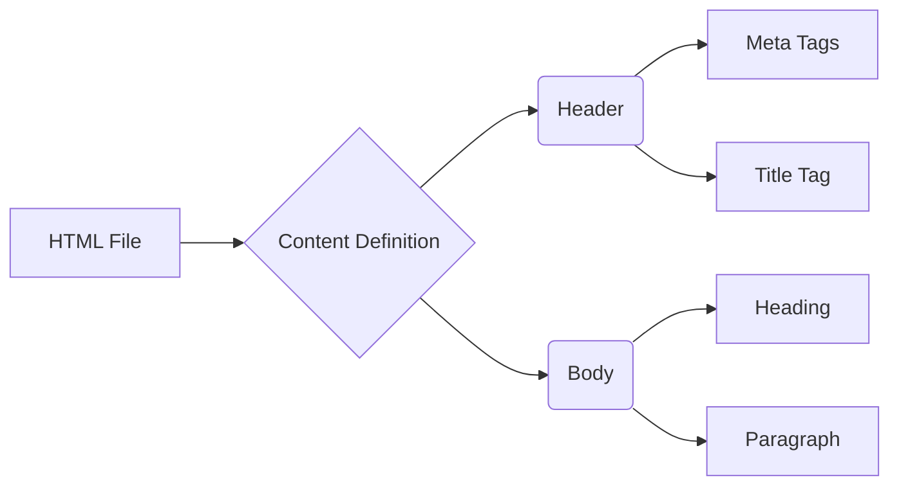
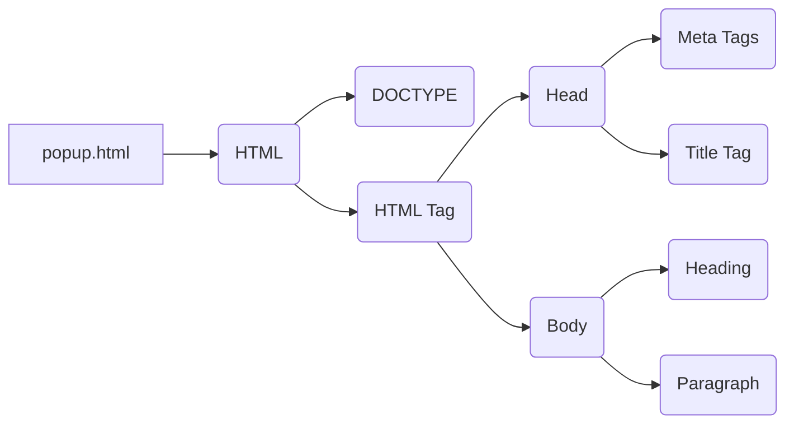

# Code Explanation for popup.html

## <input code>

```html
## \file hypotez/src/webdriver/firefox/extentions/test_extention/html/popup.html
# -*- coding: utf-8 -*-\


""" module: src.webdriver.firefox.extentions.test_extention.html """
MODE = 'debug'
<!DOCTYPE html>
<html lang="en">
<head>
    <meta charset="UTF-8">
    <meta name="viewport" content="width=device-width, initial-scale=1.0">
    <title>Hypotez</title>
</head>
<body>
    <h1>Hypotez</h1>
    <p>Привет, Это Давидка. Я обучаю модель</p>
</body>
</html>
```

## <algorithm>

This code is a simple HTML file.  There is no algorithm in the traditional sense of a step-by-step process because it's purely presentation markup.  The HTML structure defines the content and layout of the webpage.



## <mermaid>



This mermaid code represents the simple structure of the HTML file.  No dependencies are imported as it's a simple HTML file.

## <explanation>

This file is an HTML document, not Python code.  It defines the structure and content of a web page that will be displayed in a Firefox extension's popup.  Let's break down the key elements:

* **Imports:**  There are no imports. This is a standard HTML file, not a Python script.

* **Classes:**  No classes are defined. This is an HTML file, not a Python class definition.

* **Functions:**  No functions are defined. This is an HTML file, not a Python function definition.

* **Variables:** The only variable is `MODE = 'debug'`.  This is a Python-style variable declaration, but it's within a multi-line comment (`""" module: ... """`).  It's not used by the HTML file directly.  It's likely intended for use with some Python code that generates/processes the HTML, outside the scope of the HTML itself.  The `` line at the top suggests this.  It's a shebang used by some systems to specify which interpreter should run a script. This is likely used to specify that Python should be used to run this.

* **Potential Errors/Improvements:**

    * The `MODE = 'debug'` variable, as described above, is unused within the HTML itself.  Its presence in a multi-line comment suggests it's meant for external Python processing. The shebang line also reinforces this idea that the file is likely part of a larger system involving Python.

* **Relationships:** This HTML file is likely part of a larger Firefox extension project. The `hypotez/src/webdriver/firefox/extentions/test_extention` path suggests this is part of a larger project with different sub-directories.  The Python code that generates or processes this HTML file (implied by the shebang and the variable within a comment) would be linked. The `venv` directory likely contains a virtual environment for the project.


**In summary:**  This file is a simple HTML template that displays a message in a browser popup.  Its primary role is presentation, not logic.  The code is designed to be interpreted by a web browser, not a Python interpreter.  The shebang and commented-out variable indicate that it's likely part of a larger project that uses Python code to create this HTML.