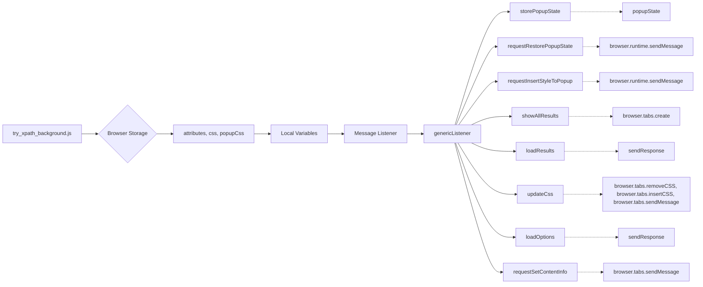

# Code Explanation: try_xpath_background.js

## <input code>

```javascript
/* This Source Code Form is subject to the terms of the Mozilla Public
 * License, v. 2.0. If a copy of the MPL was not distributed with this
 * file, You can obtain one at http://mozilla.org/MPL/2.0/. */

(function (window, undefined) {
    "use strict";

    // alias
    var tx = tryxpath;
    var fu = tryxpath.functions;

    var popupState = null;
    var popupCss = "body{width:367px;height:auto;}";
    var results = {};
    var css = "";
    var attributes = {
        "element": "data-tryxpath-element",
        "context": "data-tryxpath-context",
        "focused": "data-tryxpath-focused",
        "focusedAncestor": "data-tryxpath-focused-ancestor",
        "frame": "data-tryxpath-frame",
        "frameAncestor": "data-tryxpath-frame-ancestor"
    };

    function loadDefaultCss() {
        return new Promise((resolve, reject) => {
            var req = new XMLHttpRequest();
            req.open("GET",
                     browser.runtime.getURL("/css/try_xpath_insert.css"));
            req.responseType = "text";
            req.onreadystatechange = function () {
                if (req.readyState === XMLHttpRequest.DONE) {
                    resolve(req.responseText);
                }
            };
            req.send();
        });
    }

    // ... (rest of the code)
```

## <algorithm>

The code manages communication and storage of data between a browser extension (popup) and the content script.  A step-by-step breakdown of the workflow:

1. **Initialization:**
   - Aliases `tx` and `fu` are created for `tryxpath` and `tryxpath.functions`
   - Default values are set for `popupState`, `popupCss`, `results`, `css`, and `attributes`.
   - This initialises the variables that are used in the extension, e.g. `popupState`, which would track the state of a popup window.

2. **CSS Loading:**
   - `loadDefaultCss()` fetches the default styles (`try_xpath_insert.css`) from the extension's resources.

3. **Message Handling:**
   - `genericListener` is a central function that listens for messages from other parts of the extension.  It determines which handler function to use based on the message's `event` property.
   - Each `event` listener (like `storePopupState`, `requestInsertStyleToPopup`, etc.) manages a specific type of communication.

4. **Message Handling specific functions:**
   - `storePopupState` : Stores the state of popup in `popupState`.
   - `requestRestorePopupState`: Sends a message to restore the `popupState`.
   - `requestInsertStyleToPopup`: Sends the `popupCss` to the popup.
   - `showAllResults`: Stores the results from the content script into the `results` variable, creates a new tab to display them, and clears the `event` property from `message`.
   - `loadResults`: Sends the stored `results` to the requesting part of the extension.
   - `updateCss`:  Removes expired CSS from the active tab, then inserts the new `css` into the tab.  Handles potential errors during these operations.
   - `loadOptions`: Sends a response that includes the `attributes`, `css`, and `popupCss` to the requesting part of the extension.
   - `requestSetContentInfo`: Sends the `attributes` to the content script to enable communication.


5. **Storage Changes:**
   - The code listens to changes in the storage with `browser.storage.onChanged.addListener`.  If storage values for `attributes`, `css`, or `popupCss` are updated, it immediately updates the relevant variables.

6. **Storage Loading:**
   - `browser.storage.sync.get` retrieves the saved `attributes`, `css`, and `popupCss` from the extension's storage.
   - If no `css` is found, it defaults to loading the default `try_xpath_insert.css` file using `loadDefaultCss()`.
   - The loaded data is used to update the local variables.

7. **Error Handling:** A `catch` block handles potential errors during loading or storage operations, using the `fu.onError` function.

## <mermaid>




## <explanation>

### Imports

The code doesn't directly import external modules, but it makes use of the `browser` API (likely from a browser extension framework like Chrome or Firefox).  It uses `tryxpath` and `tryxpath.functions` as aliases, indicating they likely exist elsewhere in the project (possibly in a `tryxpath` package).


### Classes

No classes are defined; the code uses functions to encapsulate logic.


### Functions

*   **`loadDefaultCss()`**: Fetches a CSS file (`try_xpath_insert.css`) from the extension's resources using an `XMLHttpRequest` and returns a promise.
*   **`genericListener()`**: Handles messages from the content script. It looks up a handler function for the specific `message.event` and calls it if found. This allows different types of events to trigger different responses.
*   All the listeners (`storePopupState`, `requestRestorePopupState`, etc.) are event-driven functions that respond to specific events from content scripts (likely).


### Variables

*   **`popupState`**: Stores the state of the popup window (type: any).
*   **`popupCss`**: Stores the CSS for the popup window (type: string).
*   **`results`**: Stores the results of the XPath searches (type: object).
*   **`css`**: Stores the CSS to be injected (type: string).
*   **`attributes`**: Stores the attributes to be used in the content script (type: object).  Likely used to provide a consistent way to identify elements.

### Potential Errors or Improvements

1.  **Error Handling**: While `fu.onError` is used to handle errors, more specific error handling (e.g., logging the error) would be useful for debugging.  Knowing *why* a request fails is important.
2.  **CSS Management**: The `updateCss` function could benefit from more robust validation (e.g., checking if `message.expiredCssSet` is actually an object).
3.  **Event Handling**: The code relies on a central `genericListener`. This can get complex for larger extension projects. Consider using a more structured event handling mechanism to improve maintainability and reduce potential conflicts.


### Relationships with Other Parts of the Project

The code relies on:

*   **`tryxpath`**: This package likely defines the `tryxpath` object and the `functions` object.
*   **Content Script**: The `browser.tabs.sendMessage` functions imply the existence of content scripts that initiate communication.
*   **`try_xpath_insert.css`**: This CSS file contains styles used in the extension's functionality.  This CSS likely is defined within the project.
*   **`/pages/show_all_results.html`**:  This is a likely html file that the extension displays results from the content scripts.

The code interacts with browser storage, browser tabs (i.e., creating new tabs), content scripts, and the `tryxpath` module.  It orchestrates the flow of information between these components, enabling the browser extension to function.