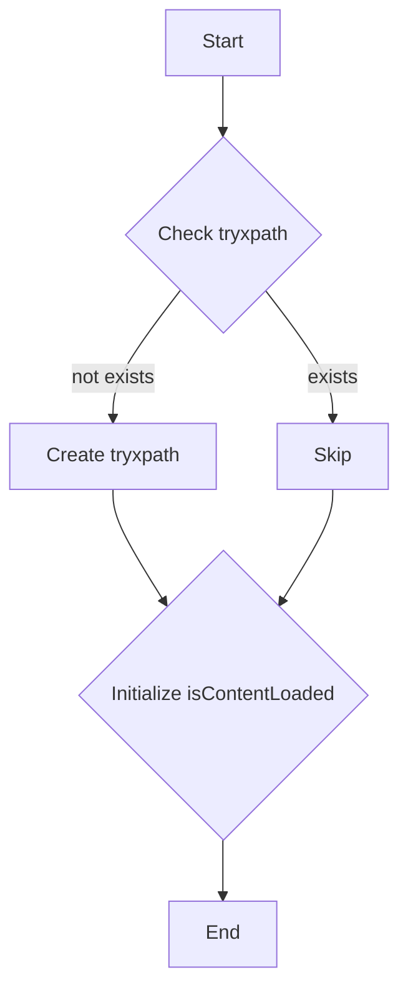

# Code Explanation

## <input code>

```javascript
/* This Source Code Form is subject to the terms of the Mozilla Public
 * License, v. 2.0. If a copy of the MPL was not distributed with this
 * file, You can obtain one at http://mozilla.org/MPL/2.0/. */

// namespace
if (!tryxpath) {
    var tryxpath = {};
}

tryxpath.isContentLoaded;
```

## <algorithm>

This code snippet is extremely basic and doesn't perform any significant operations.  It's primarily a namespace declaration and a property initialization.

```
[Start]
  --> Check if 'tryxpath' exists
     - If false:
        - Create an empty object 'tryxpath'.
     - If true:
        - Skip
  --> Initialize 'tryxpath.isContentLoaded' (assign a value, but the code doesn't specify one).
[End]
```

**Example Data Flow:**

If `tryxpath` does not exist, the code creates it: `{}`.  Then, the code initializes `tryxpath.isContentLoaded` to potentially a default value (undefined) which isn't explicitly defined.


## <mermaid>



**Dependencies:**

The code does not import any external libraries. It relies only on JavaScript's core functionality.  The diagram reflects this.


## <explanation>

* **Imports:** There are no imports. The code relies on JavaScript's built-in functionality.
* **Classes:** No classes are defined.
* **Functions:** No functions are defined.  The code is essentially a single, simple statement.
* **Variables:**
    * `tryxpath`: An object.  This code initializes a property within it.  It acts as a namespace to prevent name collisions.
    * `tryxpath.isContentLoaded`: A property that is likely used to track whether a page's content has fully loaded for testing purposes.

* **Potential Errors or Areas for Improvement:**

    * **Missing Initialization:** The code initializes `tryxpath.isContentLoaded`  without assigning a value. This could lead to unexpected behavior later if that variable is used in conditionals.
    * **Lack of Functionality:**  The code's sole purpose is to create and assign a property, which doesn't perform any useful tasks.


**Relationship to Other Project Parts:**

The code appears to be part of a larger project focused on web automation (likely using the Selenium webdriver with Firefox) and potentially interacting with HTML page elements via XPath. `tryxpath` likely encapsulates a set of functions or properties for verifying the state of the web page (e.g. if a particular HTML element exists), which could potentially be used by other modules.  Its relationship is one of an object-oriented namespace to organize variables and functions. The lack of functional code prevents a deeper relationship analysis.


**In summary:** This code snippet creates a namespace `tryxpath` and initializes an empty property `isContentLoaded`.  It's a very basic and potentially incomplete step in a larger web automation process.  The lack of initialization for `tryxpath.isContentLoaded` could lead to issues if the variable is later used in conditional statements.