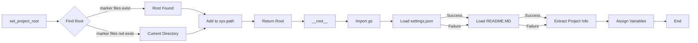

# Code Explanation for hypotez/src/webdriver/firefox/header.py

## <input code>

```python
## \file hypotez/src/webdriver/firefox/header.py
# -*- coding: utf-8 -*-\
#! venv/Scripts/python.exe
#! venv/bin/python/python3.12

"""
.. module: src.webdriver.firefox 
	:platform: Windows, Unix
	:synopsis:

"""


import sys
import json
from packaging.version import Version

from pathlib import Path
def set_project_root(marker_files=('__root__','.git')) -> Path:
    """
    Finds the root directory of the project starting from the current file's directory,
    searching upwards and stopping at the first directory containing any of the marker files.

    Args:
        marker_files (tuple): Filenames or directory names to identify the project root.
    
    Returns:
        Path: Path to the root directory if found, otherwise the directory where the script is located.
    """
    __root__:Path
    current_path:Path = Path(__file__).resolve().parent
    __root__ = current_path
    for parent in [current_path] + list(current_path.parents):
        if any((parent / marker).exists() for marker in marker_files):
            __root__ = parent
            break
    if __root__ not in sys.path:
        sys.path.insert(0, str(__root__))
    return __root__


# Get the root directory of the project
__root__ = set_project_root()
"""__root__ (Path): Path to the root directory of the project"""

from src import gs

settings:dict = None
try:
    with open(gs.path.root / 'src' /  'settings.json', 'r') as settings_file:
        settings = json.load(settings_file)
except (FileNotFoundError, json.JSONDecodeError):
    ...

doc_str:str = None
try:
    with open(gs.path.root / 'src' /  'README.MD', 'r') as settings_file:
        doc_str = settings_file.read()
except (FileNotFoundError, json.JSONDecodeError):
    ...


__project_name__ = settings.get("project_name", 'hypotez') if settings  else 'hypotez'
__version__: str = settings.get("version", '')  if settings  else ''
__doc__: str = doc_str if doc_str else ''
__details__: str = ''
__author__: str = settings.get("author", '')  if settings else ''
__copyright__: str = settings.get("copyrihgnt", '')  if settings else ''
__cofee__: str = settings.get("cofee", "Treat the developer to a cup of coffee for boosting enthusiasm in development: https://boosty.to/hypo69")  if settings else "Treat the developer to a cup of coffee for boosting enthusiasm in development: https://boosty.to/hypo69"
```

## <algorithm>

**Step 1:**  `set_project_root()` function is called.


**Step 2:** The function determines the project root directory by traversing upwards from the current file's directory until it finds a directory containing any of the specified marker files (`pyproject.toml`, `requirements.txt`, `.git`).
* **Example:** If the current file is in `hypotez/src/webdriver/firefox/header.py`, the function will check `hypotez/src/webdriver/firefox`, `hypotez/src/webdriver`, `hypotez/src`, `hypotez`, and so on.

**Step 3:** If the root directory is found, it's added to the `sys.path` to allow importing modules from that location.
* **Example:** If the root is found to be `hypotez`, then `hypotez` will be prepended to `sys.path`.

**Step 4:** `set_project_root()` returns the found root directory.

**Step 5:** The returned root directory is assigned to the variable `__root__`.

**Step 6:** The script imports the `gs` module from the `src` package.

**Step 7:**  It attempts to load settings from `settings.json` in the project's root directory.
* **Example:** If `settings.json` exists and contains valid JSON, `settings` dictionary is populated with the contents.

**Step 8:**  If `settings.json` is missing or invalid, it proceeds to the next part (no error is raised).

**Step 9:** The script attempts to read the `README.MD` file from the project's root directory.
* **Example:** If the file is valid, the contents are read into `doc_str`.

**Step 10:** If `README.MD` is missing or invalid, it proceeds to the next part (no error is raised).

**Step 11:** The script retrieves values from the `settings` dictionary (if available). Defaults are provided if the key is missing.
* **Example:** `__project_name__` gets the value for "project_name" from `settings`. If "project_name" is absent or `settings` is `None`, it defaults to 'hypotez'.

**Step 12:** Values for other attributes (`__version__`, `__doc__`, `__author__`, etc.) are set based on the `settings` and default values.


## <mermaid>



**Dependencies Analysis:**

- `sys`: Provides access to system-specific parameters and functions.
- `json`: Used for working with JSON data, crucial for loading the settings file.
- `packaging.version`: Used for handling package versions, potentially useful for version comparisons or checks.
- `pathlib`: Simplifies working with file paths. Crucial for navigating the project structure and accessing files based on path information.
- `src.gs`: (Internal dependency) Likely a module or package within the `hypotez` project.  It probably contains utility functions or objects related to file paths or other resources within the project's structure. The `gs.path.root` attribute signifies a central location object.


## <explanation>

**Imports:**

- `sys`: Used to modify the Python path, essential for accessing modules within the project.
- `json`: Used to parse the `settings.json` file, which likely contains important configuration information.
- `packaging.version`: This import is probably used for checking or comparing versions.
- `pathlib`: Provides a more object-oriented way to work with file paths.  This import makes the code more readable, and maintainable, as it avoids string manipulation errors related to OS-specific paths.
- `src.gs`: An internal module, presumably containing functions for interacting with the project's file system or resources. `gs.path.root` is likely a predefined variable representing the project's root directory, enabling the script to locate `settings.json` and `README.MD` with relative paths.

**Classes:**

- No classes are defined in this file.

**Functions:**

- `set_project_root(marker_files=...)`: This is a crucial function that dynamically locates the project root directory. It handles the cases where the script might be located within a subdirectory. This improves the portability of the code. The function takes a tuple of marker files as an argument. It iterates up the directory tree, checking if any of the files/directories exist in a parent directory.  It adds the root directory to `sys.path` to enable imports from this location.

**Variables:**

- `MODE`: A string variable, likely used for runtime configuration (e.g., 'dev', 'prod').
- `__root__`: A `Path` object, storing the path to the project's root directory.
- `settings`: A `dict`, storing the contents of `settings.json`.
- `doc_str`: A string, storing the contents of `README.MD` if found.
- `__project_name__`, `__version__`, `__doc__`, `__details__`, `__author__`, `__copyright__`, `__cofee__`: These variables hold project metadata, derived from `settings.json` (if available) or default values.

**Potential Errors/Improvements:**

- **Error Handling:** The `try...except` blocks for loading `settings.json` and `README.MD` are good practice but could be more specific.  Instead of `JSONDecodeError`, consider checking the file type (e.g., if a binary file is mistaken as a JSON).
- **Robustness:** The script relies on the existence of `settings.json` and `README.MD` in the project root.  Consider adding checks or alternative handling to gracefully handle missing files.
- **Code Clarity:** The use of `__root__` for the project's root directory is inconsistent with the rest of the names. Choosing consistent naming conventions for variables related to a directory is advisable.
- **Import Order:** Consider importing `sys` and the other modules that are used for standard library functionalities in the beginning for a more organized and consistent structure.

**Relationships with other parts of the project:**

- This `header.py` file is a foundation for other parts of the `hypotez` project. Its primary function is to ensure that the correct project environment is set, and that relevant files (like `settings.json`) are accessible, enabling correct instantiation and operation of other modules in the `hypotez` project. The `gs` module, referenced here, is likely a crucial utility module managing files and paths within the larger project.