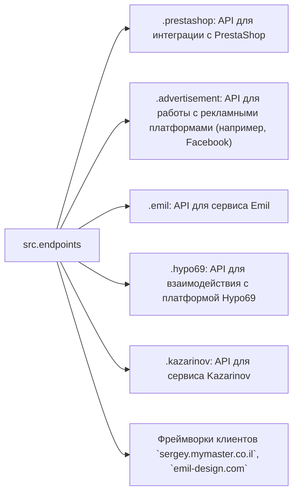

# Модуль конечных точек (`endpoints`)

## Обзор

Модуль `endpoints` предоставляет реализацию API для взаимодействия с потребителями данных.  Каждый подмодуль отвечает за интеграцию с определёнными сервисами.  `endpoints` включает подмодули для интеграции с различными системами потребителей, обеспечивая взаимодействие с внешними сервисами.


## Структура модуля



### Конечные точки взаимодействия с потребителями

# 1. **PrestaShop**
Интеграция с API PrestaShop. Использует стандартные API.

# 2. **bots**
Подмодуль для управления интеграцией с ботами Telegram и Discord.

# 3. **emil**
Подмодуль для интеграции с клиентом `emil-design.com` (PrestaShop + Facebook).

# 4. **kazarinov**
Подмодуль для интеграции с поставщиком данных Kazarinov (создание прайс-листов, продвижение в Facebook).


## Описание подмодулей

### 1. `prestashop`

Модуль предназначен для интеграции с системой электронной коммерции PrestaShop.  Реализует функционал взаимодействия с заказами, товарами и клиентами.

* **Основные функции**:
    - Создание, редактирование и удаление товаров.
    - Управление заказами и пользователями.


### 2. `advertisement`

Модуль предоставляет API для управления рекламными платформами, включая создание кампаний и аналитические отчеты.

* **Основные функции**:
    - Управление рекламными кампаниями.
    - Сбор и обработка данных аналитики.


### 3. `emil`

Интерфейс для работы с сервисом Emil, предоставляющим API для обмена данными.

* **Основные функции**:
    - Обработка и отправка запросов в сервис Emil.
    - Сбор данных из API Emil.


### 4. `hypo69`

API для взаимодействия с платформой Hypo69, предоставляющей специфические бизнес-решения.

* **Основные функции**:
    - Получение данных о клиентах.
    - Работа с пользовательскими отчетами.


### 5. `kazarinov`

Модуль для интеграции с сервисом Kazarinov. Поддерживает функционал аналитики и обмена данными.

* **Основные функции**:
    - Интеграция данных между системами.
    - Создание отчетов и аналитика.


## Установка и использование

### Установка

Для начала работы убедитесь, что установлены все зависимости проекта. Используйте команду:

```bash
pip install -r requirements.txt
```

### Использование

Импортируйте нужный подмодуль в свой код:

```python
from src.endpoints.prestashop import PrestashopAPI
from src.endpoints.advertisement import AdvertisementAPI
```

Далее настройте и используйте методы в зависимости от вашего кейса.


## Вклад в разработку

Если вы хотите внести изменения в модуль, соблюдайте следующие правила:

1. Используйте [PEP 8](https://peps.python.org/pep-0008/) для стиля кода.
2. Добавляйте тесты для нового функционала.
3. Оставляйте подробные комментарии к изменениям.

Для вопросов и предложений обращайтесь к владельцу репозитория или оставляйте комментарии в [Issues](#).