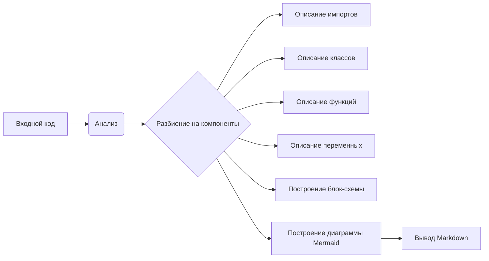

# Документация для instruction_code_explainer_md_en.py

## Обзор

Этот модуль предоставляет инструмент для генерации описания предоставленного Python-кода в формате Markdown. Он анализирует код, определяет его функциональность, и строит блок-схему, диаграмму в формате Mermaid, а также предоставляет подробное объяснение импортов, классов, функций, переменных и потенциальных проблем.

## Алгоритм

1. **Анализ кода**: Модуль принимает на вход строку с кодом Python.
2. **Разбиение на компоненты**: Код разбивается на отдельные блоки (импорты, классы, функции).
3. **Описание импортов**: Для каждого импорта определяется его назначение и зависимость от других модулей.
4. **Описание классов**: Для каждого класса определяется его роль, атрибуты, методы и взаимодействие с другими классами.
5. **Описание функций**: Для каждой функции определяется ее назначение, входные параметры, возвращаемые значения и примеры использования.
6. **Описание переменных**: Для каждой переменной определяется ее тип и назначение.
7. **Построение блок-схемы**: Строится блок-схема, отображающая поток данных между функциями и классами. Пример: блок `input` принимает на вход строку, блок `parse` разбивает ее на части.
8. **Построение диаграммы Mermaid**: Создается диаграмма в формате Mermaid, отображающая зависимости между импортируемыми модулями.
9. **Описание**:  Генерируется описание, которое включает в себя все предыдущие шаги.

**Пример:**

Входной код:

```python
import math

class Circle:
    def __init__(self, radius):
        self.radius = radius

    def area(self):
        return math.pi * self.radius ** 2
```

Вывод алгоритма:

1. `import math`: Импортирует математический модуль для использования функции `pi`.
2. `class Circle`: Определяет класс для работы с кругами.
3. `__init__(self, radius)`: Инициализирует атрибут `radius`.
4. `area(self)`: Вычисляет площадь круга.

## Диаграмма Mermaid



## Объяснение

### Импорты

`import math`: Импортирует модуль `math`, который предоставляет математические функции, включая `math.pi` для вычисления площади круга.  Он необходим для корректного выполнения вычислений в методе `area`.

### Классы

`Circle`: Класс, представляющий круг.
- `radius`: Атрибут, хранящий радиус круга.
- `__init__(self, radius)`: Конструктор класса, инициализирующий атрибут `radius`.
- `area(self)`: Метод, вычисляющий площадь круга, используя импортированную функцию `math.pi`.

### Функции


### Переменные


### Возможные ошибки и улучшения


### Связь с другими частями проекта


```
```
```
```
```
```
```
```
```
```
```

```
```
```
```
```
```
```
```
```