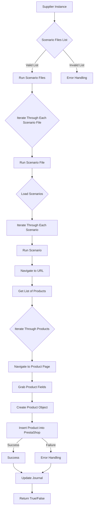

# Модуль scenario_executor

## Обзор

Этот модуль отвечает за выполнение сценариев, загруженных из предоставленного списка файлов. Он обрабатывает валидацию списка файлов, выполняет сценарии, собирает данные о продуктах и загружает их в систему PrestaShop. Модуль возвращает True, если все сценарии успешно выполнены, и False в противном случае.

## Алгоритм

Алгоритм выполнения сценариев представлен следующей диаграммой:



## Обработка ошибок

Модуль содержит обработку ошибок на различных этапах выполнения. Некорректный список файлов или проблемы при выполнении сценария приводят к обработке ошибки и возврату False.

## Функции

### `run_scenario_files`

**Описание**: Запускает выполнение сценариев, переданных в списке файлов.

**Параметры**:
- `scenario_files_list` (list): Список путей к файлам сценариев.

**Возвращает**:
- `bool`: True, если все сценарии успешно выполнены, False в противном случае.


**Вызывает исключения**:
- `ValueError`: Если переданный список пуст или содержит некорректные пути.
- `FileNotFoundError`: Если один из файлов в списке не найден.
- `Exception`: Обработка других необработанных исключений.


```python
def run_scenario_files(scenario_files_list: list) -> bool:
    """
    Args:
        scenario_files_list (list): Список путей к файлам сценариев.

    Returns:
        bool: True, если все сценарии успешно выполнены, False в противном случае.

    Raises:
        ValueError: Если переданный список пуст или содержит некорректные пути.
        FileNotFoundError: Если один из файлов в списке не найден.
        Exception: Обработка других необработанных исключений.
    """
    pass
```

### `run_scenario_file`

**Описание**: Выполняет сценарий из указанного файла.

**Параметры**:
- `scenario_file_path` (str): Путь к файлу сценария.

**Возвращает**:
- `bool`: True, если сценарий успешно выполнен, False в противном случае.


**Вызывает исключения**:
- `FileNotFoundError`: Если файл сценария не найден.
- `Exception`: Обработка других необработанных исключений.


```python
def run_scenario_file(scenario_file_path: str) -> bool:
    """
    Args:
        scenario_file_path (str): Путь к файлу сценария.

    Returns:
        bool: True, если сценарий успешно выполнен, False в противном случае.

    Raises:
        FileNotFoundError: Если файл сценария не найден.
        Exception: Обработка других необработанных исключений.
    """
    pass
```

(Аналогично, необходимо добавить документацию для других функций, используемых в модуле, например, для загрузки сценариев, выполнения сценариев, обработки ошибок и т.д.)