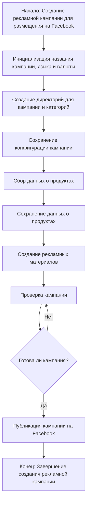

# Модуль `campaign`

## Обзор

Модуль `campaign` предназначен для управления процессом создания и публикации рекламных кампаний на Facebook. Он включает функционал для инициализации параметров кампании (название, язык, валюта), создания структуры директорий, сохранения конфигураций для новой кампании, сбора и сохранения данных о продуктах через `ali` или `html`, генерации рекламных материалов, проверки кампании и публикации ее на Facebook.

## Функции

### `initialize_campaign`

**Описание**: Инициализирует параметры новой рекламной кампании.

**Параметры**:
- `campaign_name` (str): Название кампании.
- `language` (str): Язык кампании.
- `currency` (str): Валюта кампании.

**Возвращает**:
- `dict`: Словарь с параметрами инициализированной кампании или `None` при ошибке.

**Вызывает исключения**:
- `ValueError`: При некорректных значениях параметров.

### `create_directories`

**Описание**: Создает структуру директорий для кампании и категорий.

**Параметры**:
- `campaign_name` (str): Название кампании.

**Возвращает**:
- `bool`: `True`, если директории созданы успешно, `False` в противном случае.

### `save_campaign_config`

**Описание**: Сохраняет конфигурацию кампании в файл.

**Параметры**:
- `campaign_config` (dict): Конфигурация кампании.
- `campaign_name` (str): Название кампании.

**Возвращает**:
- `bool`: `True`, если конфигурация сохранена успешно, `False` в противном случае.

**Вызывает исключения**:
- `IOError`: При проблемах с записью файла.

### `collect_product_data`

**Описание**: Сбор данных о продуктах.

**Параметры**:
- `source` (str): Источник данных ("ali" или "html").
- `product_id` (list): список ID продуктов.

**Возвращает**:
- `dict`: Словарь с данными о продуктах или `None` при ошибке.

**Вызывает исключения**:
- `ValueError`: Некорректный источник данных.
- `APIError`: Ошибки при взаимодействии с API.

### `generate_ads_materials`

**Описание**: Генерирует рекламные материалы на основе данных о продуктах.

**Параметры**:
- `product_data` (list): Список данных о продуктах.

**Возвращает**:
- `list`: Список сгенерированных рекламных материалов.

**Вызывает исключения**:
- `ValueError`: Некорректный формат данных.

### `check_campaign`

**Описание**: Проверяет готовность кампании к публикации.

**Параметры**:
- `campaign_data` (dict): Данные о кампании.

**Возвращает**:
- `bool`: `True`, если кампания готова, `False` в противном случае.

**Вызывает исключения**:
- `ValueError`: Данные о кампании некорректны.

### `publish_campaign`

**Описание**: Публикует кампанию на Facebook.

**Параметры**:
- `campaign_data` (dict): Данные о кампании.

**Возвращает**:
- `bool`: `True`, если кампания опубликована успешно, `False` в противном случае.

**Вызывает исключения**:
- `FacebookAPIEx`: Ошибки при взаимодействии с API Facebook.