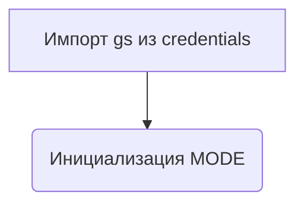
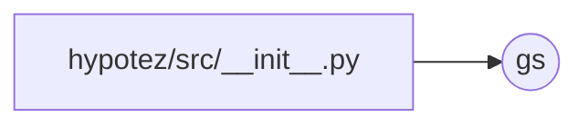

# <input code>

```python
## \file hypotez/src/__init__.py
# -*- coding: utf-8 -*-
#! venv/Scripts/python.exe
#! venv/bin/python/python3.12

"""
.. module: src 
	:platform: Windows, Unix
	:synopsis:

Root of the project.
========================================================================================

This module provides a structured overview of various modules within the project,
detailing their primary functionalities and roles.

Usage Example
--------------------

.. code-block:: python

    # No usage example available for this module.
"""


from .credentials import gs
```

# <algorithm>

Этот код является инициализационным модулем (`__init__.py`) для пакета `src`.  Он не содержит какой-либо сложной логики выполнения.

Блок-схема:



В этом случае, `gs` - это объект (вероятно, с данными учетных записей) из модуля `credentials.py` в подпапке `src`.  `MODE` - это переменная, хранящая строковое значение 'dev'.

# <mermaid>



**Объяснение построения диаграммы:**

Диаграмма показывает, что модуль `__init__.py` импортирует объект `gs` из модуля `credentials.py`.  Это отражает зависимость `__init__.py` от `credentials.py` для доступа к его ресурсам.

# <explanation>

* **Импорты:**

   - `from .credentials import gs`: Этот импорт подключает переменную `gs` из модуля `credentials.py` (находящегося в той же папке, что и `__init__.py` - указано `.credentials`). Это означает, что `__init__.py` использует функциональность или данные из модуля `credentials.py`.  Это типичная практика организации кода, в которой функции/классы/переменные, необходимые в нескольких модулях, импортируются в `__init__.py`, чтобы к ним можно было обращаться из других модулей.

* **Классы:**

    Этот файл не содержит классов.

* **Функции:**

    Этот файл не содержит функций.

* **Переменные:**

   - ``: Это глобальная переменная, которая, вероятно, используется для определения режима работы программы (например, 'dev' для разработки, 'prod' для производства). Ее значение устанавливается в 'dev'.

* **Возможные ошибки или области для улучшений:**

   - **Отсутствие документации:**  Хотя есть docstrings, они очень просты и не содержат примеров использования. Добавление примеров использования повысит читаемость кода и поможет понимать, как использовать переменную `gs`.
   - **Неопределенный тип gs:**  Без определения `gs` в `credentials.py` сложно судить, что это за объект.  Важно определить его тип (например, `class Credentials` or `dict` or `tuple`), чтобы иметь полное представление о его использовании.  Важно также, что импортируются только нужные атрибуты, а не весь модуль `credentials`.
   - **Неясность назначения:**  Комментарии не объясняют, *зачем* это `MODE` переменная.  Если она необходима в других модулях, это должно быть указано.

* **Взаимосвязи с другими частями проекта:**

    Модуль `__init__.py` служит для импортирования необходимых переменных и объектов из других модулей проекта, в частности из `credentials.py`.  Это является ключевым компонентом организации кода в иерархической структуре пакета.  Дальнейшее изучение `credentials.py` необходимо для понимания полных взаимосвязей.