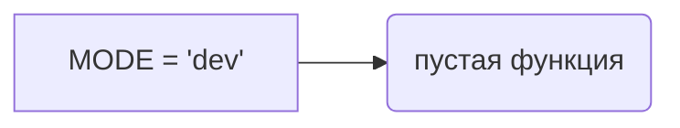

# <input code>

```python
## \file hypotez/src/ai/dialogflow/__init__.py
# -*- coding: utf-8 -*-\
#! venv/Scripts/python.exe
#! venv/bin/python/python3.12

"""
.. module: src.ai.dialogflow 
	:platform: Windows, Unix
	:synopsis:

"""
MODE = 'dev'

"""
	:platform: Windows, Unix
	:synopsis:

"""


"""
	:platform: Windows, Unix
	:synopsis:

"""


"""
  :platform: Windows, Unix

"""
"""
  :platform: Windows, Unix
  :platform: Windows, Unix
  :synopsis:
"""MODE = 'dev'
  
""" module: src.ai.dialogflow """

""" HERE SHOULD BE A DESCRIPTION OF THE MODULE OPERATION ! 
https://habr.com/ru/articles/346606/
"""
```

# <algorithm>

Алгоритм работы кода в данном файле отсутствует. Файл `__init__.py` содержит только константное значение `MODE = 'dev'` и комментарии.  Он не содержит логики, которая бы выполнялась.  Поэтому блок-схема не нужна.


# <mermaid>



# <explanation>

Этот файл `__init__.py` является инициализационным файлом для пакета `dialogflow` в модуле `ai` проекта. Он не содержит функции или классы с логикой, а только переменную и комментарии.

* **Импорты**: Нет импортов. Файл не использует другие модули или пакеты.

* **Классы**: Нет классов.

* **Функции**: Нет функций.

* **Переменные**:  `MODE = 'dev'`:  Это константа, которая задаёт режим работы (предположительно, для разработки или `dev`).  Значение `'dev'` имеет тип `str`.  Это переменная, которая не используется в коде.

* **Возможные ошибки или области для улучшений**:
    * Отсутствует описание функции.  В комментариях к коду не указано, для чего эта переменная. Если она используется в другом коде проекта, нужно добавить описания её применения.
    * Отсутствие логики. Файл `__init__.py` должен содержать импорты или определения классов/функций, относящихся к модулю `dialogflow`.  Этот файл пустой и не выполняет никакой работы.
    * Недокументированная переменная.  Названию `MODE` (режим) должно соответствовать пояснение о том, как эта переменная используется.

* **Цепочка взаимосвязей с другими частями проекта**:  Файл `hypotez/src/ai/dialogflow/__init__.py` определяет начальные параметры для модуля `dialogflow`.  В дальнейшем он должен быть подключен и использован в других модулях или скриптах, где он может использоваться для управления режимами.  Влияние этого файла будет косвенным: если в других модулях будет использоваться переменная `MODE`, то эти модули будут влиять на поведение всего проекта.

**Важно**: Комментарии в начале файла содержат неполную информацию и не отражают реальную работу модуля.  Для корректного понимания необходимо изучить другие файлы проекта, использующие переменную `MODE`.