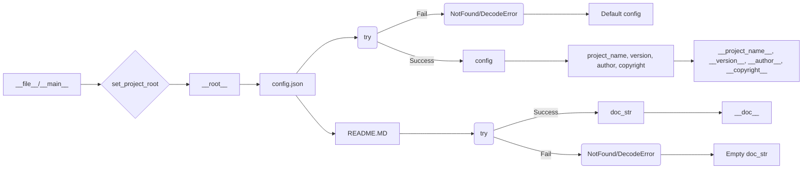

# <input code>

```python
## \file hypotez/src/ai/gemini/header.py
# -*- coding: utf-8 -*-
#! venv/Scripts/python.exe
#! venv/bin/python/python3.12

"""
.. module: src.ai.gemini 
	:platform: Windows, Unix
	:synopsis: Модуль интерфейса с моделью от Coogle - generativeai

"""
MODE = 'dev'


import sys
import json
from packaging.version import Version

from pathlib import Path
def set_project_root(marker_files=('pyproject.toml', 'requirements.txt', '.git')) -> Path:
    """
    Finds the root directory of the project starting from the current file's directory,
    searching upwards and stopping at the first directory containing any of the marker files.

    Args:
        marker_files (tuple): Filenames or directory names to identify the project root.
    
    Returns:
        Path: Path to the root directory if found, otherwise the directory where the script is located.
    """
    __root__:Path
    current_path:Path = Path(__file__).resolve().parent
    __root__ = current_path
    for parent in [current_path] + list(current_path.parents):
        if any((parent / marker).exists() for marker in marker_files):
            __root__ = parent
            break
    if __root__ not in sys.path:
        sys.path.insert(0, str(__root__))
    return __root__


# Get the root directory of the project
__root__ = set_project_root()
"""__root__ (Path): Path to the root directory of the project"""

from src import gs

config:dict = None
try:
    with open(gs.path.root / 'src' /  'config.json', 'r') as f:
        config = json.load(f)
except (FileNotFoundError, json.JSONDecodeError):
    ...

doc_str:str = None
try:
    with open(gs.path.root / 'src' /  'README.MD', 'r') as settings_file:
        doc_str = settings_file.read()
except (FileNotFoundError, json.JSONDecodeError):
    ...


__project_name__ = config.get("project_name", 'hypotez') if config else 'hypotez'
__version__: str = config.get("version", '')  if config else ''
__doc__: str = doc_str if doc_str else ''
__details__: str = ''
__author__: str = config.get("author", '')  if config else ''
__copyright__: str = config.get("copyrihgnt", '')  if config else ''
__cofee__: str = settings.get("cofee", "Treat the developer to a cup of coffee for boosting enthusiasm in development: https://boosty.to/hypo69")  if settings  else "Treat the developer to a cup of coffee for boosting enthusiasm in development: https://boosty.to/hypo69"
```

# <algorithm>

1. **`set_project_root` function:**
   - Takes a tuple of marker files as input.
   - Starts from the current file's directory.
   - Iterates through parent directories until it finds one containing any of the specified marker files.
   - If found, sets `__root__` to this directory and breaks the loop.
   - If `__root__` is not already in `sys.path`, it's added.
   - Returns the `__root__` path.

   *Example*: If the current file is in `hypotez/src/ai/gemini/header.py` and `pyproject.toml` exists in `hypotez/`, the function will return the path to `hypotez/`.

2. **Initialization of variables:**
   - The `__root__` is obtained from the `set_project_root` function.
   - It initializes `config` by trying to load `config.json` from `src/config.json` within the project root directory. Handling `FileNotFoundError` and `json.JSONDecodeError` for robustness.
   - It initializes `doc_str` by trying to load `README.MD` from `src/README.MD` within the project root directory. Similar error handling.

3. **Setting project information:**
   - Extracts project name, version, author, copyright, and documentation (README) from the `config.json` file if it exists.  Defaults are set if the file is missing or doesn't have the necessary data.
   - Assigns the extracted or default values to `__project_name__`, `__version__`, `__doc__`, `__author__`, `__copyright__`, `__coffee__`.

# <mermaid>



**Explanation of Dependencies:**


- `sys`: Used for manipulating the Python path.
- `json`: Used for reading and parsing the `config.json` file.
- `pathlib`: Used for working with file paths in a platform-independent way.
- `packaging.version`: Used for handling and manipulating software versions.  (Necessary for any project that might need to read or write version numbers or compare different version numbers.)

The code depends on `src.gs` which is not shown but is likely providing a `path` object to represent the project root (`gs.path.root`) to simplify working with paths.

# <explanation>

- **Imports:**
    - `sys`: Provides access to system-specific parameters and functions, particularly important here for manipulating the `sys.path`.
    - `json`: Used for working with JSON data, essential for reading the `config.json` file.
    - `packaging.version`: Used for handling software versioning and comparison.
    - `pathlib`: Used for working with file paths in a more object-oriented and platform-independent manner.

- **Classes:**
  - No classes are defined.

- **Functions:**
    - `set_project_root`: This function is crucial for finding the project's root directory, which is fundamental for locating configuration and other important files.  It handles the project's hierarchy elegantly.

- **Variables:**
    - `__root__`: Stores the path to the project root directory, essential for locating configuration files.
    - `config`: Stores the data loaded from `config.json`, enabling access to project-specific configurations.
    - `doc_str`: Stores the documentation loaded from `README.MD`, facilitating access to project information.
    - `__project_name__`, `__version__`, `__author__`, `__copyright__`, `__doc__`, and `__coffee__`:  These variables store the corresponding values parsed from `config.json` and/or the `README.MD` file. The `__coffee__` variable is unusual and might be a reminder or support link.

- **Error Handling:**
    - The `try...except` blocks handle `FileNotFoundError` and `json.JSONDecodeError` gracefully. This is extremely important, as it prevents crashes if the configuration file is missing or has an invalid format.


- **Possible Improvements:**
    - Consider using a dedicated configuration library (like `configparser`) for handling configuration files instead of directly using `json.load`. This can provide better structure and flexibility in managing configurations.
    - More sophisticated error handling.  Logging could be employed.
    -  The use of `settings` instead of `config` for `__cofee__` seems like a typo.


**Relationships with Other Parts of the Project:**

This `header.py` file is a foundational part of the `hypotez` project. It sets up the project environment, retrieves essential configurations (like project name, version), and provides access to important documentation (like README.md).  The `gs` module (likely part of the same project) is used to interact with the project's file structure. This module is clearly crucial, as it provides access to the project root directory, `gs.path.root`.