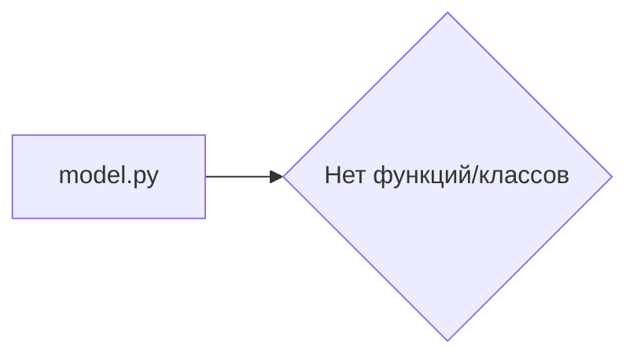

# Анализ кода из hypotez/src/ai/llama/model.py

1. **<input code>**

```python
## \file hypotez/src/ai/llama/model.py
# -*- coding: utf-8 -*-\

#! venv/bin/python/python3.12

"""
.. module: src.ai.llama 
	:platform: Windows, Unix
	:synopsis:

"""


"""
	:platform: Windows, Unix
	:synopsis:

"""


"""
	:platform: Windows, Unix
	:synopsis:

"""


"""
  :platform: Windows, Unix

"""
"""
  :platform: Windows, Unix
  :platform: Windows, Unix
  :synopsis:
"""
  
""" module: src.ai.llama """
```

2. **<algorithm>**

Код не содержит алгоритма в привычном понимании. Он представляет собой пустой файл, содержащий лишь комментарии.  Блок-схема не может быть построена.

3. **<mermaid>**



4. **<explanation>**

* **Импорты**: Нет импортов,  в файле только комментарии и строка с переменной `MODE`.


* **Классы**: Нет определений классов.


* **Функции**: Нет определений функций.


* **Переменные**: Переменная `MODE`  является строковой константой,  принявшей значение 'dev'.  В коде нет функционального использования этой переменной.


* **Возможные ошибки или области для улучшений**: Файл пустой и не имеет смысла.  Это скорее всего временный файл или файл с недописанным кодом, нуждающимся в реализации. Ошибка заключается в отсутствии функционала.  Необходимы определения функций, методов, классов, переменных, взаимодействующих с другими частями проекта.


* **Цепочка взаимосвязей**: Без кода, реализующего функционал, невозможно проследить взаимосвязь с другими частями проекта.


**Заключение**: Данный файл представляет собой незавершенный и нерабочий код.  Он скорее всего должен содержать классы и функции, отвечающие за модели Llama, но пока пуст.  Нужно добавить реализацию логики работы модели.