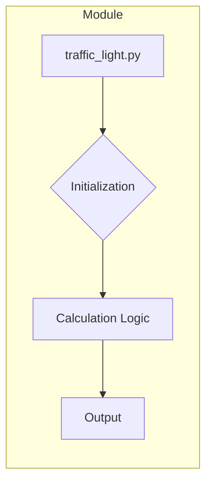

1. **<input code>**

```python
## \file hypotez/src/ai/myai/traffic_light.py
# -*- coding: utf-8 -*-\
#! venv/Scripts/python.exe
#! venv/bin/python/python3.12

"""
.. module: src.ai.myai 
	:platform: Windows, Unix
	:synopsis:

"""


"""
	:platform: Windows, Unix
	:synopsis:

"""


"""
	:platform: Windows, Unix
	:synopsis:

"""


"""
  :platform: Windows, Unix

"""
"""
  :platform: Windows, Unix
  :platform: Windows, Unix
  :synopsis:
"""
  
""" module: src.ai.myai """


""" HERE SHOULD BE A DESCRIPTION OF THE MODULE OPERATION ! 
https://habr.com/ru/articles/849414/
"""
```

2. **<algorithm>**

```mermaid
graph TD
    A[Start] --> B{Check MODE};
    B --  --> C[Module Initialization];
    B -- Otherwise --> D[Error Handling];
    C --> E[End];
    D --> F[End];
```

В данном коде нет явных алгоритмов обработки данных, так как он представляет собой заготовку или шаблон модуля.  Логика работы будет определяться кодом, который должен быть вставлен в отмеченный комментарий `HERE SHOULD BE A DESCRIPTION OF THE MODULE OPERATION !`. Алгоритм будет зависеть от реализуемой функциональности (например, контроль состояния светофора, моделирование движения транспорта и т. д.).


3. **<mermaid>**



В данном случае диаграмма отображает базовую структуру модуля. Подробная диаграмма зависит от того, какой функционал будет добавлен в `traffic_light.py`.

4. **<explanation>**

* **Импорты:** Отсутствуют импорты.  Код представляет собой заготовку модуля `traffic_light.py` в пакете `src.ai.myai`.  В дальнейшем, в зависимости от назначения, в модуле могут быть импортированы необходимые библиотеки (например, для работы с базами данных, графическими интерфейсами, другими модулями).

* **Классы:** Нет определенных классов.  Код может быть частью более крупной системы, где `traffic_light.py` является модулем для управления светофором.  Возможно, в нем будут определены классы (например, `TrafficLight`, `TrafficSignal`), которые будут представлять объекты светофора, сигнализацию и т.д.

* **Функции:**  Нет функций. В будущем предполагается, что будут определены функции для управления светофором (например, `change_light_state`, `get_current_state`).

* **Переменные:** `` — это глобальная переменная, которая определяет режим работы модуля. В данном случае, это просто строковая константа. В реальном коде эта переменная может использоваться для настройки поведения модуля.  Например, в режиме разработки могут быть включены отладочные выводы, а в режиме производства – нет.

* **Возможные ошибки/улучшения:**
    * Отсутствует реализация. Код представляет собой пустой шаблон, в нем не реализована никакая логика работы. Необходимо заполнить комментарий `HERE SHOULD BE A DESCRIPTION OF THE MODULE OPERATION !` и написать функциональность модуля.
    * Неясно, как эта часть кода интегрируется с другими модулями проекта `hypotez/src/ai/myai`.  Необходима дополнительная информация о проекте.


**Цепочка взаимосвязей:**

`traffic_light.py` находится в пакете `src.ai.myai`.  Это говорит о том, что он, скорее всего, часть проекта, который связан с искусственным интеллектом и, возможно, включает другие модули, связанные с обработкой данных, обучением моделей и т.д.  Без дополнительной информации о проекте невозможно установить более подробные связи.