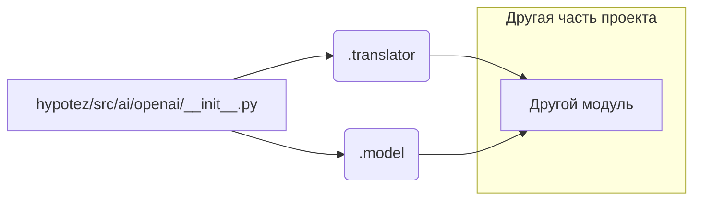

```MD
# <input code>

```python
## \file hypotez/src/ai/openai/__init__.py
# -*- coding: utf-8 -*-

#! venv/bin/python/python3.12

"""
.. module: src.ai.openai 
	:platform: Windows, Unix
	:synopsis: Модуль модели `openai`

"""


from .translator import translate
from .model import OpenAIModel
```

# <algorithm>

Этот код представляет собой инициализацию модуля `openai` в пакете `ai`.  

Алгоритм работы прост:

1. Определяется константа `MODE`, вероятно, для обозначения режима работы (например, 'dev' - для разработки, 'prod' - для производства).
2. Импортируются функции и классы из подмодулей `translator` и `model`. Это позволяет использовать их в других частях кода из этого модуля.

Пример:


```
# Пример использования
from hypotez.src.ai.openai import translate, OpenAIModel
result = translate("some text")  
model = OpenAIModel() 
```

# <mermaid>



**Объяснение диаграммы:**

Модуль `hypotez/src/ai/openai/__init__.py` импортирует функции и классы из подмодулей `translator` и `model`. Эти подмодули могут содержать дополнительный функционал, связанный с переводом и использованием моделей OpenAI соответственно.  `translator`  и `model` являются внутренними компонентами данного пакета и предоставляют функционал для работы с внешними API (например, с API OpenAI). Другой модуль (D) может использовать эти импортированные функции и классы для выполнения собственных задач, связанных с обработкой текста или использованием модели OpenAI.


# <explanation>

* **Импорты:**
    * `from .translator import translate`: Импортирует функцию `translate` из подмодуля `translator`. Символ `.` означает импорт из текущего пакета. Это указывает, что функция `translate` скорее всего определена в файле `translator.py` внутри пакета `openai`.  Это означает, что она, скорее всего, реализует какой-то перевод текста.
    * `from .model import OpenAIModel`: Импортирует класс `OpenAIModel` из подмодуля `model`. Этот класс, вероятно, представляет собой интерфейс для работы с моделью OpenAI, предоставляя методы для выполнения запросов к API.

* **Классы:**
    * `OpenAIModel`:  Этот класс, судя по имени, ответственен за взаимодействие с API OpenAI. Он содержит логику для создания, инициализации или использования модели OpenAI, вероятно, для задач, таких как генерация текста.  Подмодуль `model` скорее всего содержит дополнительные методы для работы с моделью, такие как установка параметров, отправка запросов и обработка ответов.

* **Функции:**
    * `translate`: Эта функция, скорее всего, отвечает за перевод текста с использованием внешнего API или какой-то внутренней логики.


* **Переменные:**
    * ``: Переменная, которая, вероятно, определяет режим работы модуля (например, 'dev' для разработки или 'prod' для производства). Это может влиять на настройки, логирование, или доступ к другим ресурсам.

* **Возможные ошибки и улучшения:**

    * Отсутствует обработка исключений.  Необходимо добавить `try...except` блоки, чтобы обработать возможные ошибки при взаимодействии с API OpenAI (например, ошибки подключения, ошибки авторизации).
    * Нет информации о настройках API. Необходимо указать, как происходит подключение к API OpenAI. Вероятно, это делается через переменные окружения или специальные файлы конфигурации.
    * Отсутствует документация для функций и методов. Необходимо добавить docstrings для лучшего понимания назначения и использования.

* **Связь с другими частями проекта:**

    Этот модуль `openai` предоставляет инструменты для работы с API OpenAI, поэтому его будут использовать другие части проекта, нуждающиеся в этом функционале. Например, модули для обработки запросов от пользователей, или для генерации контента, или для построения диалогов. Модуль `translator` вероятнее всего будет использован для перевода текста до передачи его модели OpenAI.


```