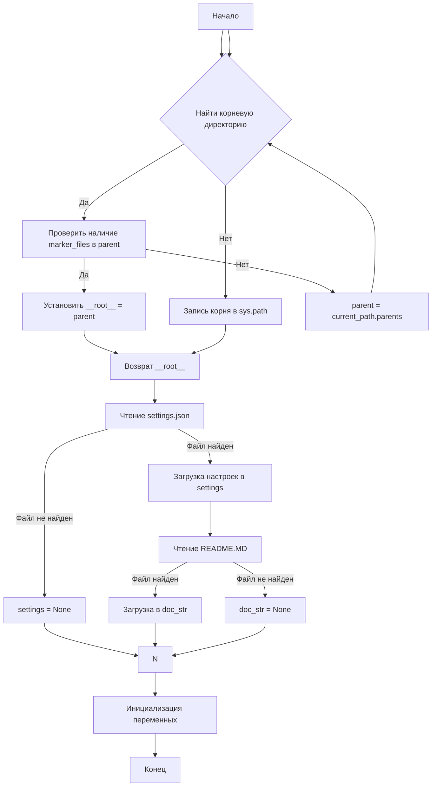
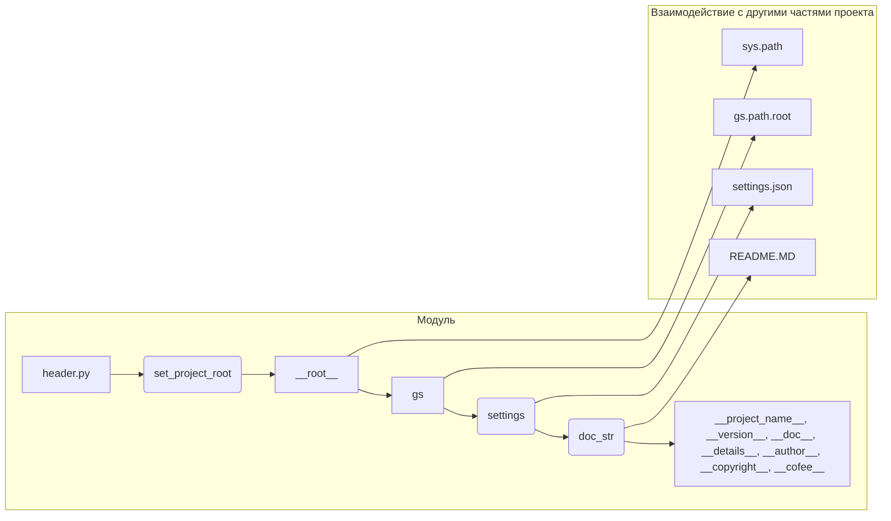

# <input code>

```python
## \file hypotez/src/logger/header.py
# -*- coding: utf-8 -*-
#! venv/Scripts/python.exe
#! venv/bin/python/python3.12

"""
module: src.logger 
	:platform: Windows, Unix
	:synopsis: Модуль определяющий корневой путь к проекту. Все импорты строятся относительно этого пути.
    :TODO: В дальнейшем перенести в системную переменную"""


import sys
import json
from packaging.version import Version

from pathlib import Path
def set_project_root(marker_files=('__root__')) -> Path:
    """
    Finds the root directory of the project starting from the current file's directory,
    searching upwards and stopping at the first directory containing any of the marker files.

    Args:
        marker_files (tuple): Filenames or directory names to identify the project root.
    
    Returns:
        Path: Path to the root directory if found, otherwise the directory where the script is located.
    """
    __root__:Path
    current_path:Path = Path(__file__).resolve().parent
    __root__ = current_path
    for parent in [current_path] + list(current_path.parents):
        if any((parent / marker).exists() for marker in marker_files):
            __root__ = parent
            break
    if __root__ not in sys.path:
        sys.path.insert(0, str(__root__))
    return __root__


# Get the root directory of the project
__root__ = set_project_root()
"""__root__ (Path): Path to the root directory of the project"""

from src import gs

settings:dict = None
try:
    with open(gs.path.root / 'src' /  'settings.json', 'r') as settings_file:
        settings = json.load(settings_file)
except (FileNotFoundError, json.JSONDecodeError):
    ...

doc_str:str = None
try:
    with open(gs.path.root / 'src' /  'README.MD', 'r') as settings_file:
        doc_str = settings_file.read()
except (FileNotFoundError, json.JSONDecodeError):
    ...


__project_name__ = settings.get("project_name", 'hypotez') if settings  else 'hypotez'
__version__: str = settings.get("version", '')  if settings  else ''
__doc__: str = doc_str if doc_str else ''
__details__: str = ''
__author__: str = settings.get("author", '')  if settings else ''
__copyright__: str = settings.get("copyrihgnt", '')  if settings else ''
__cofee__: str = settings.get("cofee", "Treat the developer to a cup of coffee for boosting enthusiasm in development: https://boosty.to/hypo69")  if settings else "Treat the developer to a cup of coffee for boosting enthusiasm in development: https://boosty.to/hypo69"
```

# <algorithm>

**Блок-схема:**



**Пример:**

Предположим, что `__file__` указывает на `hypotez/src/logger/header.py`.  Функция `set_project_root` будет искать директории, начиная с `hypotez/src/logger`, затем `hypotez/src`, и так далее, пока не найдет директорию содержащую `pyproject.toml`, `requirements.txt` или `.git`. Если найдена `hypotez`, то `__root__` будет указывать на `hypotez`.  Эта директория будет добавлена в `sys.path`.

# <mermaid>



# <explanation>

**Импорты:**

- `sys`: Для управления системными переменными, в частности, путем добавления корневой директории в `sys.path`.
- `json`: Для работы с файлами JSON (чтение и парсинг настроек).
- `packaging.version`: Для работы с версиями пакетов (возможно для обработки версий в `settings.json`).
- `pathlib`: Для работы с путями файлов и директорий. `Path` - это удобный класс для работы с файлами.
- `src.gs`: Указание на модуль `gs`, вероятно содержащий глобальные настройки или информацию о путях к файлам.  Без его детального анализа неясно, что он делает.  **Важная зависимость** от другого компонента проекта.

**Классы:**

- Нет явных классов, только использование `Path` из `pathlib`. `Path` - это класс, позволяющий работать с путями в удобной и интуитивной форме.

**Функции:**

- `set_project_root(marker_files)`: Находит корневую директорию проекта, начиная с текущего файла и поднимаясь вверх по дереву директорий.  Возвращает `Path` к корневой директории.  `marker_files` - это набор файлов (или директорий), по наличию которых функция определяет корень.
    - **Аргументы:**  `marker_files` (кортеж строк).
    - **Возвращаемое значение:** `Path`.
    - **Пример использования:** `__root__ = set_project_root(('pyproject.toml', 'requirements.txt', '.git'))`

**Переменные:**

- `__root__`: Содержит `Path` к корневой директории проекта.
- `settings`, `doc_str`: содержат загруженные данные из файлов соответственно `settings.json` и `README.MD`.  Их значения могут быть `None` при ошибках.
- `MODE`, `__project_name__`, `__version__`, `__doc__`, `__details__`, `__author__`, `__copyright__`, `__cofee__`:  Эти переменные содержат данные о проекте, полученные из `settings.json` или имеют значения по умолчанию.

**Возможные ошибки и улучшения:**

- **Обработка ошибок:** В `try...except` блоках обрабатываются `FileNotFoundError` и `json.JSONDecodeError`.  Это хорошо. Однако, более подробная информация об ошибке (например, вывод сообщения об ошибке) улучшит диагностику.
- **Типы данных:**  Проверить, что данные из `settings.json` соответствуют ожидаемым типам (например, `version` - это строка, а не число).
- **Проверка `settings`:** Перед использованием `settings` нужно убедиться, что он не равен `None`. (Это частично реализовано в коде).
- **Логирование:**  Вместо `...` использовать логирование для записи ошибок при чтении файлов (например, `logging.error`).
- **Документация:** Добавьте более подробную документацию для функций и переменных, особенно для `gs`.
- **`gs.path.root`:** Очень важно понять, что это такое. Необходим анализ модуля `gs`, чтобы понять, откуда он берёт эту переменную.

**Взаимосвязи с другими частями проекта:**

Модуль `header.py` устанавливает корень проекта и загружает настройки, которые используются другими частями проекта.  Он напрямую зависит от модуля `gs` для получения корневой директории. Это важно для корректной работы других модулей, так как импорты в этих модулях будут строиться относительно найденной `__root__`.  Наличие файла `settings.json` и `README.MD` в директории проекта также является важным фактором.