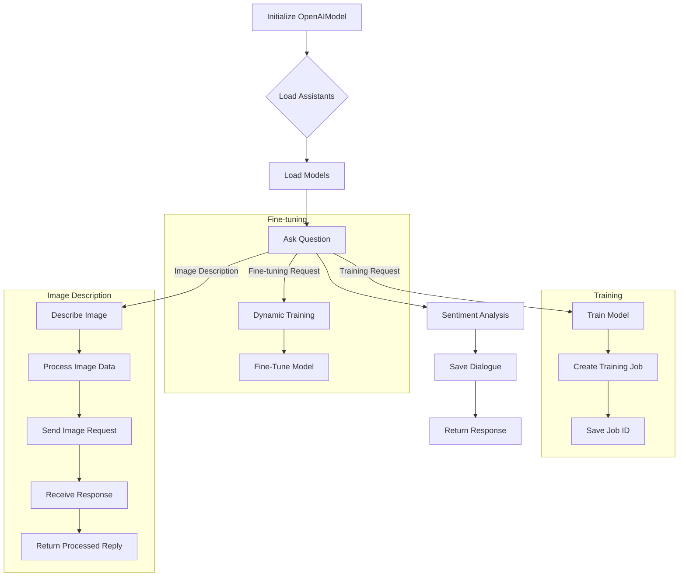
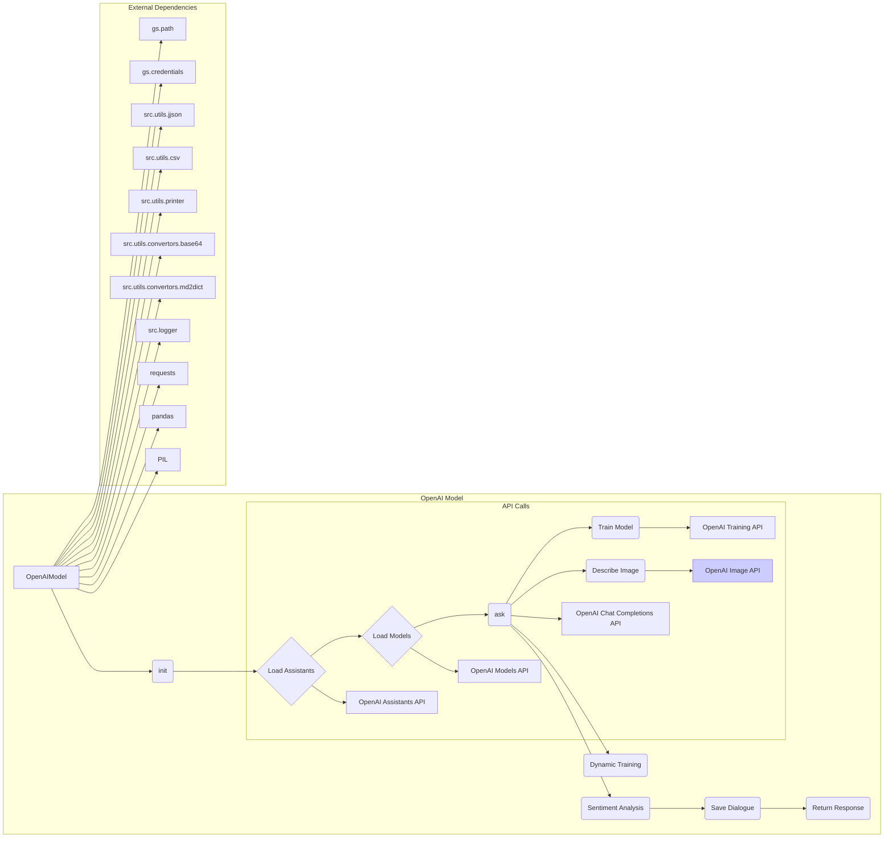

# <input code>

```python
## \file hypotez/src/ai/openai/model/training.py
# -*- coding: utf-8 -*-\
#! venv/Scripts/python.exe
#! venv/bin/python/python3.12

"""
.. module: src.ai.openai.model 
	:platform: Windows, Unix
	:synopsis: OpenAI Model Class for handling communication with the OpenAI API and training the model

"""


import time
from pathlib import Path
from types import SimpleNamespace
from typing import List, Dict, Optional
import pandas as pd
from openai import OpenAI
import requests
from PIL import Image
from io import BytesIO

from src import gs
from src.utils.jjson import j_loads, j_loads_ns, j_dumps
from src.utils.csv import save_csv_file  
from src.utils.printer import pprint
from src.utils.convertors.base64 import base64encode
from src.utils.convertors.md2dict import md2dict
from src.logger import logger

class OpenAIModel:
    """OpenAI Model Class for interacting with the OpenAI API and managing the model."""

    model: str = "gpt-4o-mini"
    #model: str = "gpt-4o-2024-08-06"
    client: OpenAI
    current_job_id: str
    assistant_id: str 
    assistant = None
    thread = None
    system_instruction: str
    dialogue_log_path: str | Path = gs.path.google_drive / 'AI' / f"{model}_{gs.now}.json"
    dialogue: List[Dict[str, str]] = []
    assistants: List[SimpleNamespace]
    models_list: List[str]

    def __init__(self, system_instruction: str = None, model_name:str = 'gpt-4o-mini', assistant_id: str = None):
        """Initialize the Model object with API key, assistant ID, and load available models and assistants.

        Args:
            system_instruction (str, optional): An optional system instruction for the model.
            assistant_id (str, optional): An optional assistant ID. Defaults to 'asst_dr5AgQnhhhnef5OSMzQ9zdk9'.
        """
        #self.client = OpenAI(api_key = gs.credentials.openai.project_api)
        self.client = OpenAI(api_key = gs.credentials.openai.api_key)
        self.current_job_id = None
        self.assistant_id = assistant_id or gs.credentials.openai.assistant_id.code_assistant
        self.system_instruction = system_instruction

        # Load assistant and thread during initialization
        self.assistant = self.client.beta.assistants.retrieve(self.assistant_id)
        self.thread = self.client.beta.threads.create()

    # ... (rest of the code)
```

# <algorithm>



**Explanation of Data Flow:**

1. **Initialization (A):**  The `OpenAIModel` is initialized, loading assistants and models. Data: `system_instruction`, `assistant_id`, API key.

2. **Model Loading (B, C):** Assistants and models are loaded from external JSON files. Data: API responses, assistant list, model list.

3. **Asking a Question (D):** The `ask()` method sends a user's message to the OpenAI API. Data: User's message, system instruction.

4. **Sentiment Analysis (E):** The `determine_sentiment()` method analyzes the model's response to categorize it as positive, negative, or neutral. Data: Model's response text.

5. **Saving Dialogue (F):** The dialogue history (messages and sentiment) is saved to a JSON file. Data: Dialogue log.

6. **Returning Response (G):** The model's response is returned to the caller. Data: Model's response string.

7. **Dynamic Training (H, I):** Historical dialogue data is used to fine-tune the model. Data: Historical dialogue JSON.

8. **Training the Model (J, K, L):** The `train()` method utilizes training data to create a training job and saves the job ID with a description. Data: training data, model.

9. **Image Description (M, N, O, P, Q):** `describe_image()` method handles sending images to OpenAI API for description. Data: image path, prompt, base64 image data.

**Example Data Flow:**

User inputs "What is the capital of France?". This triggers the `ask()` method. The data (user's message) flows through sentiment analysis, saving to the dialogue log, and finally returns the model's response.


# <mermaid>



# <explanation>

**Imports:**

- The code imports various modules, predominantly from the `src` directory. This indicates a modular structure where functionalities are organized into separate packages within the project.
- `gs`: Likely a custom module for interacting with Google Services (e.g., Google Drive, storage).
- `src.utils.jjson`, `src.utils.csv`, `src.utils.printer`, `src.utils.convertors.base64`, `src.utils.convertors.md2dict`: These imports suggest the existence of utility functions for JSON manipulation, CSV handling, printing, base64 conversion, and Markdown parsing, respectively.
- `src.logger`: A custom logger module, handling logging.
- `openai`, `requests`, `PIL`, `pandas`: Standard Python libraries for interacting with the OpenAI API, making HTTP requests, image manipulation, and data handling (in the case of pandas).

**Classes:**

- `OpenAIModel`: This class encapsulates the interaction with the OpenAI API, model handling, training, and dialogue management.
    - `model`: The name of the model to use for API calls.
    - `client`: An OpenAI client object for interaction.
    - `current_job_id`: Keeps track of the current training job ID.
    - `assistant_id`: The ID of the assistant to use.
    - `assistant`, `thread`: Objects for interacting with the OpenAI assistant and thread.
    - `system_instruction`: Instructions for the assistant.
    - `dialogue_log_path`: The file to save dialogue history.
    - `dialogue`: A list of dialogue messages.
    - `assistants`: List of available assistants.
    - `models_list`: A list of available models.

**Functions:**

- `__init__`: Initializes the `OpenAIModel` object, sets up the API client, loads assistants, and creates a thread.  Crucially, it sets up the assistant and thread.

- `list_models`, `list_assistants`:  These are `@property` methods used to fetch and return models/assistants. This approach is useful for dynamic access to these items, preventing the need for separate calls to retrieve information.
- `set_assistant`: Changes the assistant's id for interactions with OpenAI.
- `_save_dialogue`: Saves the current dialogue to a JSON file.
- `determine_sentiment`: Analyzes a message for positive, negative, or neutral sentiment.
- `ask`: Sends a message to the OpenAI model and returns the response.
- `describe_image`, `describe_image_by_requests`: These functions send images to the OpenAI API and return descriptions.   Note the `describe_image_by_requests` function utilizes `requests` for making the API call instead of the OpenAI library directly. This adds redundancy in the method of interaction with the OpenAI API.
- `dynamic_train`: Fine-tunes the model on previous conversations.
- `train`: Trains the model on a given dataset.
- `save_job_id`: Saves training job ID with description.

**Variables:**

- `MODE`: A string variable defining the operation mode.
- `gs.path`, `gs.credentials`: These indicate the use of a `gs` module for interacting with Google Services, providing access to paths and credentials for API access.


**Possible Improvements:**

- **Error Handling:**  While the code includes `try...except` blocks, consider adding more specific error handling to catch different types of exceptions and provide more informative error messages.
- **Data Validation:**  The code could benefit from input validation to check the validity of provided data, especially the training data format, to prevent unexpected behavior.
- **Asynchronous Operations:**  Consider using asynchronous operations for API calls (if appropriate), especially for image description functions.
- **Code Reusability:**  Functions like `j_loads`, `j_dumps` could be improved by utilizing proper error handling and validating the JSON structure to reduce exceptions.
- **Clearer Variable Names:** Some variable names could be more descriptive (e.g., `model_name` instead of `model`).
- **Type Hinting:** Ensure the type hints are correct and comprehensive throughout the code, especially for function arguments and return types.

**Relationships to other parts of the project:**

- `gs` interacts with Google services (likely for file storage and credentials management), suggesting a dependency on Google Cloud APIs or similar services.
- `src.utils` functions appear to provide utility methods that are reusable across the application.
- The code likely depends on a `src.logger` module and interacts with other modules within the `src` project.  Further, the use of external packages such as `pandas` and `openai` also suggest the code is part of a larger application.