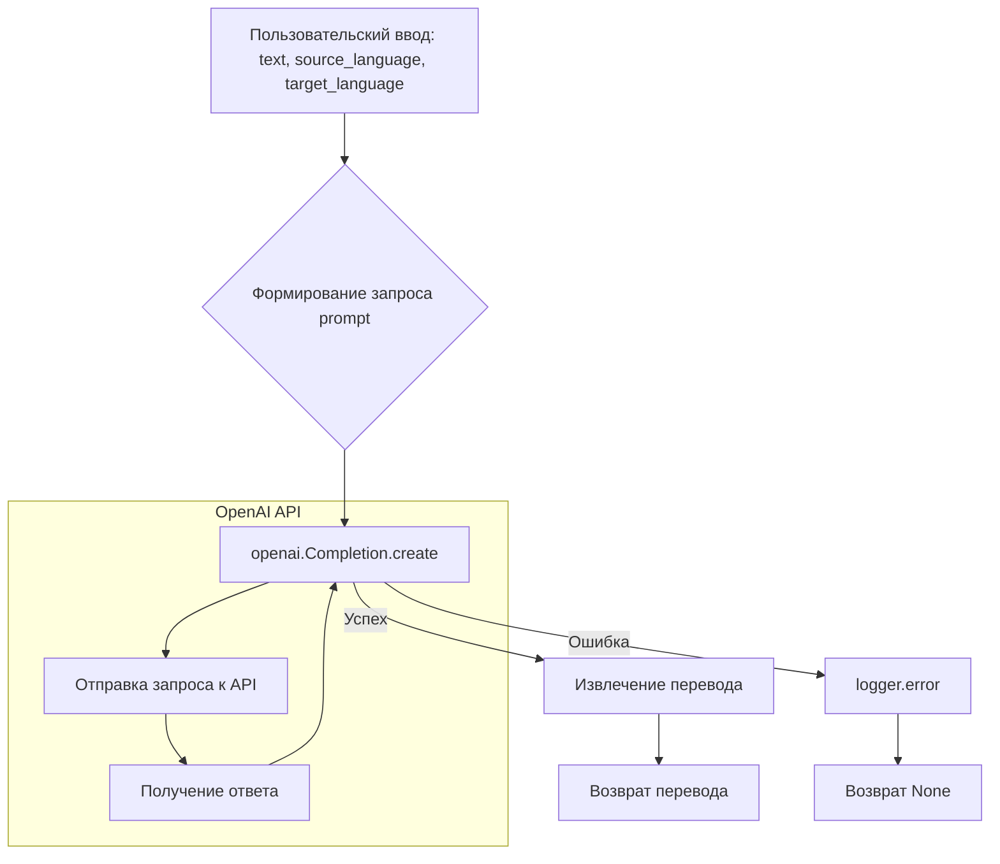

```MD
# <input code>

```python
## \file hypotez/src/ai/openai/translator.py
# -*- coding: utf-8 -*-
#! venv/Scripts/python.exe
#! venv/bin/python/python3.12

"""
.. module:: src.ai.openai
    :platform: Windows, Unix
    :synopsis: Модуль для перевода текста с использованием OpenAI API.
"""


import openai
from src import gs
from src.logger import logger

openai.api_key = gs.credentials.openai

def translate(text, source_language, target_language):
    """
    Перевод текста с использованием OpenAI API.

    Этот метод отправляет текст для перевода на указанный язык с помощью модели OpenAI и возвращает переведённый текст.

    Аргументы:
        text (str): Текст для перевода.
        source_language (str): Язык исходного текста.
        target_language (str): Язык для перевода.

    Возвращает:
        str: Переведённый текст.

    Пример использования:
        >>> source_text = "Привет, как дела?"
        >>> source_language = "Russian"
        >>> target_language = "English"
        >>> translation = translate_text(source_text, source_language, target_language)
        >>> print(f"Translated text: {translation}")
    """
    
    # Формируем запрос к OpenAI API
    prompt = (
        f"Translate the following text from {source_language} to {target_language}:\\n\\n"
        f"{text}\\n\\n"
        f"Translation:"
    )

    try:
        # Отправляем запрос к OpenAI API
        response = openai.Completion.create(
            engine="text-davinci-003",  # Укажите нужную модель
            prompt=prompt,
            max_tokens=1000,
            n=1,
            stop=None,
            temperature=0.3
        )

        # Извлекаем перевод из ответа API
        translation = response.choices[0].text.strip()
        return translation
    except Exception as ex:
        # Логируем ошибку
        logger.error("Error during translation", ex)
        return
```

# <algorithm>

**Пошаговая блок-схема:**

1. **Ввод:** Пользовательский ввод: `text`, `source_language`, `target_language`.
2. **Формирование запроса:** Формирование строки `prompt` в виде запроса к OpenAI, содержащей исходный текст, исходный язык и целевой язык.
3. **Обращение к OpenAI API:** Вызов метода `openai.Completion.create` с параметрами:
    - `engine`: "text-davinci-003" (модель).
    - `prompt`: сформированный запрос.
    - `max_tokens`: 1000 (максимальное количество токенов в ответе).
    - `n`: 1 (количество ответов).
    - `stop`: None (нет стоп-символов).
    - `temperature`: 0.3 (контролирует случайность в генерации текста).
4. **Обработка ответа:**
   - **Успешный ответ:**
     - Извлечение перевода из поля `response.choices[0].text`.
     - Возврат перевода.
   - **Ошибка:**
     - Логирование ошибки с помощью `logger.error`.
     - Возврат `None`.

**Примеры данных:**

- Входные данные: `text = "Hello, how are you?"`, `source_language = "English"`, `target_language = "Russian"`.
- Выходные данные (если нет ошибок): `translation = "Привет, как дела?"`.


# <mermaid>



**Объяснение зависимостей в диаграмме:**

- **Пользовательский ввод (A):**  Представляет внешние данные, подаваемые в функцию.
- **Формирование запроса (B):** Локальная операция внутри функции.
- **Вызов OpenAI API (C):**  Используется библиотека `openai`.  Прямая зависимость от внешнего API.
- **Извлечение перевода (D):** Обработка результата с API.
- **Возврат перевода (E) / Возврат None (G):**  Возврат результата функции.
- **Логирование ошибки (F):**  Используется модуль `logger` из пакета `src`.
- **`src.gs`**:  Библиотека, содержащая конфигурационные данные, в данном случае API ключ `openai`.
- **`openai`**: Библиотека, предоставляющая доступ к OpenAI API.

# <explanation>

**Импорты:**

- `openai`: Библиотека для работы с API OpenAI.
- `gs`: Вероятно, модуль для доступа к конфигурации, содержит `gs.credentials.openai`, хранящий ключ API OpenAI.  Необходимо смотреть в `gs.py` для понимания деталей.
- `src.logger`: Модуль для логирования ошибок и событий.  `src` – это, вероятно, корневой пакет вашего проекта.

**Классы:**

В коде нет классов.

**Функции:**

- `translate(text, source_language, target_language)`:
    - **Аргументы:** `text` (строка), `source_language` (строка), `target_language` (строка) – параметры для перевода текста.
    - **Возвращаемое значение:** Переведенный текст (строка) в случае успеха, `None` в случае ошибки.
    - **Назначение:** Отправляет запрос на перевод текста с помощью API OpenAI, обрабатывая возможные ошибки при обращении к API.
    - **Пример:** `translate("Hello", "English", "Spanish")` вернёт переведённый текст "Hola".

**Переменные:**

- `MODE`: Строковая константа, вероятно, для обозначения режима работы (например, "dev", "prod").
- `prompt`: Строка, содержащая запрос к API OpenAI для перевода.
- `response`: Объект, содержащий ответ от API OpenAI.
- `translation`: Переведенный текст.

**Возможные ошибки и улучшения:**

- **Обработка ошибок:** Обработка исключений  хорошая, но можно добавить более подробную информацию об ошибке.
- **Выбор модели:** Использование `engine="text-davinci-003"` —  определённая модель. Можно реализовать выбор модели динамически (например, через конфигурацию или перечисление доступных моделей).
- **Детализация логов:** В логах `logger.error` следует дополнять контекстом (например, исходным языком, целевым языком, исходным текстом).
- **Обработка ответа:** Если OpenAI возвращает что-то кроме `translation`, можно расширить логику обработки ответа, чтобы обрабатывать всевозможные сценарии (например, отказ, отсутствие перевода).
- **Обработка большого текста:**  `max_tokens=1000` ограниченный размер, для больших текстов необходимо реализовать разделение или другие подходы.
- **Конфигурация API ключа:** Желательно вынести API ключ OpenAI в отдельный конфигурационный файл, чтобы избежать его жесткого кодирования в коде.


**Взаимосвязь с другими частями проекта:**

Функция `translate` использует `gs.credentials.openai` для доступа к ключу API OpenAI, что указывает на зависимость от модуля `gs` (вероятно, для хранения конфигурационных данных). Также она использует `logger`, показывая взаимосвязь с системой логирования.